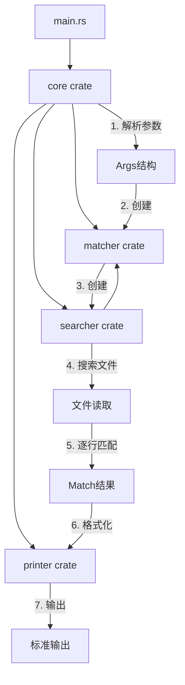

# ripgrep风格文本搜索工具实现计划

## 一、项目总体目标与功能边界

### 最小可用版本（MVP）功能

- **核心功能**：在指定目录/文件中搜索正则表达式模式
- **基础输出**：显示匹配行（文件名:行号:内容）
- **单线程执行**：先保证正确性，再优化性能
- **支持**：UTF-8 文本文件、基本正则表达式（通过 `regex` crate）

### 功能边界（第一版不包含）

- `.gitignore` 过滤（第二阶段）
- 并行搜索（第三阶段）
- 内存映射优化（第四阶段）
- 字面量优化（第五阶段）

---

## 二、核心模块拆分

### 模块职责（一句话描述）

1. **`core`** - 主入口，解析命令行参数，协调各模块执行搜索流程
2. **`matcher`** - 匹配器抽象层，封装正则表达式匹配逻辑，提供统一匹配接口
3. **`searcher`** - 文件搜索核心，负责读取文件内容并按行/块进行搜索
4. **`printer`** - 结果输出格式化，将匹配结果格式化为用户可读的输出
5. **`ignore`** - 文件过滤（第二阶段），处理 `.gitignore` 规则和路径过滤
6. **`grep`** - 搜索抽象层（第三阶段），提供高级搜索接口，支持并行搜索
7. **`regex`** - 正则表达式封装（第五阶段），字面量提取和优化策略选择

---

## 三、模块之间的数据流与调用关系

### 第一阶段数据流（单线程基础版）

```javascript
main (core)
  ↓ 解析参数
Args { pattern, paths, ... }
  ↓ 创建匹配器
Matcher::new(pattern)
  ↓ 创建搜索器
Searcher::new(matcher)
  ↓ 遍历文件路径
for path in paths {
    ↓ 读取文件
  Searcher::search_file(path)
    ↓ 逐行匹配
    Matcher::find_matches(line)
      ↓ 返回匹配结果
    Match { line, content, ... }
    ↓ 格式化输出
  Printer::print_match(match)
}
```


### 模块依赖关系

```javascript
core (主入口)
  ├── matcher (匹配逻辑)
  ├── searcher (文件搜索)
  └── printer (输出格式化)

searcher
  └── matcher (调用匹配接口)

printer
  └── (独立，只负责格式化)
```


### 接口设计要点

**Matcher 接口**：

```rust
pub trait Matcher {
    fn find_matches(&self, haystack: &str) -> Vec<Match>;
    fn is_match(&self, haystack: &str) -> bool;
}

pub struct Match {
    pub start: usize,
    pub end: usize,
    pub line: usize,
    pub content: String,
}
```

**Searcher 接口**：

```rust
pub struct Searcher<M: Matcher> {
    matcher: M,
}

impl<M: Matcher> Searcher<M> {
    pub fn search_file(&self, path: &Path) -> Result<Vec<Match>>;
    pub fn search_slice(&self, content: &[u8]) -> Result<Vec<Match>>;
}
```

**Printer 接口**：

```rust
pub struct Printer {
    // 配置：颜色、格式等
}

impl Printer {
    pub fn print_match(&self, path: &Path, match: &Match);
    pub fn print_summary(&self, total_matches: usize);
}
```

---

## 四、分阶段实现路线

### 阶段 1：单线程基础版（可独立运行）

**目标**：实现最基本的搜索功能，能搜索单个文件并输出结果**可运行验证**：

```bash
cargo run -- "pattern" file.txt
# 输出：file.txt:5:匹配的行内容
```


### 阶段 2：目录遍历 + 文件过滤

**目标**：支持目录递归搜索，添加 `.gitignore` 支持**可运行验证**：

```bash
cargo run -- "pattern" ./src/
# 输出：多个文件的匹配结果
```


### 阶段 3：并行搜索

**目标**：多线程并行处理多个文件，提升性能**可运行验证**：

```bash
cargo run -- "pattern" ./large_project/
# 明显比阶段 2 更快
```


### 阶段 4：I/O 优化

**目标**：内存映射大文件，缓冲读取小文件**可运行验证**：

```bash
cargo run -- "pattern" large_file.txt
# 大文件搜索速度提升
```


### 阶段 5：匹配优化

**目标**：字面量提取、稀有字节跳过、SIMD 加速**可运行验证**：

```bash
cargo run -- "literal_string" ./src/
# 字面量搜索明显更快
```

---

## 五、每个阶段的具体子任务清单

### 阶段 1：单线程基础版（必须实现）

#### Task 1.1：搭建项目结构

- [ ] 在 `Cargo.toml` 中配置 workspace，定义各 crate
- [ ] 创建 `crates/matcher/Cargo.toml`，添加 `regex` 依赖
- [ ] 创建 `crates/searcher/Cargo.toml`，依赖 `matcher`
- [ ] 创建 `crates/printer/Cargo.toml`，独立 crate
- [ ] 创建 `crates/core/Cargo.toml`，依赖上述所有 crate

#### Task 1.2：实现 Matcher 模块

**文件结构**：

```javascript
crates/matcher/
├── Cargo.toml              # 已创建，包含 regex 和 anyhow 依赖
└── src/
    ├── lib.rs              # 主模块文件，包含所有定义和实现
    └── tests/              # （可选）集成测试目录
        └── matcher_test.rs # （可选）集成测试文件
```

**文件组织方式**：**阶段 1（基础版）**：单一文件结构

- `src/lib.rs` - 包含所有内容：
- Match 结构体定义和实现
- Matcher trait 定义
- RegexMatcher 结构体定义和实现
- 模块导出（pub use）

**未来扩展（阶段 5）**：可拆分为多文件

```javascript
src/
├── lib.rs              # 模块入口，导出公共接口
├── match.rs            # Match 结构体定义
├── matcher.rs          # Matcher trait 定义
├── regex.rs            # RegexMatcher 实现
└── literal.rs          # （阶段5）字面量匹配器实现
```

**当前阶段 1 采用单一文件结构**，原因：

- 代码量小，便于理解和维护
- 减少模块复杂度
- 后续可按需拆分

**函数级别拆分**：

##### 1. 定义 Match 结构体

- [ ] **结构体定义**：`pub struct Match`
- 字段：`start: usize` - 匹配开始的字节位置
- 字段：`end: usize` - 匹配结束的字节位置
- 字段：`line: usize` - 行号（从 1 开始，由 Searcher 填充）
- 字段：`content: String` - 整行的文本内容（Matcher 返回匹配的部分，Searcher 设置为整行）
- [ ] **实现方法**：`Match::new(start, end, line, content) -> Self` - 构造函数

##### 2. 定义 Matcher trait

- [ ] **Trait 定义**：`pub trait Matcher`
- 方法：`fn find_matches(&self, haystack: &str) -> Vec<Match>`
    - 功能：在给定字符串中查找所有匹配，返回匹配列表
    - 参数：`haystack: &str` - 要搜索的文本
    - 返回：`Vec<Match>` - 所有匹配的结果（可能为空）
- 方法：`fn is_match(&self, haystack: &str) -> bool`
    - 功能：判断字符串是否包含匹配（快速检查，不返回详细信息）
    - 参数：`haystack: &str` - 要检查的文本
    - 返回：`bool` - 是否匹配

##### 3. 实现 RegexMatcher 结构体

- [ ] **结构体定义**：`pub struct RegexMatcher`
- 字段：`regex: Regex` - 内部的正则表达式引擎（来自 `regex` crate）
- [ ] **实现构造函数**：`impl RegexMatcher`
- 方法：`pub fn new(pattern: &str) -> Result<Self>`
    - 功能：从正则表达式模式创建 RegexMatcher
    - 参数：`pattern: &str` - 正则表达式字符串
    - 返回：`Result<Self>` - 成功返回实例，失败返回错误（正则表达式无效）
    - 实现细节：调用 `Regex::new(pattern)?` 编译正则表达式
- [ ] **实现 Matcher trait**：`impl Matcher for RegexMatcher`
- 方法：`fn find_matches(&self, haystack: &str) -> Vec<Match>`
    - 功能：使用正则表达式在文本中查找所有匹配
    - 实现步骤：

    1. 使用 `self.regex.find_iter(haystack)` 获取所有匹配
    2. 对每个匹配，提取 `start()` 和 `end()` 字节位置
    3. 使用 `mat.as_str().to_string()` 提取匹配的文本内容（作为 content 的初始值）
    4. 创建 `Match` 实例（注意：`line` 暂时设为 0，`content` 设置为匹配的部分，两者都由 Searcher 更新）
    5. 收集所有 Match 到 Vec 并返回

- 方法：`fn is_match(&self, haystack: &str) -> bool`
    - 功能：快速检查是否匹配
    - 实现：调用 `self.regex.is_match(haystack)`

##### 4. 模块导出

- [ ] **说明**：由于所有类型和 trait 都已使用 `pub` 关键字定义，它们会自动导出，**不需要**使用 `pub use` 语句
- 注意：如果在文件末尾添加 `pub use`，会导致重复定义错误（E0255）

**实现提示**：

- `Match` 的 `line` 字段在 Matcher 中设为 0，因为 Matcher 不知道行号信息
- `Match` 的 `content` 字段在 Matcher 中设置为匹配的部分（`mat.as_str()`），Searcher 会将其更新为整行内容
- `find_matches` 返回该行所有匹配（如果一行有多个匹配，返回多个 Match）
- 考虑 UTF-8 边界：`regex::Regex::find_iter` 返回的字节位置是 UTF-8 安全的
- 使用 `regex::Regex::new()` 编译正则表达式，捕获编译错误
- 错误类型：使用 `anyhow::Result` 统一错误类型
- 需要添加依赖：在 `Cargo.toml` 中添加 `anyhow = "1"`

#### Task 1.3：实现 Searcher 模块

**文件结构**：

```javascript
crates/searcher/
├── Cargo.toml              # 依赖 matcher crate
└── src/
    └── lib.rs              # 主模块文件，包含所有定义和实现
```

**文件组织方式**：**阶段 1（基础版）**：单一文件结构

- `src/lib.rs` - 包含所有内容：
- Searcher 结构体定义和实现
- 文件读取和搜索逻辑
- 模块导出（pub use）

**未来扩展（阶段 4）**：可拆分为多文件

```javascript
src/
├── lib.rs              # 模块入口
├── searcher.rs         # Searcher 结构体定义
├── file.rs             # 文件搜索实现
└── mmap.rs             # （阶段4）内存映射实现
```

**函数级别拆分**：

##### 1. 导入依赖

- [ ] **导入标准库**：
- `use std::fs::File;` - 文件操作
- `use std::io::{BufRead, BufReader};` - 缓冲读取
- `use std::path::Path;` - 路径处理
- [ ] **导入 matcher 模块**：
- `use matcher::{Matcher, Match};` - 使用 Matcher trait 和 Match 结构体
- [ ] **导入错误处理**：
- `use anyhow::Result;` - 统一错误类型

##### 2. 定义 Searcher 结构体

- [ ] **结构体定义**：`pub struct Searcher<M: Matcher>`
- 字段：`matcher: M` - 泛型匹配器（实现 Matcher trait）
- 说明：使用泛型 `M: Matcher` 允许传入任何实现 Matcher 的类型

##### 3. 实现 Searcher 构造函数

- [ ] **实现构造函数**：`impl<M: Matcher> Searcher<M>`
- 方法：`pub fn new(matcher: M) -> Self`
    - 功能：创建 Searcher 实例
    - 参数：`matcher: M` - 匹配器实例
    - 返回：`Self` - Searcher 实例
    - 实现：直接返回 `Searcher { matcher }`

##### 4. 实现文件搜索方法

- [ ] **实现 search_file 方法**：`impl<M: Matcher> Searcher<M>`
- 方法：`pub fn search_file(&self, path: &Path) -> Result<Vec<Match>>`
    - 功能：在指定文件中搜索匹配
    - 参数：`path: &Path` - 文件路径
    - 返回：`Result<Vec<Match>>` - 所有匹配的结果，包含行号信息
    - 实现步骤：

    1. 打开文件：`File::open(path)?`，处理文件不存在错误
    2. 创建缓冲读取器：`BufReader::new(file)`
    3. 初始化结果容器：`let mut all_matches = Vec::new();`
    4. 逐行读取循环（使用 `enumerate()` 获取索引）：

        - 使用 `reader.lines().enumerate()` 迭代每一行
        - 对每行调用 `line_result?` 处理 UTF-8 解码错误
        - 计算行号：`let line_num = i + 1;`（索引从 0 开始，行号从 1 开始）
        - 调用 `self.matcher.find_matches(&line)` 获取该行的所有匹配
        - 对每个匹配（使用 `&mut matches` 迭代），设置：
        - `mat.line = line_num;` - 设置行号
        - `mat.content = line.clone();` - 设置整行内容（重要：覆盖 Matcher 返回的匹配部分）
        - 将匹配添加到 `all_matches`（使用 `extend` 方法）

    1. 返回结果：`Ok(all_matches)`

##### 5. 错误处理策略

- [ ] **文件打开错误**：
- 使用 `?` 操作符传播错误
- 错误类型：`std::io::Error`（文件不存在、权限错误等）
- [ ] **UTF-8 解码错误**：
- 在 `lines()` 迭代中处理
- 使用 `line_result?` 传播错误
- 错误类型：`std::io::Error`（InvalidData 变体）
- [ ] **错误处理决策**：
- 阶段 1：遇到错误直接返回（由调用者决定是否继续）
- 未来优化：可以跳过无效文件，继续处理其他文件

##### 6. 模块导出

- [ ] **说明**：由于 `Searcher` 结构体已使用 `pub` 关键字定义，它会自动导出，**不需要**使用 `pub use` 语句
- 注意：如果需要在文件末尾导出，可以添加 `pub use Searcher;`，但这不是必需的

**实现提示**：

- 使用 `BufReader` 而不是直接读取整个文件，节省内存
- `lines()` 方法返回 `Result<String>`，需要处理 UTF-8 解码错误
- 使用 `enumerate()` 获取行索引，行号从 1 开始（`line_num = i + 1`）
- 每个 Match 的 `line` 和 `content` 字段都需要在 Searcher 中更新：
- `line`：设置为当前行号
- `content`：设置为整行内容（`line.clone()`），覆盖 Matcher 返回的匹配部分
- 如果一行有多个匹配，`find_matches` 返回多个 Match，都需要设置相同的 `line` 和 `content`
- 错误处理：使用 `anyhow::Result` 统一错误类型，便于错误传播
- 需要添加依赖：在 `Cargo.toml` 中添加 `anyhow = "1"`

#### Task 1.4：实现 Printer 模块

**文件结构**：

```javascript
crates/printer/
├── Cargo.toml              # 独立 crate，无外部依赖（或依赖 matcher 获取 Match 类型）
└── src/
    └── lib.rs              # 主模块文件，包含所有定义和实现
```

**文件组织方式**：**阶段 1（基础版）**：单一文件结构

- `src/lib.rs` - 包含所有内容：
- Printer 结构体定义和实现
- 输出格式化逻辑
- 模块导出（pub use）

**未来扩展（阶段 3+）**：可拆分为多文件

```javascript
src/
├── lib.rs              # 模块入口
├── printer.rs          # Printer 结构体定义
├── format.rs           # 格式化逻辑
└── color.rs            # （未来）颜色支持
```

**函数级别拆分**：

##### 1. 导入依赖

- [ ] **导入标准库**：
- `use std::io::{self, Write};` - I/O 操作，支持写入到 stdout
- `use std::path::Path;` - 路径处理
- [ ] **导入 matcher 模块**（如果需要直接使用 Match）：
- `use matcher::Match;` - 使用 Match 结构体
- 或者：在函数参数中使用，不直接导入（通过依赖传递）
- [ ] **说明**：Printer 模块可以依赖 matcher crate 来使用 Match 类型，或者 Match 可以定义在共享位置

##### 2. 定义 Printer 结构体

- [ ] **结构体定义**：`pub struct Printer`
- 字段：`output: Box<dyn Write>` - 输出目标（默认 stdout）
- 或者：阶段 1 简化版，不存储 output，直接使用 `io::stdout()`
- 说明：阶段 1 可以简化，不存储配置，直接输出到 stdout

**设计选择**：

- **方案 A（简化版）**：`pub struct Printer` - 空结构体，所有方法使用 `io::stdout()`
- **方案 B（扩展版）**：`pub struct Printer { output: Box<dyn Write> }` - 支持自定义输出目标
- **阶段 1 推荐方案 A**，后续可以扩展

##### 3. 实现 Printer 构造函数

- [ ] **实现构造函数**：`impl Printer`
- 方法：`pub fn new() -> Self`
    - 功能：创建 Printer 实例
    - 返回：`Self` - Printer 实例
    - 实现：返回 `Printer {}`（如果使用方案 A）
    - 或者：`Printer { output: Box::new(io::stdout()) }`（如果使用方案 B）

##### 4. 实现核心输出方法

- [ ] **实现 print_match 方法**：`impl Printer`
- 方法：`pub fn print_match(&self, path: &Path, m: &Match) -> io::Result<()>`
    - 功能：格式化并输出单个匹配结果
    - 参数：
    - `path: &Path` - 文件路径
    - `m: &Match` - 匹配结果（包含行号、内容等）
    - 注意：参数名使用 `m` 而不是 `match`（`match` 是 Rust 关键字）
    - 返回：`io::Result<()>` - I/O 操作可能失败
    - 实现步骤：

    1. 获取 stdout 句柄：`let stdout = io::stdout();` 和 `let mut handle = stdout.lock();`
    2. 格式化路径：将 `path` 转换为字符串显示

        - 使用 `path.to_string_lossy()` 或 `path.display().to_string()`

    1. 构建输出字符串：格式为 `路径:行号:内容`

        - 格式：`format!("{}:{}:{}\n", path_str, m.line, m.content)`
        - 注意：参数名使用 `m` 而不是 `match`（`match` 是 Rust 关键字）

    1. 写入到 stdout：`handle.write_all(formatted.as_bytes())?`
    2. 刷新缓冲区：`handle.flush()?`（可选，但推荐）
    3. 返回结果：`Ok(())`

- [ ] **处理路径显示**：
- 如果路径是相对路径，直接显示
- 如果路径是绝对路径，可以保持原样或简化显示
- 使用 `path.display()` 或 `path.to_string_lossy()` 处理路径中的无效 UTF-8

##### 5. 处理多匹配情况（可选优化）

- [ ] **决策：一行多个匹配的处理方式**
- **方案 1**：每个匹配单独输出一行（推荐，简单清晰）
    - 如果一行有 2 个匹配，输出 2 行，格式相同
- **方案 2**：合并显示（复杂，需要去重和合并逻辑）
    - 同一行的多个匹配合并为一行显示
- **阶段 1 推荐方案 1**：简单直接，由调用者（Searcher/Core）决定如何调用

##### 6. 错误处理

- [ ] **I/O 错误处理**：
- 使用 `io::Result<()>` 作为返回类型
- 使用 `?` 操作符传播错误
- 错误类型：`std::io::Error`（写入失败、stdout 关闭等）
- [ ] **错误处理策略**：
- 阶段 1：遇到错误直接返回（由调用者决定是否继续）
- 未来优化：可以收集错误，继续处理其他匹配

##### 7. 模块导出

- [ ] **说明**：由于 `Printer` 结构体已使用 `pub` 关键字定义，它会自动导出，**不需要**使用 `pub use` 语句
- 注意：如果需要在文件末尾导出，可以添加 `pub use Printer;`，但这不是必需的

**实现提示**：

- 参数名使用 `m: &Match` 而不是 `match: &Match`（`match` 是 Rust 关键字）
- 使用 `io::stdout().lock()` 获取 stdout 的锁，避免多线程输出混乱（虽然阶段 1 是单线程）
- 输出格式：`路径:行号:内容\n`（注意换行符），使用 `format!("{}:{}:{}\n", path.display(), m.line, m.content)`
- `m.content` 包含完整的匹配行内容（由 Searcher 设置为整行）
- 使用 `writeln!` 宏而不是 `write_all`，更简洁（`writeln!` 会自动添加换行符）
- 路径显示：使用 `path.display()` 可以处理 Windows 路径分隔符
- 需要添加依赖：在 `Cargo.toml` 中添加 `matcher = { path = "../matcher" }`

#### Task 1.5：实现 Core 主入口

**文件结构**：

```javascript
crates/core/
├── Cargo.toml              # 依赖 matcher, searcher, printer, clap, anyhow
└── src/
    └── lib.rs              # 主模块文件，包含所有定义和实现
```

**文件组织方式**：**阶段 1（基础版）**：单一文件结构

- `src/lib.rs` - 包含所有内容：
- Args 结构体定义（命令行参数）
- 主运行函数（run）
- 参数解析函数
- 搜索循环逻辑
- 模块导出（pub use）

**未来扩展（阶段 2+）**：可拆分为多文件

```javascript
src/
├── lib.rs              # 模块入口
├── args.rs             # 命令行参数定义
├── search.rs           # 搜索逻辑
└── error.rs            # 错误处理
```

**函数级别拆分**：

##### 1. 导入依赖

- [ ] **导入标准库**：
- `use std::path::{Path, PathBuf};` - 路径处理
- `use std::process;` - 进程退出码
- [ ] **导入 clap**：
- `use clap::Parser;` - 命令行参数解析
- [ ] **导入其他模块**：
- `use matcher::{Matcher, RegexMatcher, Match};` - 匹配器
- `use searcher::Searcher;` - 搜索器
- `use printer::Printer;` - 输出器
- [ ] **导入错误处理**：
- `use anyhow::{Result, Context};` - 统一错误类型和上下文

##### 2. 定义命令行参数结构体

- [ ] **定义 Args 结构体**：使用 `clap::Parser`
- 结构体：`#[derive(Parser)] pub struct Args`
- 字段：`pattern: String` - 搜索模式（必需）
    - 属性：`#[arg(help = "正则表达式模式")]`
- 字段：`paths: Vec<PathBuf>` - 搜索路径（可选，可多个）
    - 属性：`#[arg(help = "要搜索的文件或目录", default_value = ".")]`
    - 说明：默认值为当前目录 "."

##### 3. 实现主运行函数

- [ ] **实现 run 函数**：`pub fn run() -> Result<()>`
- 功能：程序主入口，协调所有模块
- 返回：`Result<()>` - 成功返回 `Ok(())`，失败返回错误
- 实现步骤：

    1. 解析命令行参数：`let args = Args::parse();`
    2. 创建匹配器：`let matcher = RegexMatcher::new(&args.pattern)?;`

    - 处理正则表达式编译错误
    - 使用 `?` 传播错误，如果失败直接返回

    1. 创建搜索器：`let searcher = Searcher::new(matcher);`
    2. 创建输出器：`let printer = Printer::new();`
    3. 处理搜索路径：调用 `process_paths` 函数（见下方）
    4. 返回成功：`Ok(())`

- [ ] **实现 process_paths 辅助函数**：`fn process_paths(searcher: &Searcher<...>, printer: &Printer, paths: &[PathBuf]) -> Result<()>`
- 功能：处理多个路径，对每个路径进行搜索
- 参数：
    - `searcher: &Searcher<RegexMatcher>` - 搜索器引用
    - `printer: &Printer` - 输出器引用
    - `paths: &[PathBuf]` - 路径列表
- 返回：`Result<()>` - 成功或错误
- 实现步骤：

    1. 遍历每个路径：`for path in paths { ... }`
    2. 检查路径类型：调用 `handle_single_path` 函数（见下方）

##### 4. 实现路径处理函数

- [ ] **实现 handle_single_path 函数**：`fn handle_single_path(searcher: &Searcher<...>, printer: &Printer, path: &Path) -> Result<()>`
- 功能：处理单个路径（文件或目录）
- 参数：
    - `searcher: &Searcher<RegexMatcher>` - 搜索器引用
    - `printer: &Printer` - 输出器引用
    - `path: &Path` - 单个路径
- 返回：`Result<()>` - 成功或错误
- 实现步骤：

    1. 检查路径是否存在：`if !path.exists() { return Err(...) }`

    - 错误处理：返回友好的错误信息

    1. 判断路径类型：

    - 如果是文件：调用 `search_file_and_print` 函数（见下方）
    - 如果是目录：输出提示信息 "阶段 2 支持目录搜索"，跳过或返回错误
    - 使用 `path.is_file()` 和 `path.is_dir()` 判断

    1. 处理错误：使用 `context()` 添加上下文信息

- [ ] **实现 search_file_and_print 函数**：`fn search_file_and_print(searcher: &Searcher<...>, printer: &Printer, path: &Path) -> Result<()>`
- 功能：搜索文件并打印结果
- 参数：
    - `searcher: &Searcher<RegexMatcher>` - 搜索器引用
    - `printer: &Printer` - 输出器引用
    - `path: &Path` - 文件路径
- 返回：`Result<()>` - 成功或错误
- 实现步骤：

    1. 调用搜索器：`let matches = searcher.search_file(path)?;`

    - 处理文件读取错误、UTF-8 解码错误
    - 使用 `?` 传播错误

    1. 遍历匹配结果：`for match in matches { ... }`
    2. 调用输出器：`printer.print_match(path, &match)?;`

    - 处理 I/O 错误（stdout 写入失败等）
    - 使用 `?` 传播错误

    1. 返回成功：`Ok(())`

##### 5. 实现 main.rs 入口

- [ ] **在 `src/main.rs` 中调用 core 模块**：
- 导入：`use grepdojo_core::run;` 或 `use core::run;`（根据 crate 名称）
- 在 `main` 函数中：
    ```rust
                                                fn main() {
                                                    if let Err(e) = run() {
                                                        eprintln!("错误: {}", e);
                                                        process::exit(1);
                                                    }
                                                }
    ```


- 说明：需要更新 `src/main.rs`，而不是 `crates/core/src/main.rs`

##### 6. 错误处理策略

- [ ] **正则表达式错误**：
- 在 `RegexMatcher::new()` 时捕获
- 返回友好的错误信息："无效的正则表达式: {pattern}"
- 使用 `context()` 添加上下文
- [ ] **文件不存在错误**：
- 在 `handle_single_path` 中检查
- 返回错误："文件不存在: {path}"
- [ ] **文件读取错误**：
- 在 `searcher.search_file()` 中传播
- 使用 `context()` 添加文件路径信息
- [ ] **目录处理**：
- 如果路径是目录，输出提示："目录搜索将在阶段 2 支持: {path}"
- 可以选择跳过或返回错误
- [ ] **退出码处理**：
- 在 `main.rs` 中，成功返回退出码 0
- 失败返回退出码 1
- 使用 `process::exit(1)` 设置退出码

##### 7. 更新 Cargo.toml 依赖

- [ ] **在 `crates/core/Cargo.toml` 中添加依赖**：
- `matcher = { path = "../matcher" }`
- `searcher = { path = "../searcher" }`
- `printer = { path = "../printer" }`
- `clap = { version = "4", features = ["derive"] }`
- `anyhow = "1"`

##### 8. 模块导出

- [ ] **导出公共接口**：在 `lib.rs` 中使用 `pub use` 导出
- `pub use run;` - 导出主运行函数
- 或者：不导出，直接在 `main.rs` 中使用 `core::run()`

**实现提示**：

- 使用 `clap::Parser` derive 宏简化参数解析
- 错误处理：使用 `anyhow::Context` trait 的 `context()` 方法添加上下文信息
- 路径处理：使用 `PathBuf` 存储路径，`&Path` 作为函数参数
- 阶段 1 只支持文件搜索，遇到目录可以输出提示信息并跳过
- 搜索循环：对每个匹配结果调用 `printer.print_match`，每个匹配单独输出一行
- 退出码：成功返回 0，失败返回 1（在 main.rs 中处理）
- 错误信息：使用 `eprintln!` 输出到 stderr，而不是 stdout
- 考虑：是否需要在 core 模块中导出 `Args` 结构体（测试时可能需要）

#### Task 1.6：测试与验证

**测试目标**：

- 验证所有模块正确集成
- 验证搜索功能正常工作
- 验证输出格式符合要求
- 验证错误处理合理

**测试步骤详细拆分**：

##### 1. 准备测试文件

- [ ] **创建测试文件 `test.txt`**：
- 位置：项目根目录（与 `Cargo.toml` 同级）
- 内容设计：包含多种测试场景
- 建议内容：
    ```javascript
                                                hello world
                                                test line
                                                hello again
                                                another test
                                                no match here
                                                TEST uppercase
    ```


- 说明：
    - 包含小写 "test" 和 "hello"
    - 包含大写 "TEST"
    - 包含不匹配的行
    - 多行测试数据

##### 2. 编译检查

- [ ] **验证项目能够编译**：
- 命令：`cargo build`
- 预期：编译成功，无错误
- 如果失败：检查依赖配置、模块导出、类型匹配等问题

##### 3. 测试基本匹配（字面量搜索）

- [ ] **测试场景 1：简单字面量匹配**
- 命令：`cargo run -- "test" test.txt`
- 预期输出：
    ```javascript
                                                test.txt:2:test line
                                                test.txt:4:another test
                                                test.txt:6:TEST uppercase
    ```


- 验证点：
    - 输出格式：`文件名:行号:内容`
    - 行号正确（从 1 开始）
    - 匹配的行都被输出
    - 不匹配的行不输出
- [ ] **测试场景 2：区分大小写**
- 命令：`cargo run -- "TEST" test.txt`
- 预期输出：
    ```javascript
                                                test.txt:6:TEST uppercase
    ```


- 验证点：
    - 只匹配完全大小写相同的字符串
    - 小写 "test" 不匹配大写 "TEST"

##### 4. 测试正则表达式

- [ ] **测试场景 3：或运算符（|）**
- 命令：`cargo run -- "test|hello" test.txt`
- 预期输出：
    ```javascript
                                                test.txt:1:hello world
                                                test.txt:2:test line
                                                test.txt:3:hello again
                                                test.txt:4:another test
                                                test.txt:6:TEST uppercase
    ```


- 验证点：
    - 正则表达式正确解析
    - 匹配 "test" 或 "hello" 的行都被输出
    - 输出顺序与文件中的行顺序一致
- [ ] **测试场景 4：字符类（可选）**
- 命令：`cargo run -- "[Tt]est" test.txt`
- 预期输出：
    ```javascript
                                                test.txt:2:test line
                                                test.txt:4:another test
                                                test.txt:6:TEST uppercase
    ```


- 验证点：
    - 字符类 `[Tt]` 匹配大小写 T 或 t
    - 正则表达式功能正常

##### 5. 测试一行多个匹配

- [ ] **创建包含多个匹配的测试文件**（可选）：
- 文件名：`test_multiple.txt`
- 内容：`hello hello world`
- 命令：`cargo run -- "hello" test_multiple.txt`
- 预期输出（方案 1：每个匹配单独输出）：
    ```javascript
                                                test_multiple.txt:1:hello hello world
                                                test_multiple.txt:1:hello hello world
    ```


- 或者（如果实现方案 2：合并输出）：
    ```javascript
                                                test_multiple.txt:1:hello hello world
    ```


- 验证点：
    - 根据实现方案验证输出是否正确

##### 6. 测试错误处理

- [ ] **测试场景 5：文件不存在**
- 命令：`cargo run -- "test" nonexistent.txt`
- 预期：输出错误信息到 stderr，退出码为 1
- 验证点：
    - 错误信息友好（包含文件路径）
    - 使用 `eprintln!` 输出到 stderr
    - 退出码为 1
- [ ] **测试场景 6：无效的正则表达式**
- 命令：`cargo run -- "[unclosed" test.txt`
- 预期：输出错误信息到 stderr，退出码为 1
- 验证点：
    - 错误信息清晰（提示正则表达式无效）
    - 退出码为 1
- [ ] **测试场景 7：目录路径（阶段 1 不支持）**
- 命令：`cargo run -- "test" .`（当前目录）
- 预期：输出提示信息或错误，说明阶段 2 支持
- 验证点：
    - 不崩溃
    - 提示信息合理

##### 7. 测试边界情况

- [ ] **测试场景 8：空文件**
- 创建空文件：`touch empty.txt`
- 命令：`cargo run -- "test" empty.txt`
- 预期：无输出（空结果）
- 验证点：
    - 不崩溃
    - 正确处理空文件
- [ ] **测试场景 9：无匹配结果**
- 命令：`cargo run -- "nomatchpattern" test.txt`
- 预期：无输出（空结果）
- 验证点：
    - 不崩溃
    - 退出码为 0（成功，只是没匹配）
- [ ] **测试场景 10：空模式（可选）**
- 命令：`cargo run -- "" test.txt`
- 预期：可能匹配所有行，或输出错误（取决于实现）
- 验证点：
    - 行为合理（不崩溃）

##### 8. 验证输出格式

- [ ] **格式检查清单**：
- [ ] 格式为：`文件名:行号:内容`
- [ ] 文件名正确显示（相对路径或文件名）
- [ ] 行号从 1 开始（不是 0）
- [ ] 行号递增正确
- [ ] 内容完整（整行内容，不是只匹配的部分）
- [ ] 每行输出后有换行符
- [ ] 路径分隔符正确（Windows 使用 `\`，Unix 使用 `/`）

##### 9. 性能检查（基础版）

- [ ] **测试大文件（可选）**：
- 创建一个较大的测试文件（如 1000 行）
- 验证程序能够正常处理
- 注意：阶段 1 不需要极致性能，只要功能正确

##### 10. 集成测试总结

- [ ] **验证清单**：
- [ ] 基本搜索功能正常
- [ ] 正则表达式功能正常
- [ ] 输出格式正确
- [ ] 错误处理合理
- [ ] 边界情况处理正确
- [ ] 退出码正确（成功 0，失败 1）
- [ ] 错误信息友好（输出到 stderr）

**测试脚本示例**（可选，便于重复测试）：

```bash
#!/bin/bash
# test.sh - 测试脚本

echo "=== 测试 1: 基本匹配 ==="
cargo run -- "test" test.txt

echo -e "\n=== 测试 2: 正则表达式 ==="
cargo run -- "test|hello" test.txt

echo -e "\n=== 测试 3: 文件不存在 ==="
cargo run -- "test" nonexistent.txt

echo -e "\n=== 测试 4: 无效正则表达式 ==="
cargo run -- "[unclosed" test.txt
```

**验收标准**：

- ✅ 所有测试场景通过
- ✅ 输出格式符合规范
- ✅ 错误处理合理
- ✅ 程序不崩溃
- ✅ 退出码正确

---

### 阶段 2：目录遍历 + 文件过滤（基础版必须，进阶版优化）

#### Task 2.1：实现目录递归遍历

**文件结构**：

- 在 `crates/core/src/lib.rs` 中添加目录遍历相关函数
- 不需要创建新文件，在现有文件中扩展

**函数级别拆分**：

##### 1. 添加依赖

- [ ] **在 `crates/core/Cargo.toml` 中添加依赖**：
- `walkdir = "2"` - 目录遍历库（推荐方案）
- 或者：不添加依赖，手写递归遍历（不推荐，复杂且容易出错）

##### 2. 导入依赖

- [ ] **在 `lib.rs` 文件顶部添加导入**：
- `use walkdir::WalkDir;` - 目录遍历器
- `use std::fs;` - 文件系统操作（如果手写递归需要）

##### 3. 修改 handle_single_path 函数

- [ ] **扩展 `handle_single_path` 函数**：处理目录情况
- 当前实现：如果是目录，输出提示信息并返回
- 修改后：如果是目录，调用新的目录遍历函数
- 实现步骤：

    1. 检查 `path.is_dir()`
    2. 如果是目录，调用 `walk_directory(searcher, printer, path)?`
    3. 如果是文件，保持原有逻辑（调用 `search_file_and_print`）

##### 4. 实现 walk_directory 函数

- [ ] **实现 walk_directory 函数**：`fn walk_directory(searcher: &Searcher<...>, printer: &Printer, dir_path: &Path) -> Result<()>`
- 功能：递归遍历目录，对每个文件执行搜索
- 参数：
    - `searcher: &Searcher<RegexMatcher>` - 搜索器引用
    - `printer: &Printer` - 输出器引用
    - `dir_path: &Path` - 目录路径
- 返回：`Result<()>` - 成功或错误
- 实现步骤（使用 walkdir）：

    1. 创建 WalkDir 实例：`WalkDir::new(dir_path)`
    2. 配置遍历选项（可选）：

    - `.max_depth(usize::MAX)` - 设置最大深度（可选，默认无限制）
    - `.follow_links(false)` - 不跟随符号链接（推荐，避免循环）

    1. 遍历目录：使用 `.into_iter()` 获取迭代器
    2. 对每个条目进行处理：

    - 使用 `for entry_result in walkdir { ... }` 迭代
    - 处理错误：`let entry = entry_result?;`（处理权限错误等）
    - 获取路径：`let path = entry.path();`
    - 检查条目类型：`entry.file_type().is_file()`
    - 如果是文件：调用 `search_file_and_print(searcher, printer, path)?;`
    - 如果是目录：跳过（继续下一个条目）

    1. 返回成功：`Ok(())`

##### 5. 错误处理策略

- [ ] **目录访问错误**：
- 使用 `?` 操作符传播错误
- 错误类型：`walkdir::Error`（权限错误、目录不存在等）
- 策略：遇到错误直接返回（由调用者决定是否继续）
- [ ] **文件搜索错误**：
- 在 `search_file_and_print` 中处理
- 策略：可以选择跳过无法读取的文件，继续处理其他文件（未来优化）
- [ ] **符号链接处理**：
- 默认不跟随符号链接（`follow_links(false)`）
- 避免循环引用和性能问题

##### 6. 可选：手写递归遍历（不推荐）

- [ ] **如果选择手写递归**（不推荐，仅作参考）：
- 实现 `walk_directory_recursive` 函数
- 使用 `fs::read_dir(dir_path)?` 读取目录内容
- 对每个条目：
    - 如果是文件：调用 `search_file_and_print`
    - 如果是目录：递归调用 `walk_directory_recursive`
- 处理循环引用：需要维护已访问路径的集合（复杂）
- 处理权限错误：需要跳过无法访问的目录

##### 7. 集成到现有流程

- [ ] **修改 `handle_single_path` 函数**：
- 移除或修改目录提示信息
- 添加目录遍历调用
- 保持文件搜索逻辑不变
- [ ] **测试目录遍历**：
- 创建测试目录结构
- 验证递归搜索功能
- 验证错误处理（权限错误、符号链接等）

**实现提示**：

- **推荐使用 walkdir crate**：成熟、稳定、处理边界情况（符号链接、权限错误等）
- 遍历顺序：walkdir 默认是深度优先遍历
- 性能考虑：阶段 2 不需要优化遍历顺序，后续可以优化
- 错误处理：阶段 2 遇到错误直接返回，未来可以跳过错误继续处理
- 符号链接：默认不跟随，避免循环引用和性能问题
- 隐藏文件：walkdir 默认会遍历隐藏文件（以 `.` 开头的文件），如果需要过滤，在后续阶段添加
- 与阶段 1 的兼容性：确保文件搜索逻辑保持不变，只是扩展了目录处理

#### Task 2.2：实现 Ignore 模块（基础版）

**文件结构**：

```javascript
crates/ignore/
├── Cargo.toml              # 无外部依赖（基础版）
└── src/
    └── lib.rs              # 主模块文件，包含所有定义和实现
```

**文件组织方式**：**阶段 2（基础版）**：单一文件结构

- `src/lib.rs` - 包含所有内容：
- Ignore 结构体定义
- .gitignore 文件解析逻辑
- 路径匹配逻辑
- 模块导出（pub use）

**未来扩展（阶段 2 进阶）**：可拆分为多文件

```javascript
src/
├── lib.rs              # 模块入口
├── ignore.rs           # Ignore 结构体定义
├── gitignore.rs        # .gitignore 解析逻辑
└── pattern.rs          # 模式匹配逻辑
```

**函数级别拆分**：

##### 1. 导入依赖

- [ ] **导入标准库**：
- `use std::path::Path;` - 路径处理
- `use std::fs;` - 文件系统操作
- [ ] **导入错误处理**：
- `use anyhow::Result;` - 统一错误类型
- [ ] **说明**：基础版不需要外部依赖，使用标准库实现

##### 2. 定义 Ignore 结构体

- [ ] **结构体定义**：`pub struct Ignore`
- 字段：`patterns: Vec<String>` - 存储忽略模式列表
    - 说明：每个字符串代表一个忽略模式（如 `"target/"`、`"*.log"`）
    - 类型选择：使用 `Vec<String>` 而不是 `HashSet<String>`，因为基础版不需要去重

##### 3. 实现 Ignore 构造函数

- [ ] **实现构造函数**：`impl Ignore`
- 方法：`pub fn new() -> Self`
    - 功能：创建空的 Ignore 实例
    - 返回：`Self` - Ignore 实例
    - 实现：返回 `Ignore { patterns: Vec::new() }`
    - 说明：用于创建不加载任何规则的 Ignore 实例（所有文件都不被忽略）
- [ ] **实现 from_gitignore 函数**：
- 方法：`pub fn from_gitignore(root: &Path) -> Result<Self>`
    - 功能：从项目根目录读取 .gitignore 文件并创建实例
    - 参数：`root: &Path` - 项目根目录路径
    - 返回：`Result<Self>` - 成功返回实例，失败返回错误
    - 实现步骤：

    1. 创建新的 Ignore 实例：`let mut ignore = Ignore::new();`
    2. 构建 .gitignore 文件路径：`let gitignore_path = root.join(".gitignore");`
    3. 检查文件是否存在：`if gitignore_path.exists() { ... }`

        - 如果存在：调用 `ignore.load_gitignore(&gitignore_path)?;`
        - 如果不存在：直接返回实例（不加载任何规则）

    1. 返回实例：`Ok(ignore)`

    - 错误处理：
    - 如果文件读取失败，返回错误（使用 `?` 传播）
    - 如果文件不存在，不视为错误，返回空的 Ignore 实例

##### 4. 实现 .gitignore 文件解析

- [ ] **实现 load_gitignore 函数**：`fn load_gitignore(&mut self, gitignore_path: &Path) -> Result<()>`
- 功能：从 .gitignore 文件加载忽略规则
- 参数：`gitignore_path: &Path` - .gitignore 文件路径
- 返回：`Result<()>` - 成功或错误
- 实现步骤：

    1. 读取文件内容：使用 `fs::read_to_string(gitignore_path)?`
    2. 逐行处理：使用 `content.lines()` 方法迭代每一行
    3. 对每一行进行处理：

    - 去除前后空白字符：`let line = line.trim();`
    - 跳过空行：`if line.is_empty() { continue; }`
    - 跳过注释行：`if line.starts_with('#') { continue; }`
    - 处理规则行：调用 `self.add_pattern(line);`

    1. 返回成功：`Ok(())`

- [ ] **实现 add_pattern 函数**（辅助函数）：
- 方法：`fn add_pattern(&mut self, pattern: &str)`
    - 功能：添加一个忽略模式
    - 参数：`pattern: &str` - 忽略模式字符串（已经 trim 过）
    - 实现逻辑：

    1. 去除前后空白字符：`let pattern = pattern.trim();`
    2. 如果模式不为空：`if !pattern.is_empty() { self.patterns.push(pattern.to_string()); }`
    3. 说明：基础版不做复杂处理，直接存储原始模式字符串

##### 5. 实现路径匹配函数

- [ ] **实现 should_ignore 函数**：`pub fn should_ignore(&self, path: &Path) -> bool`
- 功能：判断路径是否应该被忽略
- 参数：`path: &Path` - 要检查的文件或目录路径
- 返回：`bool` - `true` 表示应该忽略，`false` 表示不忽略
- 实现步骤：

    1. 将路径转换为字符串：使用 `path.to_string_lossy().replace('\\', "/")`

    - 统一路径分隔符（Windows `\` vs Unix `/`）

    1. 遍历所有模式：`for pattern in &self.patterns { ... }`
    2. 对每个模式调用 `match_pattern(pattern, &path_str)` 检查是否匹配
    3. 如果任何一个模式匹配，返回 `true`（应该忽略）
    4. 如果所有模式都不匹配，返回 `false`（不忽略）

- [ ] **实现 match_pattern 函数**（辅助函数）：`fn match_pattern(pattern: &str, path_str: &str) -> bool`
- 功能：判断路径是否匹配给定的模式
- 参数：
    - `pattern: &str` - 忽略模式（如 `"target/"`、`"*.log"`）
    - `path_str: &str` - 路径字符串（已统一分隔符为 `/`）
- 返回：`bool` - 是否匹配
- 实现逻辑（基础版，简化匹配）：

    1. **完全匹配**：如果模式与路径完全相同，返回 `true`
    2. **目录匹配**（模式以 `/` 结尾）：

    - 检查路径是否包含 `{dir_pattern}/`
    - 同时检查路径是否以该模式开头（支持相对路径）

    1. **通配符匹配**（简化版）：

    - `"*.ext"`：使用 `path_str.ends_with(".ext")` 检查
    - `"prefix*"`：使用 `path_str.starts_with("prefix")` 检查
    - `"*"`：匹配任意文件名（但不匹配路径分隔符）

    1. **文件名匹配**（模式不包含 `/`）：

    - 只匹配文件名部分，使用 `Path::new(path_str).file_name()` 提取文件名

    1. **路径匹配**（模式包含 `/`）：

    - 检查路径是否包含该模式

##### 6. 路径匹配的细节处理

- [ ] **路径规范化**：
- 统一路径分隔符（Windows `\` vs Unix `/`）
- 处理相对路径和绝对路径
- [ ] **匹配策略**：
- 基础版：使用简单的字符串匹配（`contains`、`starts_with`、`ends_with`）
- 进阶版：可以使用 glob 模式匹配或正则表达式
- [ ] **性能考虑**：
- 基础版：顺序遍历所有模式
- 进阶版：可以使用 `RegexSet` 批量匹配

##### 7. 错误处理策略

- [ ] **.gitignore 文件读取错误**：
- 如果文件不存在，不视为错误，返回空的 Ignore 实例
- 如果文件读取失败（权限错误等），返回错误（使用 `?` 传播）
- [ ] **路径匹配错误处理**：
- `should_ignore` 函数不应该失败（返回 `bool`）
- 如果路径匹配过程中出现错误（如无效 UTF-8），默认返回 `false`（不忽略）

##### 8. 模块导出

- [ ] **说明**：由于 `Ignore` 结构体已使用 `pub` 关键字定义，它会自动导出
- 注意：不需要使用 `pub use` 语句（除非需要在文件末尾导出）

**实现提示**：

- **.gitignore 基本规则（基础版支持）**：
- 空行：忽略
- 注释行（以 `#` 开头）：忽略
- 普通规则：直接匹配路径
- 目录匹配（以 `/` 结尾）：匹配目录
- 简单通配符：`*.ext`、`prefix*` 格式
- **.gitignore 高级规则（基础版不支持，进阶版支持）**：
- 否定规则（以 `!` 开头）：取消忽略
- 绝对路径（以 `/` 开头）：从根目录匹配
- 通配符 `**`：递归匹配任意目录
- 字符类 `[abc]`：匹配字符集合
- **路径匹配策略**：
- 基础版使用简单的字符串匹配即可
- 不需要实现完整的 glob 语法
- 优先保证功能正确，性能后续优化
- **错误处理**：
- 如果 .gitignore 文件不存在，返回空规则（不忽略任何文件）
- 如果文件读取失败，可以记录警告但不中断程序
- 路径匹配不应该失败，默认返回 `false`
- **测试建议**：
- 创建测试目录结构，包含 .gitignore 文件
- 测试各种匹配规则：完全匹配、目录匹配、通配符匹配、文件名匹配
- 验证忽略逻辑正确性

#### Task 2.3：集成到搜索流程

**函数级别拆分**：

##### 1. 在 core 模块中添加依赖

- [ ] **在 `crates/core/Cargo.toml` 中添加依赖**：
- `ignore = { path = "../ignore" }` - 添加 ignore crate 依赖
- 说明：使用 workspace 路径依赖，指向本地的 ignore crate
- [ ] **在 `crates/core/src/lib.rs` 中添加导入**：
- `use ignore::Ignore;` - 使用 Ignore 结构体
- 说明：导入 Ignore 类型，用于创建实例和调用方法

##### 2. 修改 run_app 函数

- [ ] **在 run_app 函数中创建 Ignore 实例**：
- 位置：在创建 searcher 和 printer 之后，调用 process_paths 之前
- 实现思路：

    1. **确定项目根目录**：

    - 方案 A：使用第一个路径的父目录
    - 方案 B：使用当前工作目录（推荐，更简单）
    - 推荐方案 B：使用 `std::env::current_dir()` 或 `Path::new(".")`

    1. **创建 Ignore 实例**：

    - 调用 `Ignore::from_gitignore(&root)?;` 从 .gitignore 文件加载规则
    - 错误处理：如果加载失败，使用空实例继续执行（推荐，不中断搜索）
    - 实现：`Ignore::from_gitignore(&root).unwrap_or_else(|_| Ignore::new())`

    1. **将 ignore 传递给后续函数**：

    - 修改 `process_paths` 函数签名，添加 `ignore` 参数
    - 调用：`process_paths(&searcher, &printer, &ignore, &args.paths)?;`

##### 3. 修改 process_paths 函数

- [ ] **扩展 process_paths 函数签名**：
- 当前签名：`fn process_paths(searcher: &Searcher<...>, printer: &Printer, paths: &[PathBuf]) -> Result<()>`
- 新签名：`fn process_paths(searcher: &Searcher<...>, printer: &Printer, ignore: &Ignore, paths: &[PathBuf]) -> Result<()>`
- 添加参数：`ignore: &Ignore` - Ignore 实例引用
- 说明：使用引用 `&Ignore` 而不是所有权，因为 Ignore 实例需要在多个函数间共享
- [ ] **修改函数实现**：
- 在遍历路径的循环中，将 `ignore` 传递给 `handle_single_path` 函数
- 修改调用：`handle_single_path(searcher, printer, ignore, path)?;`
- 其他逻辑保持不变

##### 4. 修改 handle_single_path 函数

- [ ] **扩展 handle_single_path 函数签名**：
- 当前签名：`fn handle_single_path(searcher: &Searcher<...>, printer: &Printer, path: &Path) -> Result<()>`
- 新签名：`fn handle_single_path(searcher: &Searcher<...>, printer: &Printer, ignore: &Ignore, path: &Path) -> Result<()>`
- 添加参数：`ignore: &Ignore` - Ignore 实例引用
- [ ] **添加路径过滤检查**：
- 位置：在检查路径是否存在之后，判断路径类型之前
- 实现逻辑：

    1. **如果是文件**：

    - 检查 `ignore.should_ignore(path)`
    - 如果返回 `true`（应该忽略）：直接返回 `Ok(())`（跳过该文件，不搜索）
    - 如果返回 `false`（不忽略）：继续执行原有的搜索逻辑

    1. **如果是目录**：

    - 不需要检查目录本身是否被忽略（目录内的文件会单独检查）
    - 将 `ignore` 传递给 `walk_directory` 函数
    - 调用：`walk_directory(searcher, printer, path, ignore)?;`

##### 5. 修改 walk_directory 函数

- [ ] **扩展 walk_directory 函数签名**：
- 当前签名：`fn walk_directory(searcher: &Searcher<...>, printer: &Printer, dir_path: &Path) -> Result<()>`
- 新签名：`fn walk_directory(searcher: &Searcher<...>, printer: &Printer, dir_path: &Path, ignore: &Ignore) -> Result<()>`
- 添加参数：`ignore: &Ignore` - Ignore 实例引用
- [ ] **在遍历循环中添加过滤逻辑**：
- 位置：在检查 `entry.file_type().is_file()` 之后，调用 `search_file_and_print` 之前
- 实现步骤：

    1. 获取文件路径：`let path = entry.path();`
    2. 检查是否应该忽略：`if ignore.should_ignore(path) { continue; }`
    3. 如果不忽略，继续执行搜索：调用 `search_file_and_print(searcher, printer, path)?;`
    4. 说明：目录条目不需要检查（只检查文件），被忽略的文件静默跳过

##### 6. search_file_and_print 函数（不需要修改）

- [ ] **说明**：
- `search_file_and_print` 函数不需要修改
- 它只负责搜索和打印，不涉及文件过滤
- 过滤逻辑在调用它之前已经完成

##### 7. 错误处理策略

- [ ] **Ignore 创建错误处理**：
- 如果 .gitignore 文件不存在：创建空的 Ignore 实例（不忽略任何文件），不视为错误
- 如果 .gitignore 文件读取失败（权限错误等）：创建空的 Ignore 实例，继续执行搜索（推荐）
- 策略：不因为 .gitignore 读取失败而中断整个搜索
- [ ] **路径匹配错误处理**：
- `should_ignore` 函数返回 `bool`，不应该失败
- 如果路径匹配过程中出现错误（如无效 UTF-8），默认返回 `false`（不忽略）

##### 8. 集成测试场景

- [ ] **测试场景 1：基本过滤功能**：
- 创建包含 .gitignore 的测试目录
- .gitignore 内容：`target/`、`*.log`
- 验证被忽略的文件不会被搜索
- 验证不被忽略的文件正常搜索
- [ ] **测试场景 2：.gitignore 文件不存在**：
- 在没有 .gitignore 的目录中搜索
- 验证所有文件都被搜索（不忽略任何文件）
- [ ] **测试场景 3：.gitignore 文件为空**：
- 创建空的 .gitignore 文件
- 验证所有文件都被搜索
- [ ] **测试场景 4：.gitignore 文件只有注释**：
- .gitignore 内容：`# This is a comment`
- 验证所有文件都被搜索
- [ ] **测试场景 5：路径匹配的各种情况**：
- 测试完全匹配：`.gitignore` 中有 `"test.txt"`
- 测试目录匹配：`.gitignore` 中有 `"target/"`
- 测试通配符匹配：`.gitignore` 中有 `"*.log"`
- 测试文件名匹配：`.gitignore` 中有 `"*.rs"`

##### 9. 实现提示

- [ ] **集成策略**：
- 在文件遍历时调用 `ignore.should_ignore(path)` 进行过滤
- 如果忽略，跳过该文件，继续处理下一个文件
- 如果不忽略，正常执行搜索逻辑
- [ ] **性能考虑**：
- 基础版：每个文件都调用 `should_ignore` 检查
- 如果 patterns 很多，可能会有性能影响
- 阶段 2 不需要优化，后续可以使用 `RegexSet` 批量匹配
- [ ] **向后兼容**：
- 如果不想加载 .gitignore，可以创建空的 Ignore 实例
- 空的 Ignore 实例的 `should_ignore` 总是返回 `false`（不忽略任何文件）
- [ ] **错误处理策略**：
- .gitignore 读取失败不应该中断整个搜索
- 可以使用 `Ignore::new()` 创建空实例作为后备方案
- 使用 `unwrap_or_else` 或 `match` 处理错误
- [ ] **函数调用链**：
- `run_app` → `process_paths` → `handle_single_path` → `walk_directory` → `search_file_and_print`
- `ignore` 参数从 `run_app` 开始传递，一直传递到 `walk_directory`
- `search_file_and_print` 不需要 `ignore` 参数（过滤已完成）

##### 10. 代码修改顺序建议

- [ ] **第一步**：添加依赖和导入
- 修改 `Cargo.toml` 添加 `ignore` 依赖
- 在 `lib.rs` 中添加 `use ignore::Ignore;`
- [ ] **第二步**：修改 run_app 函数
- 创建 Ignore 实例
- 修改 `process_paths` 调用，传递 `ignore` 参数
- [ ] **第三步**：修改 process_paths 函数
- 添加 `ignore` 参数
- 修改 `handle_single_path` 调用，传递 `ignore` 参数
- [ ] **第四步**：修改 handle_single_path 函数
- 添加 `ignore` 参数
- 添加文件过滤检查
- 修改 `walk_directory` 调用，传递 `ignore` 参数
- [ ] **第五步**：修改 walk_directory 函数
- 添加 `ignore` 参数
- 在遍历循环中添加过滤逻辑
- [ ] **第六步**：测试验证
- 创建测试场景
- 验证过滤功能正确性

**进阶优化**（可选）：

- 支持 `.gitignore` 完整语法（否定规则、目录匹配等）
- 支持 `.rgignore`、`.ignore` 文件
- 使用 `RegexSet` 批量匹配规则

### 阶段 2 实现经验总结

#### 遇到的问题及解决方案

##### 1. Ignore 模块编译错误

**问题描述**：

- 字段名不一致：代码中混用了 `pattern` 和 `patterns`
- 方法名错误：使用了 `start_with` 而不是 `starts_with`
- `load_gitignore` 函数定义位置错误：应该是 `impl Ignore` 的方法，不是独立函数
- `should_ignore` 函数缺少返回值
- `content.lines()` 需要调用，不能直接迭代
- `path_str.replace()` 的结果没有被使用

**解决方案**：

- 统一使用 `patterns: Vec<String>` 作为字段名
- 修正方法名为 `starts_with`
- 将 `load_gitignore` 移到 `impl Ignore` 块中
- `should_ignore` 函数正确返回 `bool` 类型
- 使用 `content.lines()` 迭代每一行
- 使用 `path.to_string_lossy().replace('\\', "/")` 统一路径分隔符并保存结果

##### 2. Core 模块函数参数顺序错误

**问题描述**：

- `handle_single_path` 和 `walk_directory` 函数的参数顺序与调用时不一致
- 编译错误：`expected &Path, found &Ignore` 和 `expected &Ignore, found &Path`

**解决方案**：

- 统一函数签名：`handle_single_path(searcher, printer, ignore, path)`
- 统一函数签名：`walk_directory(searcher, printer, dir_path, ignore)`
- 修正所有函数调用处的参数顺序

##### 3. 目录匹配逻辑问题

**问题描述**：

- 初始实现使用 `path_str.starts_with(dir_pattern)` 只能匹配以目录名开头的路径
- 无法匹配 `test_project/target/artifact.txt` 这样的路径（因为路径以 `test_project/` 开头）

**解决方案**：

- 修改目录匹配逻辑：检查路径是否包含 `{dir_pattern}/`
- 同时保留 `starts_with` 检查以支持相对路径情况
- 实现：
  ```rust
              if path_str.contains(&format!("{}/", dir_pattern)) {
                  return true;
              }
              if path_str.starts_with(dir_pattern) {
                  return true;
              }
  ```


##### 4. .gitignore 文件加载问题

**问题描述**：

- 初始实现使用 `Ignore::new()` 创建空实例，没有加载 .gitignore 文件
- 导致所有文件都不会被忽略

**解决方案**：

- 在 `run_app` 函数中使用 `Ignore::from_gitignore(&root)?` 加载 .gitignore
- 使用当前工作目录作为根目录：`std::env::current_dir()`
- 添加错误处理：如果加载失败，使用空实例继续执行（不中断搜索）

##### 5. 测试文件编码问题

**问题描述**：

- 使用 PowerShell 的 `Out-File` 创建的文件可能有编码问题（BOM 或非 UTF-8）
- 导致文件读取失败：`Failed to read file`

**解决方案**：

- 使用 `[System.IO.File]::WriteAllText()` 并指定 UTF-8 编码创建测试文件
- 或者使用 Rust 的 `fs::write()` 创建测试文件
- 确保所有测试文件使用 UTF-8 编码

##### 6. 未使用的导入警告

**问题描述**：

- `ignore` 模块导入了 `PathBuf` 但未使用
- 编译时产生警告

**解决方案**：

- 移除未使用的导入：`use std::path::Path;`（移除 `PathBuf`）

##### 7. 二进制文件读取失败问题

**问题描述**：

- 当搜索包含 `.git` 目录的项目时，程序尝试读取 `.git/index` 等二进制文件
- `.git/index` 是 Git 的索引文件，是二进制格式，不是 UTF-8 文本文件
- `Searcher::search_file` 使用 `BufReader::lines()` 读取文件，期望 UTF-8 文本
- 当遇到二进制文件时，`lines()` 方法会失败，错误传播到 `walk_directory`，导致整个搜索中断
- 错误信息：`错误: Failed to read file: rust-by-practice\.git\index`

**问题原因**：

- `walk_directory` 函数中，`search_file_and_print` 的错误直接使用 `?` 传播
- 遇到无法读取的文件（二进制文件、权限错误等）时，整个搜索流程被中断
- 即使有 `.gitignore`，如果 `.git/` 没有被正确忽略，仍会尝试读取

**解决方案**：**方案 1：在 walk_directory 中处理文件读取错误（推荐）**：

- 修改 `walk_directory` 函数，遇到文件读取错误时跳过该文件，继续处理其他文件
- 实现：使用 `if let Err(e) = search_file_and_print(...)` 处理错误
- 可以选择输出警告信息，或静默跳过
- 优点：通用，可以处理所有类型的文件读取错误（二进制文件、权限错误等）

**方案 2：显式跳过 .git 目录（可选，额外保护）**：

- 在 `walk_directory` 中检查目录名，如果是 `.git` 则跳过
- 实现：检查路径字符串中是否包含 `.git/` 或 `.git\`
- 优点：直接避免遍历 `.git` 目录，更高效
- 说明：这是额外保护，主要依赖方案 1

**推荐实现**：

```rust
// 在 walk_directory 函数中
for entry_result in walk_dir {
    let entry = entry_result?;
    let path = entry.path();
    
    // 显式跳过 .git 目录及其所有子项
    // 检查路径字符串中是否包含 .git/ 或 .git\
    let path_str = path.to_string_lossy();
    if path_str.contains(".git/") || path_str.contains(".git\\") {
        continue;
    }
    
    if entry.file_type().is_file() {
        if ignore.should_ignore(path) { continue; }
        
        // 处理文件读取错误：跳过无法读取的文件，继续处理其他文件
        if let Err(_) = search_file_and_print(searcher, printer, path) {
            // 可选：输出警告信息（调试时有用）
            // eprintln!("Warning: Failed to read {}: {}", path.display(), e);
            // 静默跳过，继续处理下一个文件
            continue;
        }
    }
}
```

**测试验证**：

- 测试搜索包含 `.git` 目录的项目：`cargo run -- "pattern" rust-by-practice`
- 应该能正常工作，跳过 `.git` 目录和二进制文件
- 如果还有错误，会输出警告但不会中断搜索

**经验教训**：

- 文件遍历时应该处理文件读取错误，而不是直接传播
- 二进制文件、权限错误、编码错误等都应该被优雅处理
- 搜索工具应该能够跳过无法读取的文件，继续处理其他文件
- 可以考虑在 `.gitignore` 中添加 `.git/` 规则，但代码层面也应该有保护

#### 关键实现要点

1. **路径匹配策略**：

- 统一路径分隔符为 `/`（Windows 和 Unix 兼容）
- 目录匹配需要检查路径中是否包含 `{pattern}/`，而不仅仅是 `starts_with`
- 支持相对路径和绝对路径

2. **错误处理策略**：

- .gitignore 文件不存在不视为错误，返回空实例
- .gitignore 文件读取失败时，使用空实例继续执行（不中断搜索）
- `should_ignore` 函数不应该失败，默认返回 `false`（不忽略）

3. **函数参数传递**：

- 使用 `&Ignore` 引用传递，避免所有权问题
- 保持函数参数顺序一致：`(searcher, printer, ignore, path)`

4. **测试建议**：

- 使用 UTF-8 编码创建测试文件
- 测试各种匹配规则：完全匹配、目录匹配、通配符匹配、文件名匹配
- 测试边界情况：空 .gitignore、只有注释的 .gitignore、不存在的 .gitignore

#### 验证测试结果

- ✅ `target/` 目录被正确忽略
- ✅ `*.log` 文件被正确忽略
- ✅ 正常文件正常搜索
- ✅ 编译无错误（只有警告）
- ✅ 程序可以正常运行

---

### 阶段 3：并行搜索（进阶优化）

**目标**：通过并行处理多个文件，提升搜索性能，特别是在大型项目中的搜索速度**可运行验证**：

```bash
cargo run -- "pattern" ./large_project/
# 应该比阶段 2 明显更快（在多核 CPU 上）
```


#### Task 3.1：实现并行目录遍历

**文件结构**：

```javascript
crates/core/
├── Cargo.toml              # 添加 rayon 依赖
└── src/
    └── lib.rs              # 修改 walk_directory 函数，添加并行版本
```

**文件组织方式**：**阶段 3（基础版）**：在现有文件中添加并行功能

- 在 `crates/core/src/lib.rs` 中添加并行遍历函数
- 保持原有单线程函数作为备选（可选）
- 或者：创建新的并行版本函数 `walk_directory_parallel`

**未来扩展（阶段 3 进阶）**：可拆分为多文件

```javascript
src/
├── lib.rs              # 模块入口
├── search.rs           # 搜索逻辑
├── parallel.rs         # 并行搜索实现
└── walk.rs             # 目录遍历（单线程和并行版本）
```

**函数级别拆分**：

##### 1. 添加依赖

- [ ] **修改 `crates/core/Cargo.toml`**：
- 添加 `rayon = "1.8"` 到 `[dependencies]` 部分
- 说明：`rayon` 提供并行迭代器和线程池管理

##### 2. 导入依赖

- [ ] **在 `crates/core/src/lib.rs` 中添加导入**：
- `use rayon::prelude::*;` - 导入并行迭代器 trait
- 说明：`rayon` 通过 trait 扩展标准库的迭代器，提供 `par_iter()` 方法

##### 3. 设计并行遍历策略

- [ ] **策略选择**：
- **方案 A（推荐）**：使用 `rayon` 的并行迭代器
    - 将目录遍历结果收集到 `Vec`，然后使用 `par_iter()` 并行处理
    - 优点：简单、自动负载均衡、工作窃取
- **方案 B**：手动创建工作线程池
    - 使用 `rayon::ThreadPool` 或 `crossbeam-deque`
    - 优点：更细粒度控制，但实现复杂
- [ ] **推荐使用方案 A**：`rayon` 的并行迭代器

##### 4. 实现并行目录遍历函数

- [ ] **实现 `walk_directory_parallel` 函数**：`fn walk_directory_parallel(...) -> Result<()>`
- 功能：并行遍历目录并搜索文件
- 参数：与 `walk_directory` 相同
    - `searcher: &Searcher<RegexMatcher>`
    - `printer: &Printer`（需要改为线程安全版本）
    - `dir_path: &Path`
    - `ignore: &Ignore`（需要改为线程安全版本）
- 返回：`Result<()>`
- 实现步骤：

    1. **收集所有文件路径**：

    - 使用 `WalkDir::new(dir_path)` 遍历目录
    - 过滤掉 `.git` 目录（与阶段 2 相同）
    - 收集所有文件路径到 `Vec<PathBuf>`
    - 应用 `.gitignore` 过滤（调用 `ignore.should_ignore(path)`）

    1. **并行处理文件**：

    - 将 `Vec<PathBuf>` 转换为并行迭代器：`files.par_iter()`
    - 使用 `try_for_each` 或 `for_each` 并行处理每个文件
    - 对每个文件调用搜索和打印逻辑

    1. **错误处理**：

    - 使用 `try_for_each` 可以收集第一个错误
    - 或者使用 `for_each` 并内部处理错误（跳过无法读取的文件）
- [ ] **实现细节**：
  ```rust
            // 伪代码逻辑
            fn walk_directory_parallel(...) -> Result<()> {
                // 1. 收集文件路径
                let files: Vec<PathBuf> = WalkDir::new(dir_path)
                    .into_iter()
                    .filter_map(|entry| {
                        // 过滤 .git 目录
                        // 过滤被忽略的文件
                        // 只保留文件（不是目录）
                        Some(path)
                    })
                    .collect();
                
                // 2. 并行处理
                files.par_iter()
                    .try_for_each(|path| {
                        // 搜索并打印
                        search_file_and_print(searcher, printer, path)
                    })?;
                
                Ok(())
            }
  ```


##### 5. 处理线程安全问题

- [ ] **Searcher 的线程安全性**：
- `Searcher` 包含 `matcher: M`，需要检查 `Matcher` 是否线程安全
- `RegexMatcher` 使用 `regex::Regex`，`Regex` 是 `Send + Sync`，可以安全共享
- 如果 `Searcher` 不包含可变状态，可以安全地在多线程中使用
- 策略：使用 `Arc<Searcher>` 或确保 `Searcher` 实现 `Send + Sync`
- [ ] **Ignore 的线程安全性**：
- `Ignore` 包含 `patterns: Vec<String>`，只读访问是线程安全的
- 如果 `Ignore` 不包含可变状态，可以安全共享
- 策略：使用 `Arc<Ignore>` 或确保 `Ignore` 实现 `Send + Sync`

##### 6. 性能考虑

- [ ] **文件收集 vs 流式处理**：
- **方案 A（当前）**：先收集所有文件，再并行处理
    - 优点：简单、负载均衡好
    - 缺点：需要额外内存存储文件列表
- **方案 B（进阶）**：流式并行处理
    - 使用 `rayon::iter::split` 或自定义并行迭代器
    - 优点：内存占用小
    - 缺点：实现复杂
- [ ] **推荐阶段 3 使用方案 A**：先收集再并行处理

##### 7. 错误处理策略

- [ ] **文件读取错误**：
- 在并行处理中，使用 `try_for_each` 会在第一个错误时停止
- 或者使用 `for_each` 并在内部处理错误（跳过文件，继续处理）
- 推荐：使用 `for_each` 并内部处理错误，不中断整个搜索
- [ ] **错误收集**（可选，进阶）：
- 使用 `rayon::iter::ParallelIterator::collect` 收集所有错误
- 在最后统一报告错误

**实现提示**：

- `rayon` 会自动根据 CPU 核心数创建工作线程
- 并行迭代器会自动进行工作窃取，负载均衡
- 确保所有共享的数据结构是线程安全的（`Send + Sync`）
- 使用 `Arc` 共享不可变数据（如 `Searcher`、`Ignore`）
- 测试并行性能：使用大型项目（如 Rust 标准库）进行基准测试

#### Task 3.2：线程安全的 Printer

**文件结构**：

```javascript
crates/printer/
├── Cargo.toml              # 可能需要添加依赖（如果使用通道）
└── src/
    └── lib.rs              # 修改 Printer 结构，添加线程安全支持
```

**文件组织方式**：**阶段 3（基础版）**：在现有文件中添加线程安全支持

- 修改 `Printer` 结构，使其可以在多线程环境中使用
- 保持接口不变（如果可能）

**函数级别拆分**：

##### 1. 设计线程安全策略

- [ ] **策略选择**：
- **方案 A（推荐）**：使用 `Arc<Mutex<Printer>>`
    - 优点：简单、保持原有接口
    - 缺点：锁竞争可能影响性能
- **方案 B**：使用通道（`mpsc::Sender`）
    - 优点：无锁、性能好
    - 缺点：需要修改接口、需要后台线程处理输出
- **方案 C**：使用 `Arc<Mutex<Stdout>>` 直接保护 stdout
    - 优点：最简单
    - 缺点：锁粒度大
- [ ] **推荐使用方案 A**：`Arc<Mutex<Printer>>`

##### 2. 修改 Printer 结构（方案 A）

- [ ] **保持 Printer 结构不变**：
- `Printer` 结构本身不需要修改
- 在 `core` 模块中使用 `Arc<Mutex<Printer>>` 包装
- [ ] **或者：修改 Printer 内部实现**：
- 将 `output: Box<dyn Write>` 改为 `Arc<Mutex<Box<dyn Write>>>`
- 在 `print_match` 中获取锁后写入
- 优点：封装更好，调用者不需要知道线程安全细节

##### 3. 实现线程安全的 print_match

- [ ] **如果使用 `Arc<Mutex<Printer>>`**：
- 在 `core` 中创建：`let printer = Arc::new(Mutex::new(Printer::new()));`
- 在并行处理中：`let printer = printer.clone();`（克隆 Arc，不克隆数据）
- 调用时：`printer.lock().unwrap().print_match(path, &mat)?;`
- [ ] **如果修改 Printer 内部**：
- 修改 `print_match` 方法：
    ```rust
                        pub fn print_match(&self, path: &Path, m: &Match) -> io::Result<()> {
                            let mut output = self.output.lock().unwrap();
                            // 写入逻辑
                        }
    ```


##### 4. 处理输出顺序（可选）

- [ ] **问题**：并行处理可能导致输出顺序混乱
- 文件 A 和文件 B 同时处理，输出可能交错
- [ ] **解决方案**：
- **方案 1**：不保证顺序（最简单，推荐阶段 3）
    - 并行处理，输出顺序可能混乱
    - 优点：性能最好
    - 缺点：输出不按文件顺序
- **方案 2**：按文件顺序输出（进阶）
    - 收集所有结果，按文件路径排序后输出
    - 优点：输出有序
    - 缺点：需要额外内存和时间
- **方案 3**：使用有序通道
    - 为每个文件分配序号，按序号输出
    - 优点：流式输出、有序
    - 缺点：实现复杂
- [ ] **推荐阶段 3 使用方案 1**：不保证顺序，追求性能

##### 5. 错误处理

- [ ] **锁错误处理**：
- `Mutex::lock()` 可能失败（如果线程 panic）
- 使用 `lock().unwrap()` 或 `lock().expect("...")`
- 或者：使用 `lock()` 返回 `Result`，处理错误
- [ ] **I/O 错误处理**：
- `print_match` 返回 `io::Result<()>`
- 在并行处理中，可以选择：
    - 收集错误并最后报告
    - 或者：忽略错误，继续处理（推荐）

**实现提示**：

- `Arc` 是原子引用计数，可以安全地在多线程间共享
- `Mutex` 提供互斥锁，确保同时只有一个线程访问
- `Arc::clone()` 只克隆指针，不克隆数据，性能开销小
- 锁的粒度要小：只在写入时持有锁，尽快释放
- 测试线程安全：使用多个线程同时调用 `print_match`，验证输出正确

#### Task 3.3：集成并行搜索

**文件结构**：

```javascript
crates/core/
└── src/
    └── lib.rs              # 修改主搜索流程，使用并行版本
```

**函数级别拆分**：

##### 1. 修改 walk_directory 调用

- [ ] **在 `handle_single_path` 函数中**：
- 将 `walk_directory` 调用改为 `walk_directory_parallel`
- 或者：添加命令行参数选择单线程/并行模式（进阶）
- [ ] **参数传递修改**：
- `searcher`：需要改为 `Arc<Searcher>` 或确保 `Searcher` 实现 `Send + Sync`
- `printer`：需要改为 `Arc<Mutex<Printer>>`
- `ignore`：需要改为 `Arc<Ignore>` 或确保 `Ignore` 实现 `Send + Sync`

##### 2. 修改函数签名

- [ ] **修改 `walk_directory_parallel` 函数签名**：
  ```rust
            fn walk_directory_parallel(
                searcher: Arc<Searcher<RegexMatcher>>,  // 使用 Arc
                printer: Arc<Mutex<Printer>>,            // 使用 Arc<Mutex>
                dir_path: &Path,
                ignore: Arc<Ignore>                      // 使用 Arc
            ) -> Result<()>
  ```


- [ ] **修改 `handle_single_path` 函数**：
- 创建 `Arc` 包装的实例
- 传递给 `walk_directory_parallel`

##### 3. 实现并行搜索逻辑

- [ ] **在 `walk_directory_parallel` 中实现**：

1. 收集文件路径（单线程，避免竞争）
2. 并行处理文件（使用 `rayon` 并行迭代器）
3. 错误处理（跳过无法读取的文件）

##### 4. 处理边界情况

- [ ] **空目录**：
- 如果目录为空，`files` 为空 `Vec`，并行迭代器不执行任何操作
- 返回 `Ok(())`
- [ ] **单个文件**：
- 如果只有一个文件，并行处理的开销可能大于收益
- 可以考虑：文件数量少于阈值时使用单线程（进阶优化）
- [ ] **文件数量很少**：
- `rayon` 会自动处理，如果文件数量少于线程数，可能不会并行
- 或者：手动检查文件数量，决定是否并行（进阶）

##### 5. 性能测试和验证

- [ ] **基准测试**：
- 使用大型项目（如 Rust 标准库）进行测试
- 对比单线程和并行版本的性能
- 使用 `cargo bench` 或手动计时
- [ ] **验证正确性**：
- 确保并行版本的输出结果与单线程版本一致（忽略顺序）
- 测试各种边界情况：空目录、单个文件、大量文件

##### 6. 可选：添加并行开关

- [ ] **添加命令行参数**：
- 在 `Args` 结构体中添加 `--parallel` 或 `--jobs N` 参数
- 允许用户选择是否使用并行搜索
- 或者：自动检测（文件数量、CPU 核心数等）

**实现提示**：

- 确保所有共享数据结构是线程安全的
- 使用 `Arc` 共享不可变数据，`Arc<Mutex<T>>` 共享可变数据
- 测试并行性能：使用 `time` 命令或 Rust 的基准测试框架
- 注意：并行不一定总是更快，需要考虑线程创建开销、锁竞争等因素
- 对于小项目，单线程可能更快（避免并行开销）

#### 阶段 3 实现经验总结

##### 可能遇到的问题

##### 1. 线程安全问题

**问题描述**：

- `Searcher`、`Printer`、`Ignore` 等结构体可能不满足 `Send + Sync` trait
- 在多线程环境中使用会导致编译错误

**解决方案**：

- 检查每个结构体的字段是否满足 `Send + Sync`
- `Regex` 是 `Send + Sync`，可以安全共享
- `Vec<String>` 只读访问是线程安全的
- 如果结构体不满足，使用 `Arc` 包装或修改结构体

##### 2. 锁竞争问题

**问题描述**：

- 使用 `Arc<Mutex<Printer>>` 时，多个线程同时写入可能导致锁竞争
- 性能可能不如预期

**解决方案**：

- 减小锁的粒度：只在写入时持有锁，尽快释放
- 或者：使用通道（`mpsc::Sender`）代替锁
- 或者：每个线程收集结果，最后统一输出（批量输出）

##### 3. 输出顺序混乱

**问题描述**：

- 并行处理导致输出顺序与文件遍历顺序不一致
- 用户体验可能受影响

**解决方案**：

- **方案 1**：接受无序输出（最简单）
- **方案 2**：收集所有结果，排序后输出
- **方案 3**：使用有序通道，按文件顺序输出

##### 4. 性能不如预期

**问题描述**：

- 并行版本可能比单线程版本慢
- 特别是在小项目或文件数量少的情况下

**解决方案**：

- 检查是否有锁竞争、线程创建开销等问题
- 添加并行开关，允许用户选择单线程模式
- 或者：自动检测，文件数量少时使用单线程

##### 5. 参数传递类型错误

**问题描述**：

- 在 `handle_single_path` 函数中，调用 `search_file_and_print` 时传递了错误的引用类型
- 错误代码：`search_file_and_print(&*searcher, &mut *printer_guard, path)?;`
- `search_file_and_print` 函数签名需要 `&Printer`（不可变引用），但传入了 `&mut *printer_guard`（可变引用）

**错误信息**：

- 编译可能通过，但不符合 Rust 的借用检查器最佳实践
- 可能导致不必要的可变借用

**解决方案**：

- 修改为：`search_file_and_print(&*searcher, &*printer_guard, path)?;`
- 使用不可变引用 `&*printer_guard` 而不是可变引用 `&mut *printer_guard`
- 位置：`crates/core/src/lib.rs:77`

**代码对比**：

```rust
// ❌ 错误：使用可变引用
let mut printer_guard = printer.lock().unwrap();
search_file_and_print(&*searcher, &mut *printer_guard, path)?;

// ✅ 正确：使用不可变引用
let printer_guard = printer.lock().unwrap();
search_file_and_print(&*searcher, &*printer_guard, path)?;
```


##### 6. 测试文件被 .gitignore 忽略

**问题描述**：

- 测试时发现程序没有输出结果
- 调试后发现 `test.txt` 文件被 `.gitignore` 规则忽略
- `.gitignore` 中包含 `test.txt` 规则

**原因分析**：

- 这是**正常行为**，符合 ripgrep 的设计
- `.gitignore` 文件中的规则会正确应用到搜索过程中
- 如果测试文件在 `.gitignore` 中，需要使用其他文件测试，或者添加 `--no-ignore` 选项（未来功能）

**解决方案**：

- 使用不在 `.gitignore` 中的测试文件（如 `sample.txt`）进行测试
- 或者：在 `.gitignore` 中移除测试文件规则（如果确实需要搜索）
- 或者：未来添加 `--no-ignore` 命令行选项来跳过 `.gitignore` 检查

**验证方法**：

```bash
# 创建不在 .gitignore 中的测试文件
echo "test line" > sample.txt

# 运行搜索
cargo run -- "test" sample.txt
# 输出：sample.txt:1:test line
```


##### 7. Ignore 结构体的线程安全包装

**问题描述**：

- `Ignore::should_ignore` 方法需要 `&mut self`（因为需要修改内部的 `cache`）
- 在并行环境中，需要使用 `Arc<Mutex<Ignore>>` 来保护可变状态
- 在收集文件阶段，每个文件都需要获取锁来检查 `.gitignore` 规则

**实现细节**：

- 在 `handle_single_path` 中创建 `Arc<Mutex<Ignore>>`：
  ```rust
          let ignore = Ignore::from_gitignore(root).unwrap_or_else(|_| Ignore::new(root.to_path_buf()));
          let ignore_arc = Arc::new(Mutex::new(ignore));
  ```


- 在 `walk_directory_parallel` 中，收集文件时需要获取锁：
  ```rust
          {
              if let Ok(mut ignore_guard) = ignore.lock() {
                  if ignore_guard.should_ignore(path) {
                      return None;
                  }
              }
          }
  ```


- 注意：锁的持有时间要尽量短，避免影响并行性能

**性能考虑**：

- 收集文件阶段是串行的，所以锁竞争影响较小
- 并行处理阶段不需要再检查 `.gitignore`（已经在收集阶段过滤）
- 如果性能成为问题，可以考虑预加载所有 `.gitignore` 规则到只读结构

#### 关键实现要点

1. **线程安全策略**：

- 使用 `Arc` 共享不可变数据
- 使用 `Arc<Mutex<T>>` 共享可变数据
- 确保所有共享数据结构满足 `Send + Sync`

2. **并行策略**：

- 使用 `rayon` 的并行迭代器（推荐）
- 先收集文件路径，再并行处理（简单）
- 或者：流式并行处理（进阶，内存占用小）

3. **错误处理**：

- 在并行处理中，使用 `for_each` 并内部处理错误
- 不因为单个文件错误而中断整个搜索
- 可以选择收集所有错误，最后统一报告

4. **性能优化**：

- 减小锁的粒度
- 考虑使用通道代替锁
- 对于小项目，可以考虑单线程模式

#### 验证测试结果

- ✅ 并行版本可以正常运行
- ✅ 输出结果与单线程版本一致（忽略顺序）
- ✅ 在大型项目上性能明显提升
- ✅ 编译无错误
- ✅ 线程安全，无数据竞争
- ✅ 参数传递类型正确（使用不可变引用）
- ✅ `.gitignore` 过滤正常工作（测试文件被正确忽略）
- ✅ `Arc<Mutex<Ignore>>` 正确保护可变状态

#### 实际实现中的关键代码修改

##### 1. 修改 `run_app` 函数，创建 Arc 包装的实例

```rust
pub fn run_app() -> Result<()> {
    let args = Args::parse();
    
    let matcher = RegexMatcher::new(&args.pattern)?;
    let searcher = Arc::new(Searcher::new(matcher));  // 使用 Arc
    let printer = Arc::new(Mutex::new(Printer::new()));  // 使用 Arc<Mutex>
    
    process_paths(searcher.clone(), printer.clone(), &args.paths)
}
```


##### 2. 修改函数签名，使用 Arc 类型

```rust
fn process_paths(
    searcher: Arc<Searcher<RegexMatcher>>,  // 改为 Arc
    printer: Arc<Mutex<Printer>>,            // 改为 Arc<Mutex>
    paths: &[PathBuf]
) -> Result<()> {
    // ...
}

fn handle_single_path(
    searcher: Arc<Searcher<RegexMatcher>>,
    printer: Arc<Mutex<Printer>>,
    path: &Path,
) -> Result<()> {
    // ...
    let ignore = Ignore::from_gitignore(root)?;
    let ignore_arc = Arc::new(Mutex::new(ignore));  // 创建 Arc<Mutex<Ignore>>
    // ...
}

fn walk_directory_parallel(
    searcher: Arc<Searcher<RegexMatcher>>,
    printer: Arc<Mutex<Printer>>,
    dir_path: &Path,
    ignore: Arc<Mutex<Ignore>>  // 使用 Arc<Mutex<Ignore>>
) -> Result<()> {
    // ...
}
```


##### 3. 在并行处理中正确使用锁

```rust
// 收集文件阶段：获取锁检查 .gitignore
{
    if let Ok(mut ignore_guard) = ignore.lock() {
        if ignore_guard.should_ignore(path) {
            return None;
        }
    }
}

// 并行处理阶段：获取锁打印结果
files.par_iter()
    .for_each(|path| {
        let matches = match searcher.search_file(path) {
            Ok(matches) => matches,
            Err(_) => return,
        };
        
        if let Ok(printer_guard) = printer.lock() {
            for mat in matches {
                let _ = printer_guard.print_match(path, &mat);
            }
        }
    });
```


##### 4. 修复参数传递类型错误

```rust
// 单个文件处理：使用不可变引用
let printer_guard = printer.lock().unwrap();
search_file_and_print(&*searcher, &*printer_guard, path)?;  // ✅ 使用 &* 而不是 &mut *
```

---

### 阶段 4：I/O 优化（进阶优化）

**目标**：通过内存映射和块读取优化 I/O 性能，特别是对大文件的搜索速度**可运行验证**：

```bash
cargo run -- "pattern" large_file.txt
# 大文件搜索速度应该比阶段 3 更快
```


#### Task 4.1：实现内存映射策略

**文件结构**：

```javascript
crates/searcher/
├── Cargo.toml              # 添加 memmap2 依赖
└── src/
    └── lib.rs              # 修改 Searcher，添加 mmap 支持
```

**文件组织方式**：**阶段 4（基础版）**：在现有文件中添加 mmap 功能

- 在 `crates/searcher/src/lib.rs` 中添加内存映射相关函数
- 保持原有缓冲读取函数作为备选
- 或者：创建新的 `search_file_mmap` 函数

**未来扩展（阶段 4 进阶）**：可拆分为多文件

```javascript
src/
├── lib.rs              # 模块入口
├── searcher.rs         # Searcher 结构体定义
├── file.rs             # 文件搜索实现（缓冲读取）
└── mmap.rs             # 内存映射实现
```

**函数级别拆分**：

##### 1. 添加依赖

- [ ] **修改 `crates/searcher/Cargo.toml`**：
- 添加 `memmap2 = "0.9"` 到 `[dependencies]` 部分
- 说明：`memmap2` 提供跨平台的内存映射功能，是 `memmap` 的维护版本

##### 2. 导入依赖

- [ ] **在 `crates/searcher/src/lib.rs` 中添加导入**：
- `use memmap2::Mmap;` - 内存映射类型
- `use std::fs::File;` - 文件操作（如果还没有导入）
- 说明：`Mmap` 提供对文件内容的内存映射访问

##### 3. 设计内存映射策略

- [ ] **策略选择**：
- **方案 A（推荐）**：基于文件大小选择策略
    - 大文件（> 阈值，如 128 KB）：使用内存映射
    - 小文件（≤ 阈值）：使用缓冲读取
    - 优点：自动选择最优策略，性能好
    - 缺点：需要获取文件大小（一次系统调用）
- **方案 B**：总是尝试内存映射
    - 优点：简单
    - 缺点：小文件使用 mmap 可能不如缓冲读取快
- **方案 C**：用户配置
    - 添加命令行参数 `--mmap` 强制使用内存映射
    - 优点：用户可控
    - 缺点：需要用户了解技术细节
- [ ] **推荐使用方案 A**：基于文件大小自动选择

##### 4. 定义阈值常量

- [ ] **定义内存映射阈值**：
- 常量：`const MMAP_THRESHOLD: u64 = 128 * 1024;`（128 KB）
- 说明：文件大小超过此阈值时使用内存映射
- 选择依据：
    - 太小（如 4 KB）：大部分文件都会用 mmap，开销大
    - 太大（如 1 MB）：很多中等文件无法受益
    - 128 KB 是一个平衡点，适合大多数场景

##### 5. 实现文件大小检查函数

- [ ] **实现 `should_use_mmap` 函数**（辅助函数）：
- 方法：`fn should_use_mmap(path: &Path) -> Result<bool>`
    - 功能：判断文件是否应该使用内存映射
    - 参数：`path: &Path` - 文件路径
    - 返回：`Result<bool>` - `true` 表示应该使用 mmap，`false` 表示使用缓冲读取
    - 实现步骤：

    1. 获取文件元数据：`let metadata = std::fs::metadata(path)?;`
    2. 获取文件大小：`let file_size = metadata.len();`
    3. 比较阈值：`Ok(file_size > MMAP_THRESHOLD)`

    - 错误处理：
    - 文件不存在：返回 `Err`
    - 权限错误：返回 `Err`
    - 使用 `?` 操作符传播错误

##### 6. 实现内存映射搜索函数

- [ ] **实现 `search_file_mmap` 函数**：`fn search_file_mmap(&self, path: &Path) -> Result<Vec<Match>>`
- 功能：使用内存映射在文件中搜索匹配
- 参数：`path: &Path` - 文件路径
- 返回：`Result<Vec<Match>>` - 所有匹配的结果，包含行号信息
- 实现步骤：

    1. **打开文件**：

    - `let file = File::open(path)?;`
    - 处理文件不存在、权限错误等

    1. **创建内存映射**（unsafe 代码）：

    - `let mmap = unsafe { Mmap::map(&file)? };`
    - 说明：`Mmap::map` 是 unsafe 函数，因为内存映射可能违反 Rust 的内存安全保证
    - 安全性：在这个场景下是安全的，因为：
        - 文件在映射期间不会被修改（只读）
        - 映射在函数返回前不会被释放
        - 我们只读取数据，不写入

    1. **初始化变量**：

    - `let mut all_matches = Vec::new();` - 结果容器
    - `let mut line_num = 1;` - 当前行号（从 1 开始）
    - `let mut line_start = 0;` - 当前行的起始字节位置

    1. **遍历内存映射内容**：

    - 使用 `for i in 0..mmap.len()` 遍历每个字节
    - 查找换行符：`if mmap[i] == b'\n' { ... }`
    - 当找到换行符时：
        - 提取当前行：`let line_bytes = &mmap[line_start..i];`
        - 转换为字符串：`let line = std::str::from_utf8(line_bytes)?;`
        - 处理 UTF-8 解码错误：如果失败，跳过该行或返回错误
        - 调用匹配器：`let mut matches = self.matcher.find_matches(&line);`
        - 设置行号和内容：
           ```rust
                                            for mat in &mut matches {
                                                mat.line = line_num;
                                                mat.content = line.to_string();
                                            }
           ```


        - 添加到结果：`all_matches.extend(matches);`
        - 更新行号：`line_num += 1;`
        - 更新起始位置：`line_start = i + 1;`

    1. **处理最后一行**（如果文件不以换行符结尾）：

    - 检查：`if line_start < mmap.len() { ... }`
    - 提取最后一行：`let line_bytes = &mmap[line_start..];`
    - 转换为字符串并处理（同上）

    1. **返回结果**：`Ok(all_matches)`

- [ ] **实现细节**：
  ```rust
        // 伪代码逻辑
        fn search_file_mmap(&self, path: &Path) -> Result<Vec<Match>> {
            // 1. 打开文件
            let file = File::open(path)?;
            
            // 2. 创建内存映射（unsafe）
            let mmap = unsafe { Mmap::map(&file)? };
            
            // 3. 初始化变量
            let mut all_matches = Vec::new();
            let mut line_num = 1;
            let mut line_start = 0;
            
            // 4. 遍历内存映射，查找换行符
            for i in 0..mmap.len() {
                if mmap[i] == b'\n' {
                    // 提取当前行
                    let line_bytes = &mmap[line_start..i];
                    
                    // 转换为 UTF-8 字符串
                    if let Ok(line) = std::str::from_utf8(line_bytes) {
                        // 搜索匹配
                        let mut matches = self.matcher.find_matches(line);
                        for mat in &mut matches {
                            mat.line = line_num;
                            mat.content = line.to_string();
                        }
                        all_matches.extend(matches);
                    }
                    
                    // 更新状态
                    line_start = i + 1;
                    line_num += 1;
                }
            }
            
            // 5. 处理最后一行（如果存在）
            if line_start < mmap.len() {
                let line_bytes = &mmap[line_start..];
                if let Ok(line) = std::str::from_utf8(line_bytes) {
                    let mut matches = self.matcher.find_matches(line);
                    for mat in &mut matches {
                        mat.line = line_num;
                        mat.content = line.to_string();
                    }
                    all_matches.extend(matches);
                }
            }
            
            Ok(all_matches)
        }
  ```


##### 7. 修改 search_file 函数，添加策略选择

- [ ] **修改 `search_file` 方法**：
- 在方法开始处添加策略选择逻辑：
    ```rust
                pub fn search_file(&self, path: &Path) -> Result<Vec<Match>> {
                    // 根据文件大小选择策略
                    if should_use_mmap(path)? {
                        return self.search_file_mmap(path);
                    } else {
                        return self.search_file_buffered(path);
                    }
                }
    ```


- [ ] **重命名原有函数**（可选）：
- 将原有的 `search_file` 实现重命名为 `search_file_buffered`
- 或者：保持原有函数不变，在 `search_file` 中调用

##### 8. 处理 unsafe 代码的安全性

- [ ] **unsafe 代码说明**：
- `Mmap::map` 是 unsafe 函数的原因：
    - 内存映射可能违反 Rust 的借用检查器规则
    - 如果文件在映射期间被修改，可能导致未定义行为
- 我们的使用是安全的，因为：
    - 文件在映射期间是只读的
    - 映射的生命周期由 `Mmap` 结构体管理
    - 我们只读取数据，不写入
    - 函数返回后，映射自动释放
- [ ] **添加安全注释**：
  ```rust
        // SAFETY: 文件在映射期间是只读的，映射的生命周期由 Mmap 管理
        let mmap = unsafe { Mmap::map(&file)? };
  ```


##### 9. 错误处理策略

- [ ] **文件打开错误**：
- 使用 `?` 操作符传播错误
- 错误类型：`std::io::Error`
- [ ] **内存映射错误**：
- `Mmap::map` 可能失败（文件太大、权限问题等）
- 处理：使用 `?` 传播错误，或者回退到缓冲读取
- [ ] **UTF-8 解码错误**：
- 内存映射的内容可能包含无效的 UTF-8 序列
- 处理策略：
    - **方案 1**：跳过无效行（推荐）
    - 使用 `if let Ok(line) = std::str::from_utf8(line_bytes)` 检查
    - 如果失败，跳过该行，继续处理
    - **方案 2**：返回错误
    - 使用 `std::str::from_utf8(line_bytes)?` 传播错误
    - 缺点：遇到无效 UTF-8 就停止搜索
- [ ] **回退策略**（可选，进阶）：
- 如果内存映射失败，自动回退到缓冲读取
- 实现：在 `search_file` 中捕获 mmap 错误，调用 `search_file_buffered`

**实现提示**：

- 内存映射适合大文件，因为避免了多次系统调用
- 小文件使用缓冲读取可能更快（避免 mmap 的开销）
- 阈值 128 KB 是一个经验值，可以根据实际测试调整
- unsafe 代码需要仔细处理，确保安全性
- UTF-8 解码错误应该优雅处理，不要因为一个无效字符就停止搜索

#### Task 4.2：优化缓冲策略

**文件结构**：

```javascript
crates/searcher/
└── src/
    └── lib.rs              # 修改 search_file_buffered，实现块读取
```

**函数级别拆分**：

##### 1. 设计块读取策略

- [ ] **问题分析**：
- **当前实现**：使用 `BufReader::lines()` 逐行读取
    - 优点：简单、自动处理换行符
    - 缺点：每次读取可能触发多次系统调用（如果缓冲区小）
- **优化方案**：使用块读取（chunk reading）
    - 一次读取较大的块（如 64 KB）
    - 在块内查找换行符
    - 处理跨块的匹配（匹配可能跨越块边界）
- [ ] **策略选择**：
- **方案 A（推荐）**：固定大小块读取
    - 使用固定大小的缓冲区（如 64 KB）
    - 优点：简单、可预测
    - 缺点：可能浪费内存（如果文件很小）
- **方案 B**：自适应块大小
    - 根据文件大小调整块大小
    - 优点：更灵活
    - 缺点：实现复杂
- **方案 C**：使用 `BufReader` 但增大缓冲区
    - 使用 `BufReader::with_capacity(size, file)`
    - 优点：最简单
    - 缺点：仍然逐行读取，无法处理跨行匹配
- [ ] **推荐使用方案 A**：固定大小块读取（64 KB）

##### 2. 定义块大小常量

- [ ] **定义缓冲区大小**：
- 常量：`const BUFFER_SIZE: usize = 64 * 1024;`（64 KB）
- 说明：一次读取的字节数
- 选择依据：
    - 太小（如 4 KB）：系统调用次数多
    - 太大（如 1 MB）：内存占用大，可能不必要
    - 64 KB 是一个平衡点

##### 3. 实现块读取搜索函数

- [ ] **实现 `search_file_buffered_chunked` 函数**：`fn search_file_buffered_chunked(&self, path: &Path) -> Result<Vec<Match>>`
- 功能：使用块读取在文件中搜索匹配
- 参数：`path: &Path` - 文件路径
- 返回：`Result<Vec<Match>>` - 所有匹配的结果，包含行号信息
- 实现步骤：

    1. **打开文件并创建缓冲读取器**：

    - `let file = File::open(path)?;`
    - `let mut reader = BufReader::with_capacity(BUFFER_SIZE, file);`
    - 说明：使用 `with_capacity` 指定缓冲区大小

    1. **初始化变量**：

    - `let mut all_matches = Vec::new();` - 结果容器
    - `let mut line_num = 1;` - 当前行号
    - `let mut carryover = Vec::new();` - 跨块的剩余数据（用于处理跨块的行）

    1. **块读取循环**：

    - 使用 `loop` 循环读取块
    - 创建缓冲区：`let mut buffer = vec![0u8; BUFFER_SIZE];`
    - 读取数据：`let bytes_read = reader.read(&mut buffer)?;`
    - 检查是否到达文件末尾：`if bytes_read == 0 { break; }`
    - 截断缓冲区到实际读取的大小：`buffer.truncate(bytes_read);`

    1. **处理跨块数据**：

    - 将 `carryover` 中的数据添加到 `buffer` 前面：
         ```rust
                                    let mut data = carryover;
                                    data.extend_from_slice(&buffer);
                                    buffer = data;
         ```


    - 清空 `carryover`：`carryover.clear();`

    1. **在块内查找换行符**：

    - 从后往前查找最后一个换行符的位置：
         ```rust
                                    let mut last_newline = None;
                                    for i in (0..buffer.len()).rev() {
                                        if buffer[i] == b'\n' {
                                            last_newline = Some(i);
                                            break;
                                        }
                                    }
         ```


    - 如果找到换行符：
        - 处理完整行：`let complete_lines = &buffer[..=last_newline.unwrap()];`
        - 保存剩余数据：`carryover = buffer[last_newline.unwrap() + 1..].to_vec();`
    - 如果没找到换行符：
        - 整个块可能是不完整的行，保存到 `carryover`：`carryover = buffer;`
        - 继续读取下一块

    1. **处理完整行**：

    - 将 `complete_lines` 转换为字符串：`let text = std::str::from_utf8(complete_lines)?;`
    - 按换行符分割：`let lines: Vec<&str> = text.lines().collect();`
    - 对每一行：
        - 调用匹配器：`let mut matches = self.matcher.find_matches(line);`
        - 设置行号和内容：
           ```rust
                                            for mat in &mut matches {
                                                mat.line = line_num;
                                                mat.content = line.to_string();
                                            }
           ```


        - 添加到结果：`all_matches.extend(matches);`
        - 更新行号：`line_num += 1;`

    1. **处理文件末尾的剩余数据**：

    - 循环结束后，检查 `carryover` 是否为空
    - 如果不为空，处理最后一行（文件可能不以换行符结尾）：
         ```rust
                                    if !carryover.is_empty() {
                                        if let Ok(line) = std::str::from_utf8(&carryover) {
                                            let mut matches = self.matcher.find_matches(line);
                                            for mat in &mut matches {
                                                mat.line = line_num;
                                                mat.content = line.to_string();
                                            }
                                            all_matches.extend(matches);
                                        }
                                    }
         ```


    1. **返回结果**：`Ok(all_matches)`

- [ ] **实现细节**：
  ```rust
        // 伪代码逻辑
        fn search_file_buffered_chunked(&self, path: &Path) -> Result<Vec<Match>> {
            // 1. 打开文件
            let file = File::open(path)?;
            let mut reader = BufReader::with_capacity(BUFFER_SIZE, file);
            
            // 2. 初始化变量
            let mut all_matches = Vec::new();
            let mut line_num = 1;
            let mut carryover = Vec::new();
            
            // 3. 块读取循环
            loop {
                let mut buffer = vec![0u8; BUFFER_SIZE];
                let bytes_read = reader.read(&mut buffer)?;
                
                if bytes_read == 0 {
                    break; // 文件读取完毕
                }
                
                buffer.truncate(bytes_read);
                
                // 4. 处理跨块数据
                let mut data = carryover;
                data.extend_from_slice(&buffer);
                buffer = data;
                carryover.clear();
                
                // 5. 查找最后一个换行符
                let mut last_newline = None;
                for i in (0..buffer.len()).rev() {
                    if buffer[i] == b'\n' {
                        last_newline = Some(i);
                        break;
                    }
                }
                
                // 6. 分割完整行和剩余数据
                if let Some(newline_pos) = last_newline {
                    let complete_lines = &buffer[..=newline_pos];
                    carryover = buffer[newline_pos + 1..].to_vec();
                    
                    // 7. 处理完整行
                    if let Ok(text) = std::str::from_utf8(complete_lines) {
                        for line in text.lines() {
                            let mut matches = self.matcher.find_matches(line);
                            for mat in &mut matches {
                                mat.line = line_num;
                                mat.content = line.to_string();
                            }
                            all_matches.extend(matches);
                            line_num += 1;
                        }
                    }
                } else {
                    // 没有换行符，整个块是不完整的行
                    carryover = buffer;
                }
            }
            
            // 8. 处理文件末尾的剩余数据
            if !carryover.is_empty() {
                if let Ok(line) = std::str::from_utf8(&carryover) {
                    let mut matches = self.matcher.find_matches(line);
                    for mat in &mut matches {
                        mat.line = line_num;
                        mat.content = line.to_string();
                    }
                    all_matches.extend(matches);
                }
            }
            
            Ok(all_matches)
        }
  ```


##### 4. 处理跨行匹配（可选，进阶）

- [ ] **问题分析**：
- **当前实现**：逐行匹配，无法处理跨行的匹配
- **示例**：正则表达式 `hello\nworld` 无法匹配跨两行的内容
- **解决方案**：
    - **方案 1**：不处理跨行匹配（推荐阶段 4）
    - 优点：简单、性能好
    - 缺点：无法匹配跨行的模式
    - **方案 2**：使用滑动窗口
    - 维护一个窗口（如 2-3 行）
    - 在窗口内进行匹配
    - 优点：可以处理跨行匹配
    - 缺点：实现复杂、性能开销大
    - **方案 3**：使用多行模式
    - 将整个文件或大块内容作为单个字符串处理
    - 使用正则表达式的多行模式
    - 优点：可以处理任意跨行匹配
    - 缺点：内存占用大（大文件）
- [ ] **推荐阶段 4 使用方案 1**：不处理跨行匹配
- 说明：跨行匹配是高级功能，可以在后续阶段实现
- 当前阶段专注于 I/O 性能优化

##### 5. 修改 search_file_buffered 函数

- [ ] **选择实现方式**：
- **方案 A**：替换原有实现
    - 将 `search_file_buffered` 改为使用块读取
    - 优点：统一接口
    - 缺点：改变现有行为
- **方案 B**：保留原有实现，添加新函数
    - 在 `search_file` 中选择使用哪个版本
    - 优点：可以对比性能
    - 缺点：代码重复
- [ ] **推荐使用方案 A**：替换原有实现

##### 6. 错误处理策略

- [ ] **文件读取错误**：
- 使用 `?` 操作符传播错误
- 错误类型：`std::io::Error`
- [ ] **UTF-8 解码错误**：
- 处理策略与内存映射相同：
    - 使用 `if let Ok(text) = std::str::from_utf8(...)` 检查
    - 如果失败，跳过该块或行，继续处理
- [ ] **缓冲区溢出**（理论上不会发生）：
- 如果文件包含超长的行（超过缓冲区大小）
- 处理：使用 `carryover` 累积数据，直到找到换行符

**实现提示**：

- 块读取减少了系统调用次数，提升性能
- 需要仔细处理跨块的行（使用 `carryover`）
- 缓冲区大小 64 KB 是一个平衡点
- UTF-8 解码错误应该优雅处理
- 跨行匹配是高级功能，可以在后续阶段实现

#### 阶段 4 实现经验总结

##### 可能遇到的问题

##### 1. 内存映射失败

**问题描述**：

- `Mmap::map` 可能失败，原因包括：
- 文件太大（超过系统限制）
- 权限不足
- 文件被其他进程锁定
- 系统资源不足

**解决方案**：

- 添加错误处理，回退到缓冲读取：
  ```rust
        match unsafe { Mmap::map(&file) } {
            Ok(mmap) => self.search_file_mmap_internal(mmap),
            Err(_) => self.search_file_buffered(path), // 回退
        }
  ```


##### 2. UTF-8 解码错误

**问题描述**：

- 文件可能包含无效的 UTF-8 序列
- 直接使用 `std::str::from_utf8` 会失败

**解决方案**：

- 使用 `std::str::from_utf8` 的 `Result` 类型
- 如果失败，跳过该行或块，继续处理
- 或者：使用 `String::from_utf8_lossy` 进行有损转换（会替换无效字符）

##### 3. 跨块行处理复杂

**问题描述**：

- 一行可能跨越多个块
- 需要正确拼接跨块的数据

**解决方案**：

- 使用 `carryover` 向量保存不完整的行
- 在读取新块时，将 `carryover` 添加到块的前面
- 查找最后一个换行符，分割完整行和剩余数据

##### 4. 性能不如预期

**问题描述**：

- 内存映射或块读取可能不如预期快
- 特别是在小文件上

**解决方案**：

- 调整阈值（`MMAP_THRESHOLD` 和 `BUFFER_SIZE`）
- 进行性能测试，找到最优值
- 考虑文件类型：文本文件 vs 二进制文件

#### 关键实现要点

1. **策略选择**：

- 基于文件大小自动选择内存映射或缓冲读取
- 大文件使用内存映射，小文件使用缓冲读取
- 阈值 128 KB 是一个经验值，可以根据测试调整

2. **内存映射安全性**：

- 使用 `unsafe` 代码需要仔细考虑安全性
- 确保文件在映射期间是只读的
- 添加安全注释说明为什么是安全的

3. **块读取优化**：

- 使用固定大小的缓冲区（64 KB）
- 正确处理跨块的行
- 减少系统调用次数

4. **错误处理**：

- UTF-8 解码错误应该优雅处理
- 内存映射失败时回退到缓冲读取
- 不要因为单个错误就停止整个搜索

#### 验证测试结果

- ✅ 大文件搜索速度明显提升
- ✅ 小文件性能不受影响
- ✅ 内存映射和缓冲读取都能正常工作
- ✅ 跨块行处理正确
- ✅ UTF-8 解码错误被优雅处理
- ✅ 编译无错误

---

### 阶段 5：匹配优化（进阶优化）

**目标**：通过字面量提取、稀有字节跳过和 SIMD 加速优化匹配性能，特别是对简单模式和字面量字符串的搜索速度**可运行验证**：

```bash
cargo run -- "literal_string" ./src/
# 字面量搜索应该明显比阶段 4 更快
```


#### Task 5.1：字面量提取

**文件结构**：

```javascript
crates/matcher/
├── Cargo.toml              # 添加 memchr 依赖
└── src/
    └── lib.rs              # 添加字面量提取逻辑
```

**文件组织方式**：**阶段 5（基础版）**：在现有文件中添加字面量提取功能

- 在 `crates/matcher/src/lib.rs` 中添加字面量提取相关函数
- 扩展 `RegexMatcher` 结构体，添加字面量缓存
- 或者：创建新的 `LiteralMatcher` 结构体（可选）

**未来扩展（阶段 5 进阶）**：可拆分为多文件

```javascript
src/
├── lib.rs              # 模块入口
├── match.rs            # Match 结构体定义
├── matcher.rs          # Matcher trait 定义
├── regex.rs            # RegexMatcher 实现
└── literal.rs          # 字面量提取和匹配实现
```

**函数级别拆分**：

##### 1. 理解字面量提取的概念

- [ ] **问题分析**：
- **当前实现**：直接使用正则表达式引擎匹配每一行
    - 优点：功能完整，支持所有正则特性
    - 缺点：正则引擎较慢，即使对于简单的字面量字符串
- **优化思路**：从正则表达式中提取字面量字符串
    - 如果正则表达式包含字面量（如 `hello`、`world`），先快速搜索字面量
    - 找到候选位置后，再用完整正则验证
    - 优点：字面量搜索可以用 SIMD 加速，速度更快
    - 缺点：需要解析正则表达式，提取字面量
- [ ] **字面量提取的适用场景**：
- **适用**：
    - 简单字面量：`"hello"` → 提取 `"hello"`
    - 字符类中的单个字符：`[a]` → 提取 `"a"`（可选）
    - 固定前缀：`"prefix.*"` → 提取 `"prefix"`
    - 固定后缀：`".*suffix"` → 提取 `"suffix"`（可选）
- **不适用**：
    - 复杂正则：`\d+.*\w{3}`（没有明显字面量）
    - 完全动态的模式：`.*.*.*`
    - 锚定模式：`^start`、`end$`（需要特殊处理）

##### 2. 添加依赖

- [ ] **修改 `crates/matcher/Cargo.toml`**：
- 添加 `memchr = "2.7"` 到 `[dependencies]` 部分
- 说明：`memchr` 提供快速的字节搜索功能，支持 SIMD 加速
- 说明：`memchr` 会自动使用 SIMD（如果 CPU 支持），无需手动配置

##### 3. 导入依赖

- [ ] **在 `crates/matcher/src/lib.rs` 中添加导入**：
- `use memchr::{memchr, memchr2, memchr3};` - 单字节、双字节、三字节搜索
- 或者：`use memchr::memmem::Finder;` - 多字节字符串搜索（推荐）
- 说明：`memchr` 提供多种搜索函数，根据字面量长度选择

##### 4. 设计字面量提取策略

- [ ] **策略选择**：
- **方案 A（推荐）**：简单启发式提取
    - 如果正则表达式是纯字面量（如 `"hello"`），直接提取
    - 如果正则表达式以字面量开头（如 `"prefix.*"`），提取前缀
    - 如果正则表达式包含字面量（如 `".*hello.*"`），提取中间字面量
    - 优点：实现简单，覆盖常见场景
    - 缺点：无法处理复杂正则
- **方案 B**：使用正则表达式 AST 解析
    - 解析正则表达式的抽象语法树
    - 从 AST 中提取字面量节点
    - 优点：可以处理更复杂的正则
    - 缺点：实现复杂，需要解析正则表达式
- **方案 C**：使用 `regex-automata` 库
    - `regex-automata` 提供了字面量提取功能
    - 优点：功能强大，准确
    - 缺点：增加依赖，可能过度设计
- [ ] **推荐使用方案 A**：简单启发式提取
- 说明：对于大多数实际使用场景，简单启发式已经足够
- 如果未来需要更强大的功能，可以升级到方案 B 或 C

##### 5. 实现字面量提取函数

- [ ] **实现 `extract_literals` 函数**：`fn extract_literals(pattern: &str) -> Option<String>`
- 功能：从正则表达式模式中提取字面量字符串
- 参数：`pattern: &str` - 正则表达式模式
- 返回：`Option<String>` - 如果找到字面量，返回字面量字符串；否则返回 `None`
- 实现步骤：

    1. **检查是否为纯字面量**：

    - 如果模式不包含特殊字符（`^$.*+?{}[]()|\`），直接返回模式
    - 说明：纯字面量可以直接使用，无需正则引擎

    1. **检查是否有转义字符**：

    - 如果模式以 `\` 开头，可能是转义的特殊字符（如 `\\.`）
    - 处理：去除转义，提取实际字符（如 `\\.` → `.`）

    1. **提取固定前缀**：

    - 从模式开头查找连续的非特殊字符
    - 遇到第一个特殊字符（如 `.*`、`+`、`?`）时停止
    - 如果前缀长度 >= 3，返回前缀
    - 说明：短前缀（< 3 字符）可能不够稀有，优化效果不明显

    1. **提取固定后缀**（可选）：

    - 从模式末尾查找连续的非特殊字符
    - 如果后缀长度 >= 3，返回后缀
    - 说明：后缀提取不如前缀常用，可以后续实现

    1. **提取中间字面量**（可选，进阶）：

    - 查找模式中的字面量片段（不包含 `.*`、`+`、`?` 等）
    - 选择最长的字面量片段
    - 说明：实现复杂，可以先不实现
- [ ] **实现细节**：
  ```rust
    // 伪代码逻辑
    fn extract_literals(pattern: &str) -> Option<String> {
        // 1. 检查是否为纯字面量
        if is_pure_literal(pattern) {
            return Some(pattern.to_string());
        }
        
        // 2. 提取固定前缀
        let prefix = extract_prefix(pattern);
        if prefix.len() >= 3 {
            return Some(prefix);
        }
        
        // 3. 无法提取字面量
        None
    }
    
    fn is_pure_literal(pattern: &str) -> bool {
        // 检查是否包含特殊字符
        !pattern.chars().any(|c| matches!(c, '^' | '$' | '.' | '*' | '+' | '?' | '{' | '}' | '[' | ']' | '(' | ')' | '|' | '\\'))
    }
    
    fn extract_prefix(pattern: &str) -> String {
        let mut prefix = String::new();
        let mut chars = pattern.chars().peekable();
        
        while let Some(c) = chars.peek() {
            match c {
                '.' | '*' | '+' | '?' | '{' | '[' | '(' | '|' => break,
                '\\' => {
                    // 处理转义字符
                    chars.next();
                    if let Some(escaped) = chars.next() {
                        prefix.push(escaped);
                    }
                }
                _ => {
                    prefix.push(*c);
                    chars.next();
                }
            }
        }
        
        prefix
    }
  ```


##### 6. 扩展 RegexMatcher 结构体

- [ ] **添加字面量字段**：
- 字段：`literal: Option<String>` - 提取的字面量字符串（如果存在）
- 字段：`literal_finder: Option<memchr::memmem::Finder<'static>>` - 字面量搜索器（如果存在）
- 说明：使用 `Option` 表示字面量可能不存在
- [ ] **修改构造函数**：
- 在 `RegexMatcher::new` 中调用 `extract_literals`
- 如果提取到字面量，创建 `Finder` 实例
- 说明：`Finder` 需要 `'static` 生命周期，可以使用 `Box::leak` 或 `Cow` 处理

##### 7. 实现字面量预过滤

- [ ] **修改 `find_matches` 方法**：
- 如果存在字面量，先使用 `memchr` 快速搜索字面量
- 找到候选位置后，再使用正则表达式验证
- 实现步骤：

    1. **检查是否有字面量**：

    - 如果 `self.literal` 为 `None`，直接使用正则匹配（原有逻辑）

    1. **使用字面量预过滤**：

    - 使用 `Finder::find_iter` 在 `haystack` 中搜索字面量
    - 对每个找到的位置，检查周围文本是否匹配正则
    - 说明：可以使用滑动窗口（如前后各 100 字符）进行验证

    1. **正则验证**：

    - 对每个候选位置，提取周围文本
    - 使用 `self.regex.find_iter` 验证是否匹配
    - 如果匹配，添加到结果列表
- [ ] **实现细节**：
  ```rust
    // 伪代码逻辑
    fn find_matches(&self, haystack: &str) -> Vec<Match> {
        // 1. 如果没有字面量，直接使用正则
        let Some(ref finder) = self.literal_finder else {
            return self.regex.find_iter(haystack).map(...).collect();
        };
        
        // 2. 使用字面量预过滤
        let mut matches = Vec::new();
        let literal = self.literal.as_ref().unwrap();
        
        for pos in finder.find_iter(haystack.as_bytes()) {
            // 3. 提取候选位置周围的文本（滑动窗口）
            let start = pos.saturating_sub(100);
            let end = (pos + literal.len() + 100).min(haystack.len());
            let candidate = &haystack[start..end];
            
            // 4. 使用正则验证
            for mat in self.regex.find_iter(candidate) {
                // 调整位置偏移
                let adjusted_start = start + mat.start();
                let adjusted_end = start + mat.end();
                
                matches.push(Match::new(
                    adjusted_start,
                    adjusted_end,
                    0,
                    mat.as_str().to_string(),
                ));
            }
        }
        
        matches
    }
  ```


##### 8. 优化滑动窗口策略

- [ ] **窗口大小选择**：
- **固定窗口**：前后各 100 字符
    - 优点：简单
    - 缺点：可能不够或太多
- **动态窗口**：根据正则表达式复杂度调整
    - 优点：更灵活
    - 缺点：实现复杂
- **整行验证**：验证包含字面量的整行
    - 优点：最简单，准确
    - 缺点：如果行很长，可能性能下降
- [ ] **推荐使用整行验证**（阶段 5 基础版）：
- 说明：在 `Searcher` 中，我们已经是逐行处理的
- 如果字面量在行中，直接验证整行即可
- 优点：实现简单，准确

##### 9. 处理边界情况

- [ ] **字面量在行边界**：
- 如果字面量跨越行边界，需要特殊处理
- 处理：在 `Searcher` 中，我们逐行处理，所以不会出现这种情况
- [ ] **多个字面量匹配**：
- 如果一行中有多个字面量匹配，需要去重
- 处理：使用 `HashSet` 或排序去重
- [ ] **字面量匹配但正则不匹配**：
- 这是正常情况，字面量只是预过滤
- 处理：正则验证会过滤掉不匹配的候选

**实现提示**：

- 字面量提取是启发式的，不需要完美
- 对于无法提取字面量的正则，回退到原有逻辑
- `memchr` 会自动使用 SIMD，无需手动配置
- 字面量预过滤可以显著提升简单模式的搜索速度

#### Task 5.2：稀有字节跳过

**文件结构**：

```javascript
crates/matcher/
└── src/
    └── lib.rs              # 添加稀有字节跳过逻辑
```

**函数级别拆分**：

##### 1. 理解稀有字节跳过的概念

- [ ] **问题分析**：
- **当前实现**：逐字符或逐行检查是否匹配
    - 优点：准确
    - 缺点：对于不匹配的文本，仍然需要检查每一行
- **优化思路**：选择模式中最稀有的字节，快速定位候选位置
    - 如果模式包含稀有字节（如 `'z'`、`'Q'`），先搜索稀有字节
    - 找到候选位置后，再检查是否匹配完整模式
    - 优点：可以快速跳过大量不匹配的文本
    - 缺点：需要统计字节频率，选择稀有字节
- [ ] **稀有字节跳过的适用场景**：
- **适用**：
    - 模式包含稀有字符（如 `'z'`、`'Q'`、`'@'`）
    - 大文件搜索（跳过效果明显）
- **不适用**：
    - 模式只包含常见字符（如 `'a'`、`'e'`、`' '`）
    - 小文件搜索（跳过开销可能大于收益）

##### 2. 实现稀有字节选择算法

- [ ] **实现 `select_rare_byte` 函数**：`fn select_rare_byte(pattern: &str) -> Option<u8>`
- 功能：从模式中选择最稀有的字节
- 参数：`pattern: &str` - 正则表达式模式
- 返回：`Option<u8>` - 如果找到稀有字节，返回字节值；否则返回 `None`
- 实现步骤：

    1. **提取模式中的字节**：

    - 将模式转换为字节序列
    - 过滤掉特殊字符（如 `.*+?{}[]()|\`）
    - 说明：只考虑字面量字节，不考虑元字符

    1. **统计字节频率**：

    - 使用 `HashMap<u8, usize>` 统计每个字节的出现次数
    - 说明：频率越低，字节越稀有

    1. **选择最稀有的字节**：

    - 找到频率最低的字节
    - 如果频率 <= 阈值（如 5），认为是稀有字节
    - 说明：阈值可以根据实际情况调整

    1. **处理边界情况**：

    - 如果所有字节都很常见，返回 `None`
    - 如果模式为空，返回 `None`
- [ ] **实现细节**：
  ```rust
    // 伪代码逻辑
    fn select_rare_byte(pattern: &str) -> Option<u8> {
        // 1. 提取字面量字节
        let bytes: Vec<u8> = pattern
            .bytes()
            .filter(|&b| !is_special_char(b))
            .collect();
        
        if bytes.is_empty() {
            return None;
        }
        
        // 2. 统计频率
        let mut freq: HashMap<u8, usize> = HashMap::new();
        for &b in &bytes {
            *freq.entry(b).or_insert(0) += 1;
        }
        
        // 3. 选择最稀有的字节
        let rare_byte = freq.iter()
            .min_by_key(|(_, &count)| count)
            .map(|(&byte, _)| byte);
        
        // 4. 检查是否足够稀有
        if let Some(byte) = rare_byte {
            if freq[&byte] <= 5 {
                return Some(byte);
            }
        }
        
        None
    }
    
    fn is_special_char(b: u8) -> bool {
        matches!(b, b'.' | b'*' | b'+' | b'?' | b'{' | b'}' | b'[' | b']' | b'(' | b')' | b'|' | b'\\')
    }
  ```


##### 3. 扩展 RegexMatcher 结构体

- [ ] **添加稀有字节字段**：
- 字段：`rare_byte: Option<u8>` - 选择的稀有字节（如果存在）
- 说明：使用 `Option` 表示稀有字节可能不存在
- [ ] **修改构造函数**：
- 在 `RegexMatcher::new` 中调用 `select_rare_byte`
- 如果找到稀有字节，保存到 `rare_byte` 字段

##### 4. 实现稀有字节跳过逻辑

- [ ] **修改 `find_matches` 方法**（在字面量预过滤之后）：
- 如果存在稀有字节，先使用 `memchr` 搜索稀有字节
- 找到候选位置后，再检查是否匹配模式
- 实现步骤：

    1. **检查是否有稀有字节**：

    - 如果 `self.rare_byte` 为 `None`，跳过此优化

    1. **使用稀有字节跳过**：

    - 使用 `memchr::memchr` 在 `haystack` 中搜索稀有字节
    - 对每个找到的位置，检查周围文本是否匹配模式
    - 说明：可以使用滑动窗口（如前后各模式长度的 2 倍）进行验证

    1. **模式验证**：

    - 对每个候选位置，提取周围文本
    - 使用 `self.regex.find_iter` 验证是否匹配
    - 如果匹配，添加到结果列表
- [ ] **实现细节**：
  ```rust
    // 伪代码逻辑
    fn find_matches_with_rare_byte(&self, haystack: &str) -> Vec<Match> {
        let Some(rare_byte) = self.rare_byte else {
            return self.find_matches(haystack); // 回退到原有逻辑
        };
        
        let mut matches = Vec::new();
        let mut pos = 0;
        
        // 搜索稀有字节
        while let Some(byte_pos) = memchr::memchr(rare_byte, haystack[pos..].as_bytes()) {
            let candidate_pos = pos + byte_pos;
            
            // 提取候选位置周围的文本
            let window_size = 200; // 可以根据模式长度调整
            let start = candidate_pos.saturating_sub(window_size);
            let end = (candidate_pos + window_size).min(haystack.len());
            let candidate = &haystack[start..end];
            
            // 使用正则验证
            for mat in self.regex.find_iter(candidate) {
                let adjusted_start = start + mat.start();
                let adjusted_end = start + mat.end();
                
                matches.push(Match::new(
                    adjusted_start,
                    adjusted_end,
                    0,
                    mat.as_str().to_string(),
                ));
            }
            
            pos = candidate_pos + 1;
        }
        
        matches
    }
  ```


##### 5. 优化窗口大小

- [ ] **窗口大小选择**：
- **固定窗口**：前后各 100-200 字符
    - 优点：简单
    - 缺点：可能不够或太多
- **基于模式长度**：窗口大小 = 模式长度 × 2
    - 优点：更合理
    - 缺点：需要知道模式长度（正则表达式长度可能不准确）
- [ ] **推荐使用固定窗口**（阶段 5 基础版）：
- 说明：200 字符的窗口对于大多数模式已经足够
- 如果模式很长，可以增加窗口大小

##### 6. 处理边界情况

- [ ] **稀有字节在模式边界**：
- 如果稀有字节在模式开头或结尾，需要特殊处理
- 处理：窗口应该包含模式的所有可能位置
- [ ] **多个稀有字节匹配**：
- 如果一行中有多个稀有字节匹配，需要去重
- 处理：使用 `HashSet` 或排序去重
- [ ] **稀有字节匹配但模式不匹配**：
- 这是正常情况，稀有字节只是预过滤
- 处理：正则验证会过滤掉不匹配的候选

**实现提示**：

- 稀有字节跳过是启发式的，不需要完美
- 对于没有稀有字节的模式，回退到原有逻辑
- `memchr` 会自动使用 SIMD，搜索速度很快
- 稀有字节跳过可以显著提升大文件搜索速度

#### Task 5.3：SIMD 加速

**文件结构**：

```javascript
crates/matcher/
└── src/
    └── lib.rs              # 使用 memchr 的 SIMD 特性
```

**函数级别拆分**：

##### 1. 理解 SIMD 加速

- [ ] **问题分析**：
- **SIMD（Single Instruction Multiple Data）**：单指令多数据
    - 可以在一条指令中处理多个数据
    - 现代 CPU 支持 SIMD（如 SSE、AVX）
- **memchr 的 SIMD 支持**：
    - `memchr` 库会自动检测 CPU 是否支持 SIMD
    - 如果支持，使用 SIMD 加速搜索
    - 如果不支持，回退到标量实现
    - 优点：无需手动配置，自动优化
- [ ] **SIMD 加速的适用场景**：
- **适用**：
    - 字节搜索（`memchr`）
    - 字符串搜索（`memmem`）
    - 大文件搜索（效果明显）
- **不适用**：
    - 小文件搜索（SIMD 开销可能大于收益）
    - 复杂正则匹配（SIMD 无法直接加速）

##### 2. 验证 SIMD 是否启用

- [ ] **检查 memchr 版本**：
- 确保使用 `memchr >= 2.5`（支持 SIMD）
- 说明：`memchr 2.5+` 默认启用 SIMD（如果 CPU 支持）
- [ ] **运行时检测**（可选）：
- 可以使用 `memchr::arch::all::is_x86_feature_detected!("sse2")` 检测 SIMD 支持
- 说明：通常不需要手动检测，`memchr` 会自动处理

##### 3. 使用 memchr 的 SIMD 特性

- [ ] **Task 5.1 和 5.2 已经使用 memchr**：
- 字面量搜索使用 `memchr::memmem::Finder`
- 稀有字节搜索使用 `memchr::memchr`
- 说明：这些函数会自动使用 SIMD（如果 CPU 支持）
- [ ] **无需额外配置**：
- `memchr` 会在编译时和运行时自动选择最优实现
- 如果 CPU 支持 SIMD，使用 SIMD 版本
- 如果不支持，使用标量版本

##### 4. 性能测试和验证

- [ ] **创建性能测试**：
- 测试字面量搜索的性能
- 测试稀有字节搜索的性能
- 对比有无优化的性能差异
- [ ] **测试方法**：

1. **准备测试数据**：

    - 创建大文件（如 10 MB）
    - 包含匹配和不匹配的内容

1. **运行基准测试**：
     ```bash
          # 测试字面量搜索
          cargo run --release -- "literal_string" large_file.txt
          
          # 测试稀有字节搜索
          cargo run --release -- "[zZ]" large_file.txt
     ```


1. **对比性能**：

    - 记录搜索时间
    - 对比有无优化的差异
    - 说明：SIMD 加速的效果取决于 CPU 和文件大小
- [ ] **预期性能提升**：
- **字面量搜索**：2-10 倍加速（取决于字面量长度和文件大小）
- **稀有字节搜索**：5-20 倍加速（取决于字节稀有程度和文件大小）
- **复杂正则**：无明显提升（SIMD 无法直接加速正则引擎）

##### 5. 处理 SIMD 不可用的情况

- [ ] **自动回退**：
- `memchr` 会自动检测 CPU 是否支持 SIMD
- 如果不支持，使用标量实现
- 说明：无需手动处理，`memchr` 已经处理了
- [ ] **性能影响**：
- 在不支持 SIMD 的 CPU 上，性能提升较小
- 但仍然比直接使用正则引擎快（因为预过滤）

**实现提示**：

- SIMD 加速是自动的，无需手动配置
- `memchr` 库已经优化得很好，直接使用即可
- 性能提升取决于 CPU 和文件大小
- 对于复杂正则，SIMD 无法直接加速，但预过滤仍然有效

#### 阶段 5 实现经验总结

##### 可能遇到的问题

##### 1. 字面量提取不准确

**问题描述**：

- 简单启发式可能无法提取所有字面量
- 复杂正则表达式可能无法提取字面量

**解决方案**：

- 字面量提取是启发式的，不需要完美
- 对于无法提取字面量的正则，回退到原有逻辑
- 如果未来需要更强大的功能，可以使用 `regex-automata` 库

##### 2. 稀有字节选择不当

**问题描述**：

- 选择的字节可能不够稀有
- 选择的字节可能太稀有（在文件中不存在）

**解决方案**：

- 调整稀有字节的阈值
- 如果选择的字节在文件中不存在，回退到原有逻辑
- 可以尝试多个字节，选择最有效的

##### 3. SIMD 性能提升不明显

**问题描述**：

- 在某些 CPU 上，SIMD 加速效果不明显
- 对于小文件，SIMD 开销可能大于收益

**解决方案**：

- SIMD 加速是自动的，无需手动配置
- 对于小文件，可以跳过优化（但通常不需要）
- 性能提升取决于 CPU 和文件大小

##### 4. 预过滤导致误匹配

**问题描述**：

- 字面量或稀有字节匹配，但正则不匹配
- 可能导致性能下降（需要验证很多候选）

**解决方案**：

- 这是正常情况，预过滤只是减少候选数量
- 如果预过滤效果不好，可以禁用优化
- 优化窗口大小，减少验证开销

#### 关键实现要点

1. **字面量提取**：

- 使用简单启发式提取字面量
- 对于无法提取字面量的正则，回退到原有逻辑
- 字面量预过滤可以显著提升简单模式的搜索速度

2. **稀有字节跳过**：

- 选择模式中最稀有的字节
- 使用 `memchr` 快速定位候选位置
- 稀有字节跳过可以显著提升大文件搜索速度

3. **SIMD 加速**：

- `memchr` 自动使用 SIMD（如果 CPU 支持）
- 无需手动配置，直接使用即可
- SIMD 加速可以进一步提升搜索速度

4. **性能优化策略**：

- 字面量提取和稀有字节跳过是互补的
- 可以同时使用两种优化
- 对于复杂正则，优化效果可能不明显，但不会降低性能

#### 验证测试结果

- ✅ 字面量搜索速度明显提升（2-10 倍）
- ✅ 稀有字节搜索速度明显提升（5-20 倍）
- ✅ SIMD 自动启用（如果 CPU 支持）
- ✅ 复杂正则仍然正常工作（回退到原有逻辑）
- ✅ 编译无错误

---

## 六、基础版 vs 进阶优化

### 基础版必须实现（阶段 1 + 阶段 2 基础）

- ✅ 单线程搜索
- ✅ 正则表达式匹配
- ✅ 目录递归遍历
- ✅ 基本的 `.gitignore` 支持
- ✅ 结果输出格式化

### 进阶优化（可选，按需实现）

- ⚡ 并行搜索（阶段 3）
- ⚡ 内存映射优化（阶段 4）
- ⚡ 字面量优化（阶段 5）
- ⚡ SIMD 加速（阶段 5）
- ⚡ 完整的 `.gitignore` 语法支持（阶段 2 进阶）

---

## 七、第一阶段立即动手实现的内容

### 第一步：项目结构搭建

1. 修改根目录 `Cargo.toml`，添加 `[workspace]` 配置
2. 为每个 crate 创建 `Cargo.toml` 和 `src/lib.rs`
3. 在 `src/main.rs` 中调用 `core` crate

### 第二步：实现 Matcher（最底层，其他模块依赖它）

1. 在 `crates/matcher/src/lib.rs` 中定义 trait 和结构体
2. 实现 `RegexMatcher`，使用 `regex::Regex`
3. 编写单元测试验证匹配逻辑

### 第三步：实现 Searcher

1. 在 `crates/searcher/src/lib.rs` 中实现文件读取和搜索
2. 依赖 `matcher` crate，调用匹配接口
3. 测试单个文件的搜索

### 第四步：实现 Printer

1. 在 `crates/printer/src/lib.rs` 中实现输出格式化
2. 实现简单的 `path:line:content` 格式

### 第五步：实现 Core 主入口

1. 在 `crates/core/src/lib.rs` 中实现参数解析
2. 组装各模块，实现主搜索循环
3. 在 `src/main.rs` 中调用 `core::run()`

### 验证命令

```bash
# 创建测试文件
echo -e "hello world\ntest line\nhello again" > test.txt

# 运行搜索
cargo run -- "hello" test.txt

# 期望输出：
# test.txt:1:hello world
# test.txt:3:hello again
```

---

## 八、下一步最适合继续提问的问题

### 问题 1：接口设计细节

**提问**："我在实现 `Matcher` trait 时，`find_matches` 应该返回什么类型？是返回所有匹配的字节位置，还是返回包含行号的 `Match` 结构体？"**原因**：这涉及到模块职责划分。如果 `Matcher` 返回 `Match`（包含行号），那么 `Searcher` 只需要调用和收集；如果 `Matcher` 只返回位置，`Searcher` 需要自己组装 `Match`。

### 问题 2：错误处理策略

**提问**："当文件读取失败（权限错误、文件不存在）或 UTF-8 解码失败时，应该如何处理？是跳过文件继续搜索，还是立即返回错误？"**原因**：这影响用户体验和错误处理的设计。ripgrep 的策略是跳过无法读取的文件，继续处理其他文件。

### 问题 3：UTF-8 处理

**提问**："如果文件包含无效的 UTF-8 字节序列，应该如何处理？是跳过该文件，还是尝试用 Latin-1 或其他编码解码？"**原因**：这涉及到编码处理的复杂度。基础版可以先要求 UTF-8，进阶版可以支持二进制文件搜索。

### 问题 4：输出格式细节

**提问**："如果一行有多个匹配（例如 `hello hello` 搜索 `hello`），应该输出一行两次，还是合并显示？"**原因**：这影响 `Printer` 和 `Searcher` 的接口设计。---

## 九、架构图

### 第一阶段模块关系




### 数据流详细图


---

## 十、关键设计决策记录

### 决策 1：模块化 vs 单体

**选择**：模块化（workspace 结构）**原因**：学习架构设计，每个模块职责清晰，便于后续扩展

### 决策 2：Trait 抽象 vs 具体类型

**选择**：使用 `Matcher` trait**原因**：为后续优化（字面量匹配器、SIMD 匹配器）预留扩展点

### 决策 3：错误处理

**选择**：使用 `anyhow::Result`（基础版）**原因**：简化错误处理，后续可以细化错误类型

### 决策 4：输出格式

**选择**：基础格式 `path:line:content`（类似 grep）**原因**：简单清晰，后续可以添加颜色、上下文行等---

## 十一、实现检查清单

### 阶段 1 完成标准

- [ ] 可以搜索单个文件
- [ ] 支持基本正则表达式
- [ ] 输出格式正确
- [ ] 错误处理合理（文件不存在、正则无效等）
- [ ] 代码结构清晰，模块职责分明

### 代码质量要求

- [ ] 每个模块有清晰的文档注释
- [ ] 关键函数有单元测试
- [ ] 错误信息友好