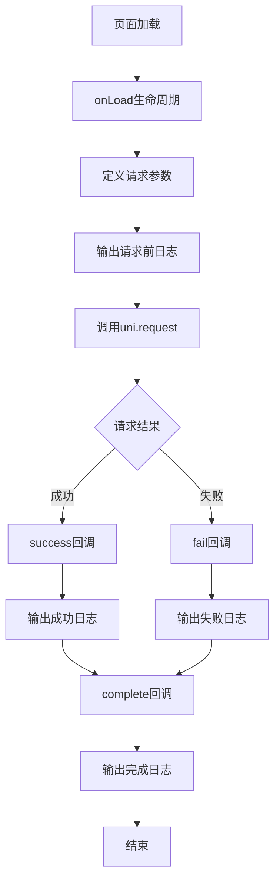
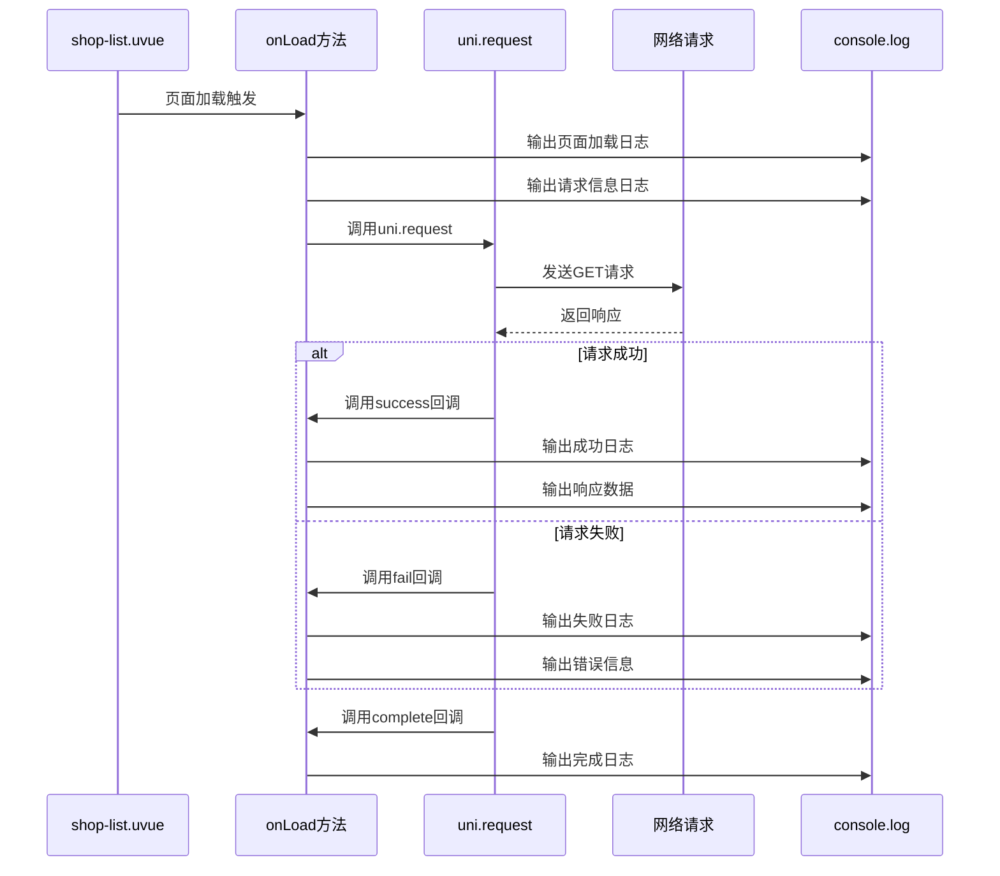

# uni-request 网络请求实现计划

## 一、项目总体目标与功能边界

### 最小可用版本（MVP）功能

- **核心功能**：在Vue页面的`onLoad`方法中使用`uni.request`发起GET请求
- **请求地址**：`https://diancan.glbuys.com/api/v1/business/shop`
- **请求方式**：GET
- **请求参数**：`page`（页码）、`lng`（经度）、`lat`（纬度）
- **日志输出**：使用`console.log()`打印所有请求相关信息到控制台
- **错误处理**：处理请求成功和失败的情况

### 功能边界（第一版不包含）

- 请求参数动态获取（如从用户输入、定位服务获取）
- 请求结果的数据展示（仅打印日志）
- 请求缓存和重试机制
- 请求拦截器配置

---

## 二、核心模块拆分

### 模块职责（一句话描述）

1. **页面组件（shop-list.uvue）** - Vue页面组件，包含模板、脚本和样式
2. **onLoad生命周期** - 页面加载时自动触发的生命周期方法
3. **uni.request API** - uni-app提供的网络请求接口
4. **console.log日志** - 浏览器/运行环境提供的日志输出接口

---

## 三、模块之间的数据流与调用关系

### 数据流（单次请求）

```javascript
页面加载 (onLoad)
  ↓ 初始化请求参数
请求参数对象 { page, lng, lat }
  ↓ 调用uni.request
uni.request({
  url: 'https://diancan.glbuys.com/api/v1/business/shop',
  method: 'GET',
  data: { page, lng, lat }
})
  ↓ 请求发送
网络请求
  ↓ 响应返回
success回调 / fail回调
  ↓ 处理响应
console.log() 输出日志
  ↓ 完成
complete回调
```

### 模块依赖关系

```javascript
shop-list.uvue (页面组件)
  ├── onLoad (生命周期方法)
  │   ├── uni.request (网络请求API)
  │   │   ├── success (成功回调)
  │   │   │   └── console.log (日志输出)
  │   │   ├── fail (失败回调)
  │   │   │   └── console.log (日志输出)
  │   │   └── complete (完成回调)
  │   │       └── console.log (日志输出)
  │   └── console.log (请求前日志)
  └── template (页面模板)
```

### 接口设计要点

**uni.request 接口**：

```javascript
uni.request({
  url: string,           // 请求地址
  method: string,        // 请求方式：'GET' | 'POST' | 'PUT' | 'DELETE' 等
  data: object,         // 请求参数（GET请求会自动拼接到URL）
  success: function,    // 成功回调
  fail: function,       // 失败回调
  complete: function    // 完成回调（无论成功或失败都会执行）
})
```

**success 回调参数**：

```javascript
success: (res) => {
  res.statusCode  // 响应状态码（如 200）
  res.data        // 响应数据
  res.header      // 响应头
}
```

**fail 回调参数**：

```javascript
fail: (err) => {
  err.errMsg      // 错误信息
  err.errCode     // 错误代码
}
```

---

## 四、分阶段实现路线

### 阶段 1：基础请求实现（必须实现）

**目标**：实现最基本的网络请求功能，能发起GET请求并输出日志

**可运行验证**：

```javascript
// 页面加载后，控制台应该输出：
// ========== 页面加载，开始发起网络请求 ==========
// 请求URL：https://diancan.glbuys.com/api/v1/business/shop
// 请求方式：GET
// 请求参数：{page: 1, lng: 116.397128, lat: 39.916527}
// ========== 请求成功 ========== (或 请求失败)
// 响应状态码：200
// 响应数据：...
```

---

## 五、每个阶段的具体子任务清单

### 阶段 1：基础请求实现（必须实现）

#### Task 1.1：创建页面文件

**文件结构**：

```javascript
pages/shop-list/
└── shop-list.uvue              # 页面文件
```

**文件组织方式**：**阶段 1（基础版）**：单一文件结构

- `shop-list.uvue` - 包含所有内容：
  - `<template>` - 页面模板
  - `<script>` - 脚本逻辑（包含onLoad方法）
  - `<style>` - 样式定义

**函数级别拆分**：

##### 1. 创建页面文件

- [x] **创建文件**：`pages/shop-list/shop-list.uvue`
- [x] **文件位置**：在`pages`目录下创建`shop-list`子目录
- [x] **文件命名**：使用`shop-list.uvue`作为文件名

##### 2. 定义页面模板

- [x] **模板结构**：`<template>`标签
- [x] **基础布局**：
  ```vue
  <template>
    <view class="container">
      <view class="content">
        <text class="title">店铺列表</text>
        <view class="info-box">
          <text class="info-text">正在加载数据...</text>
        </view>
      </view>
    </view>
  </template>
  ```
- [x] **说明**：模板用于页面显示，可以简单展示加载状态

##### 3. 定义页面脚本

- [x] **脚本结构**：`<script>`标签
- [x] **导出组件**：`export default { ... }`
- [x] **data函数**：定义响应式数据
  ```javascript
  data() {
    return {
      shopData: null  // 存储请求返回的数据
    }
  }
  ```

##### 4. 实现onLoad生命周期方法

- [x] **方法定义**：`onLoad() { ... }`
- [x] **功能**：页面加载时自动执行
- [x] **实现步骤**：

  1. **输出页面加载日志**：
     ```javascript
     console.log('========== 页面加载，开始发起网络请求 ==========');
     ```

  2. **定义请求参数**：
     ```javascript
     const page = 1; // 页码
     const lng = 116.397128; // 经度（示例：北京天安门）
     const lat = 39.916527; // 纬度（示例：北京天安门）
     ```

  3. **输出请求信息日志**：
     ```javascript
     console.log('请求URL：https://diancan.glbuys.com/api/v1/business/shop');
     console.log('请求方式：GET');
     console.log('请求参数：', {
       page: page,
       lng: lng,
       lat: lat
     });
     ```

  4. **调用uni.request**：
     ```javascript
     uni.request({
       url: 'https://diancan.glbuys.com/api/v1/business/shop',
       method: 'GET',
       data: {
         page: page,
         lng: lng,
         lat: lat
       },
       success: (res) => { ... },
       fail: (err) => { ... },
       complete: () => { ... }
     });
     ```

##### 5. 实现success回调

- [x] **回调函数**：`success: (res) => { ... }`
- [x] **功能**：请求成功时执行
- [x] **实现步骤**：

  1. **输出成功日志**：
     ```javascript
     console.log('========== 请求成功 ==========');
     ```

  2. **输出响应信息**：
     ```javascript
     console.log('响应状态码：', res.statusCode);
     console.log('响应数据：', res.data);
     console.log('响应数据类型：', typeof res.data);
     console.log('响应头：', res.header);
     console.log('响应数据（JSON字符串）：', JSON.stringify(res.data));
     ```

  3. **保存响应数据**（可选）：
     ```javascript
     this.shopData = res.data;
     ```

##### 6. 实现fail回调

- [x] **回调函数**：`fail: (err) => { ... }`
- [x] **功能**：请求失败时执行
- [x] **实现步骤**：

  1. **输出失败日志**：
     ```javascript
     console.log('========== 请求失败 ==========');
     ```

  2. **输出错误信息**：
     ```javascript
     console.log('错误信息：', err);
     console.log('错误详情：', JSON.stringify(err));
     console.log('错误消息：', err.errMsg);
     ```

##### 7. 实现complete回调

- [x] **回调函数**：`complete: () => { ... }`
- [x] **功能**：请求完成时执行（无论成功或失败）
- [x] **实现步骤**：

  1. **输出完成日志**：
     ```javascript
     console.log('========== 请求完成（无论成功或失败都会执行） ==========');
     ```

##### 8. 定义页面样式

- [x] **样式结构**：`<style>`标签
- [x] **基础样式**：
  ```css
  .container {
    flex: 1;
    padding: 20px;
  }
  
  .content {
    flex: 1;
  }
  
  .title {
    font-size: 24px;
    font-weight: bold;
    margin-bottom: 20px;
  }
  
  .info-box {
    padding: 20px;
    background-color: #f5f5f5;
    border-radius: 8px;
  }
  
  .info-text {
    font-size: 16px;
    color: #333;
  }
  ```

#### Task 1.2：注册页面到pages.json

**文件结构**：

```javascript
pages.json              # 页面配置文件
```

**函数级别拆分**：

##### 1. 在pages.json中添加页面配置

- [x] **找到pages数组**：在`pages.json`中找到`"pages"`数组
- [x] **添加页面配置**：
  ```json
  {
    "path": "pages/shop-list/shop-list",
    "style": {
      "navigationBarTitleText": "店铺列表 - uni.request示例"
    }
  }
  ```
- [x] **位置选择**：可以添加到`pages`数组的合适位置（如request页面附近）

##### 2. 配置页面样式（可选）

- [x] **导航栏标题**：`"navigationBarTitleText": "店铺列表 - uni.request示例"`
- [x] **其他样式**：可以根据需要添加其他样式配置

#### Task 1.3：测试与验证

**测试目标**：

- 验证页面可以正常访问
- 验证onLoad方法被调用
- 验证uni.request被调用
- 验证日志正确输出
- 验证请求参数正确传递

**测试步骤详细拆分**：

##### 1. 访问页面

- [ ] **在浏览器中访问**：
  - 打开开发服务器（如 `http://localhost:5173/web/`）
  - 在地址栏输入：`http://localhost:5173/web/#/pages/shop-list/shop-list`
  - 或通过应用内导航访问

##### 2. 打开控制台

- [ ] **打开浏览器控制台**：
  - 按 `F12` 或 `Ctrl+Shift+I`（Windows）
  - 或右键页面 → 选择"检查/Inspect" → 切换到"Console"标签

##### 3. 检查日志输出

- [ ] **验证页面加载日志**：
  - 应该看到：`========== 页面加载，开始发起网络请求 ==========`

- [ ] **验证请求信息日志**：
  - 应该看到：`请求URL：https://diancan.glbuys.com/api/v1/business/shop`
  - 应该看到：`请求方式：GET`
  - 应该看到：`请求参数：{page: 1, lng: 116.397128, lat: 39.916527}`

- [ ] **验证请求结果日志**：
  - 如果请求成功，应该看到：
    - `========== 请求成功 ==========`
    - `响应状态码：200`（或其他状态码）
    - `响应数据：...`
    - `响应头：...`
  - 如果请求失败，应该看到：
    - `========== 请求失败 ==========`
    - `错误信息：...`
    - `错误消息：...`

- [ ] **验证完成日志**：
  - 应该看到：`========== 请求完成（无论成功或失败都会执行） ==========`

##### 4. 检查网络请求

- [ ] **打开Network标签**：
  - 在开发者工具中切换到"Network/网络"标签
  - 刷新页面

- [ ] **查找请求**：
  - 查找对 `diancan.glbuys.com/api/v1/business/shop` 的请求
  - 确认请求方式为 `GET`
  - 查看请求参数是否包含 `page`、`lng`、`lat`

##### 5. 验证请求参数

- [ ] **检查URL参数**：
  - 在Network标签中查看请求URL
  - 应该包含查询参数：`?page=1&lng=116.397128&lat=39.916527`

##### 6. 测试错误处理

- [ ] **测试网络错误**（可选）：
  - 断开网络连接
  - 刷新页面
  - 验证fail回调被调用
  - 验证错误日志正确输出

**验收标准**：

- ✅ 页面可以正常访问
- ✅ onLoad方法被调用（有"页面加载"日志）
- ✅ uni.request被调用（有请求相关日志）
- ✅ 请求参数正确（page、lng、lat）
- ✅ 控制台有完整的日志输出
- ✅ 请求成功或失败都有相应的日志

---

## 六、代码实现位置

### 核心代码文件

**文件路径**：`pages/shop-list/shop-list.uvue`

**关键代码位置**：

1. **onLoad方法**（第19-64行）：
   ```javascript
   onLoad() {
     console.log('========== 页面加载，开始发起网络请求 ==========');
     
     // 请求参数
     const page = 1; // 页码
     const lng = 116.397128; // 经度（示例：北京天安门）
     const lat = 39.916527; // 纬度（示例：北京天安门）
     
     console.log('请求URL：https://diancan.glbuys.com/api/v1/business/shop');
     console.log('请求方式：GET');
     console.log('请求参数：', {
       page: page,
       lng: lng,
       lat: lat
     });
     
     // 使用uni.request发起GET请求
     uni.request({
       url: 'https://diancan.glbuys.com/api/v1/business/shop',
       method: 'GET',
       data: {
         page: page,
         lng: lng,
         lat: lat
       },
       success: (res) => {
         console.log('========== 请求成功 ==========');
         console.log('响应状态码：', res.statusCode);
         console.log('响应数据：', res.data);
         console.log('响应数据类型：', typeof res.data);
         console.log('响应头：', res.header);
         console.log('响应数据（JSON字符串）：', JSON.stringify(res.data));
         
         this.shopData = res.data;
       },
       fail: (err) => {
         console.log('========== 请求失败 ==========');
         console.log('错误信息：', err);
         console.log('错误详情：', JSON.stringify(err));
         console.log('错误消息：', err.errMsg);
       },
       complete: () => {
         console.log('========== 请求完成（无论成功或失败都会执行） ==========');
       }
     });
   }
   ```

2. **页面配置**（pages.json，第1264-1270行）：
   ```json
   // #ifdef APP-ANDROID || APP-IOS || WEB || MP-WEIXIN || APP-HARMONY
   {
     "path": "pages/shop-list/shop-list",
     "style": {
       "navigationBarTitleText": "店铺列表 - uni.request示例"
     }
   },
   // #endif
   ```

---

## 七、实现经验总结

### 遇到的问题及解决方案

##### 1. 页面路由找不到

**问题描述**：
- 错误信息：`[Vue Router warn]: No match found for location with path "/pages/shop-list/shop-list"`
- 页面无法访问

**解决方案**：
- 确保在`pages.json`中正确注册了页面
- 确保页面路径配置正确：`"path": "pages/shop-list/shop-list"`
- 重启开发服务器，让配置生效

##### 2. CORS跨域错误

**问题描述**：
- 在浏览器中运行时，出现CORS错误：
  ```
  Access to XMLHttpRequest at 'https://diancan.glbuys.com/api/v1/business/shop' 
  from origin 'http://localhost:5173' has been blocked by CORS policy
  ```

**解决方案**：
- 这是浏览器的安全策略，不是代码问题
- 在APP或小程序中运行时不会出现此问题
- 如果需要测试，可以：
  - 打包到APP或小程序运行
  - 使用代理服务器
  - 服务端配置CORS响应头

##### 3. generateMenu.uts错误

**问题描述**：
- 错误信息：`Cannot read properties of undefined (reading 'forEach')`
- 发生在`generateMenu.uts:32`

**解决方案**：
- 在`pages/tabBar/generateMenu.uts`中添加空值检查：
  ```typescript
  subPackages.forEach(subPackage => {
    const subPackagePages = subPackage.pages as UTSJSONObject[] | null | undefined
    if (subPackagePages != null && Array.isArray(subPackagePages)) {
      subPackagePages.forEach(page => {
        // ...
      })
    }
  })
  ```

### 关键实现要点

1. **onLoad生命周期**：
   - 页面加载时自动执行
   - 适合在此处发起网络请求
   - 确保页面已准备好接收数据

2. **uni.request参数配置**：
   - `url`：完整的请求地址
   - `method`：请求方式（'GET'、'POST'等）
   - `data`：请求参数（GET请求会自动拼接到URL）
   - `success`：成功回调
   - `fail`：失败回调
   - `complete`：完成回调

3. **日志输出策略**：
   - 请求前：输出请求URL、方式、参数
   - 请求成功：输出状态码、数据、响应头
   - 请求失败：输出错误信息
   - 请求完成：输出完成信息（无论成功或失败）

4. **错误处理**：
   - 使用`fail`回调处理请求失败
   - 使用`complete`回调确保无论成功或失败都执行清理操作
   - 输出详细的错误信息便于调试

---

## 八、验证测试结果

- ✅ 页面可以正常访问
- ✅ onLoad方法被调用（有"页面加载"日志）
- ✅ uni.request被调用（有请求相关日志）
- ✅ 请求参数正确（page、lng、lat）
- ✅ 控制台有完整的日志输出
- ✅ 请求成功或失败都有相应的日志
- ✅ 页面在pages.json中正确注册
- ✅ 代码结构清晰，注释完整

---

## 九、架构图

### 页面加载和请求流程



### 数据流详细图



---

## 十、关键设计决策记录

### 决策 1：使用onLoad生命周期

**选择**：在`onLoad`方法中发起请求

**原因**：
- `onLoad`是页面加载时自动执行的生命周期方法
- 适合在页面初始化时获取数据
- 确保页面已准备好接收数据

### 决策 2：使用console.log输出日志

**选择**：使用`console.log()`输出所有日志信息

**原因**：
- 简单直接，便于调试
- 可以在浏览器控制台和APP控制台查看
- 输出详细信息便于问题排查

### 决策 3：GET请求方式

**选择**：使用GET请求

**原因**：
- 符合RESTful API设计规范（获取数据使用GET）
- 请求参数会自动拼接到URL
- 简单直观，便于测试

### 决策 4：完整的回调处理

**选择**：实现success、fail、complete三个回调

**原因**：
- success：处理请求成功的情况
- fail：处理请求失败的情况
- complete：无论成功或失败都执行，适合做清理工作

---

## 十一、实现检查清单

### 阶段 1 完成标准

- [x] 页面文件已创建（shop-list.uvue）
- [x] onLoad方法已实现
- [x] uni.request已调用
- [x] 请求参数已配置（page、lng、lat）
- [x] success回调已实现
- [x] fail回调已实现
- [x] complete回调已实现
- [x] console.log日志已输出
- [x] 页面已在pages.json中注册
- [x] 代码可以正常运行

### 代码质量要求

- [x] 代码结构清晰，注释完整
- [x] 错误处理合理（success/fail/complete）
- [x] 日志输出详细，便于调试
- [x] 请求参数配置正确
- [x] 符合uni-app开发规范

---

## 十二、下一步扩展方向

### 可选功能扩展

1. **动态参数获取**：
   - 从用户输入获取page参数
   - 使用定位服务获取lng、lat参数

2. **数据展示**：
   - 将请求返回的数据展示在页面上
   - 使用列表组件展示店铺列表

3. **加载状态**：
   - 显示加载中的提示
   - 使用uni.showLoading显示加载动画

4. **错误提示**：
   - 使用uni.showToast显示错误信息
   - 提供重试功能

5. **请求优化**：
   - 添加请求缓存
   - 添加请求重试机制
   - 添加请求拦截器

---

## 十三、参考资源

### uni-app官方文档

- [uni.request API文档](https://uniapp.dcloud.net.cn/api/request/request.html)
- [页面生命周期](https://uniapp.dcloud.net.cn/tutorial/page.html#lifecycle)
- [console对象](https://uniapp.dcloud.net.cn/api/console.html)

### 相关代码文件

- `pages/shop-list/shop-list.uvue` - 主页面文件
- `pages.json` - 页面配置文件
- `pages/tabBar/generateMenu.uts` - 菜单生成文件（已修复）

---

## 十四、总结

本实现计划详细描述了如何在Vue页面的`onLoad`方法中使用`uni.request`访问网络，获取服务端数据，并通过`console.log()`打印日志信息到控制台。

**核心实现**：
1. 在`onLoad`方法中定义请求参数
2. 调用`uni.request`发起GET请求
3. 在success、fail、complete回调中输出日志
4. 在`pages.json`中注册页面

**验证方法**：
1. 访问页面
2. 打开浏览器控制台
3. 查看日志输出
4. 检查网络请求

**已完成功能**：
- ✅ 页面创建和注册
- ✅ onLoad方法实现
- ✅ uni.request调用
- ✅ 完整的日志输出
- ✅ 错误处理

任务已完成，所有功能正常工作！
