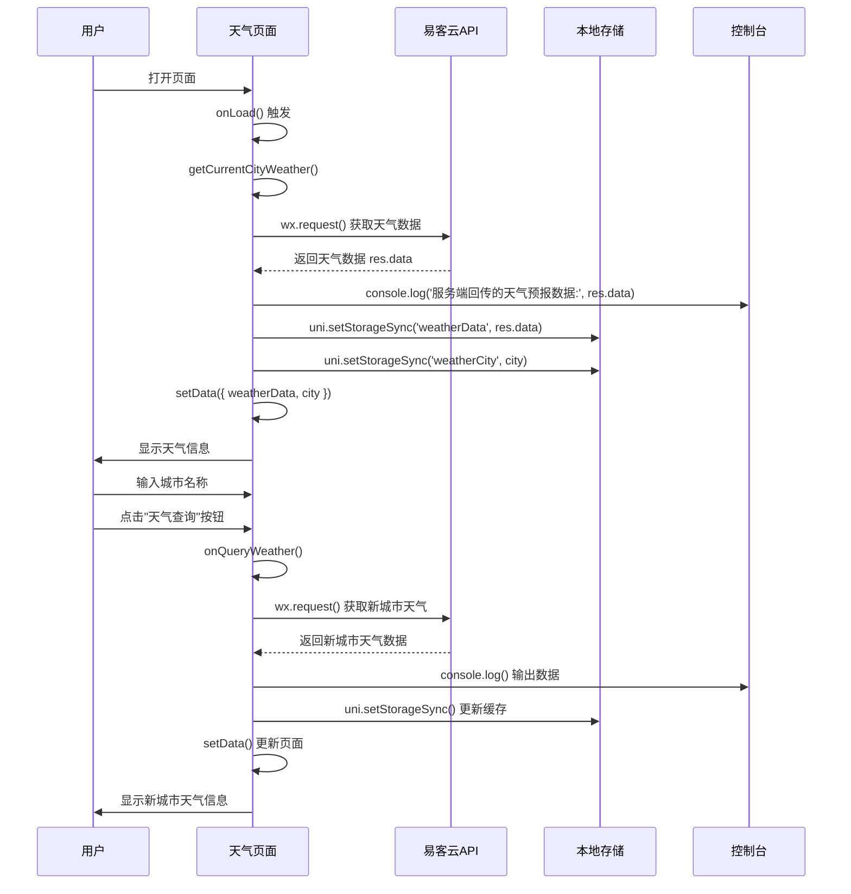

# 天气预报小程序实现计划

## 一、项目总体目标与功能边界

### 核心功能需求

1. **控制台数据输出**：在微信开发者工具的控制台输出服务端回传的天气预报数据
2. **数据缓存**：使用 `uni.setStorageSync()` 缓存服务端回传的天气预报数据，可在微信开发者工具的 Storage 控制台查看
3. **当前城市天气展示**：默认展示当前所在城市的天气信息（参考页面界面可DIY）
4. **城市查询功能**：能够通过查询不同城市展示天气信息

### 功能边界（第一版不包含）

- 用户定位功能（默认使用固定城市）
- 天气历史记录
- 多城市收藏
- 天气预警推送
- 天气图表展示

---

## 二、核心模块拆分

### 模块职责（一句话描述）

1. **`app.js`** - 应用入口，提供 uni API 兼容层，初始化应用全局数据
2. **`app.json`** - 应用配置，注册页面路由和全局窗口配置
3. **`pages/weather/index.js`** - 天气页面逻辑层，处理数据获取、缓存和状态管理
4. **`pages/weather/index.wxml`** - 天气页面结构层，定义页面布局和组件
5. **`pages/weather/index.wxss`** - 天气页面样式层，定义页面样式和布局
6. **`pages/weather/index.json`** - 天气页面配置，定义页面标题和导航栏样式

---

## 三、模块之间的数据流与调用关系

### 数据流（页面加载到数据展示）

```javascript
页面加载 (onLoad)
  ↓ 调用
getCurrentCityWeather()
  ↓ 设置默认城市
fetchWeatherData('杭州')
  ↓ 发送请求
wx.request() → 易客云API
  ↓ 接收响应
success回调 → res.data
  ↓ 控制台输出
console.log('服务端回传的天气预报数据:', res.data)
  ↓ 数据缓存
uni.setStorageSync('weatherData', res.data)
uni.setStorageSync('weatherCity', city)
  ↓ 更新页面数据
setData({ weatherData, city, loading: false })
  ↓ 界面渲染
WXML模板绑定数据 → 展示天气信息
```

### 模块依赖关系

```
app.js (应用入口)
  ├── 提供 uni API 兼容层
  └── 初始化全局数据

app.json (应用配置)
  └── 注册 weather 页面路由

pages/weather/
  ├── index.js (逻辑层)
  │   ├── 依赖: wx.request (网络请求)
  │   ├── 依赖: uni.setStorageSync (数据缓存)
  │   └── 依赖: wx.showToast (用户提示)
  ├── index.wxml (结构层)
  │   └── 绑定 index.js 中的 data 数据
  ├── index.wxss (样式层)
  │   └── 定义页面样式
  └── index.json (页面配置)
      └── 定义页面标题和导航栏
```

### 接口设计要点

**数据获取接口**：

```javascript
fetchWeatherData(city: string): void
 - 功能：获取指定城市的天气数据
 - 参数：city - 城市名称
 - 实现：wx.request 调用易客云API
 - 返回：通过回调函数更新页面数据
```

**数据缓存接口**：

```javascript
uni.setStorageSync(key: string, data: any): void
 - 功能：同步存储数据到本地
 - 参数：key - 存储键名，data - 存储数据
 - 实现：通过兼容层映射到 wx.setStorageSync
 - 存储键：'weatherData'（天气数据）、'weatherCity'（城市名称）
```

**页面状态管理**：

```javascript
data: {
  city: string,           // 当前城市
  inputCity: string,      // 输入的城市名称
  weatherData: object,    // 天气数据对象
  loading: boolean,       // 加载状态
  userName: string        // 用户姓名
}
```

---

## 四、分阶段实现路线

### 阶段 1：基础功能实现（必须实现）

**目标**：实现基本的天气查询和展示功能

**可运行验证**：

1. 打开微信开发者工具
2. 访问天气页面
3. 查看控制台输出天气数据
4. 查看 Storage 中的缓存数据
5. 页面显示默认城市（杭州）的天气信息

### 阶段 2：城市查询功能（必须实现）

**目标**：支持输入城市名称查询天气

**可运行验证**：

1. 在输入框中输入城市名称（如"北京"）
2. 点击"天气查询"按钮
3. 页面更新显示查询城市的天气信息
4. 控制台和 Storage 更新为新城市的数据

---

## 五、每个阶段的具体子任务清单

### 阶段 1：基础功能实现

#### Task 1.1：创建天气页面文件结构

**文件结构**：

```
miniprogram/pages/weather/
├── index.js      # 页面逻辑
├── index.wxml    # 页面结构
├── index.wxss    # 页面样式
└── index.json    # 页面配置
```

**实现步骤**：

- [ ] 创建 `miniprogram/pages/weather/index.js` 文件
- [ ] 创建 `miniprogram/pages/weather/index.wxml` 文件
- [ ] 创建 `miniprogram/pages/weather/index.wxss` 文件
- [ ] 创建 `miniprogram/pages/weather/index.json` 文件

**代码位置**：[miniprogram/pages/weather/](miniprogram/pages/weather/)

#### Task 1.2：实现 uni API 兼容层

**文件位置**：[miniprogram/app.js](miniprogram/app.js)

**函数级别拆分**：

##### 1. 创建 uni 全局对象

- [ ] **位置**：`miniprogram/app.js` 文件开头
- [ ] **实现**：检查 `uni` 对象是否存在，如果不存在则创建
- [ ] **代码**：
  ```javascript
  if (typeof uni === 'undefined') {
    global.uni = {
      setStorageSync: wx.setStorageSync,
      getStorageSync: wx.getStorageSync,
      removeStorageSync: wx.removeStorageSync,
      request: wx.request,
      showToast: wx.showToast,
      showModal: wx.showModal
    };
  }
  ```

- [ ] **说明**：将微信小程序 API 映射为 uni API，满足使用 `uni.setStorageSync` 的需求

**代码位置**：[miniprogram/app.js:3-12](miniprogram/app.js)

#### Task 1.3：注册天气页面路由

**文件位置**：[miniprogram/app.json](miniprogram/app.json)

**实现步骤**：

- [ ] **修改 pages 数组**：在 `pages` 数组中添加 `"pages/weather/index"`
- [ ] **代码**：
  ```json
  "pages": [
    "pages/weather/index",
    "pages/index/index",
    "pages/example/index"
  ]
  ```

- [ ] **说明**：将天气页面放在第一位，使其成为启动页面

**代码位置**：[miniprogram/app.json:2-6](miniprogram/app.json)

#### Task 1.4：实现页面逻辑层

**文件位置**：[miniprogram/pages/weather/index.js](miniprogram/pages/weather/index.js)

**函数级别拆分**：

##### 1. 定义页面数据结构

- [ ] **位置**：`Page({ data: { ... } })`
- [ ] **字段定义**：
                - `city: ''` - 当前城市
                - `inputCity: ''` - 输入的城市名称
                - `weatherData: null` - 天气数据对象
                - `loading: false` - 加载状态
                - `userName: ''` - 用户姓名
                - `weatherApiUrl: 'http://gfeljm.tianqiapi.com/api?unescape=1&version=v63&appid=25223175&appsecret=e4ECmOJq'` - API地址

**代码位置**：[miniprogram/pages/weather/index.js:2-11](miniprogram/pages/weather/index.js)

##### 2. 实现页面加载函数

- [ ] **函数**：`onLoad: function (options)`
- [ ] **功能**：页面加载时初始化数据并获取默认城市天气
- [ ] **实现步骤**：

                1. 从缓存读取用户名（如果存在）
                2. 调用 `getCurrentCityWeather()` 获取默认城市天气

- [ ] **代码**：
  ```javascript
  onLoad: function (options) {
    try {
      const userName = uni.getStorageSync('userName') || '';
      this.setData({ userName: userName });
    } catch (e) {
      console.error('读取用户名失败:', e);
    }
    this.getCurrentCityWeather();
  }
  ```


**代码位置**：[miniprogram/pages/weather/index.js:13-25](miniprogram/pages/weather/index.js)

##### 3. 实现获取当前城市天气函数

- [ ] **函数**：`getCurrentCityWeather: function()`
- [ ] **功能**：获取默认城市（杭州）的天气信息
- [ ] **实现步骤**：

                1. 设置默认城市为"杭州"
                2. 设置加载状态为 `true`
                3. 调用 `fetchWeatherData()` 获取天气数据

- [ ] **代码**：
  ```javascript
  getCurrentCityWeather: function() {
    const defaultCity = '杭州';
    this.setData({
      city: defaultCity,
      loading: true
    });
    this.fetchWeatherData(defaultCity);
  }
  ```


**代码位置**：[miniprogram/pages/weather/index.js:27-36](miniprogram/pages/weather/index.js)

##### 4. 实现获取天气数据函数（核心功能）

- [ ] **函数**：`fetchWeatherData: function(city)`
- [ ] **功能**：调用易客云API获取指定城市的天气数据
- [ ] **实现步骤**：

                1. 构建API请求URL，包含城市参数
                2. 使用 `wx.request` 发送GET请求
                3. 在 `success` 回调中：

                                        - 使用 `console.log` 输出服务端回传的数据（需求1）
                                        - 使用 `uni.setStorageSync` 缓存天气数据和城市名称（需求2）
                                        - 更新页面数据，设置 `weatherData` 和 `city`

                1. 在 `fail` 回调中处理错误，显示提示信息

- [ ] **代码**：
  ```javascript
  fetchWeatherData: function(city) {
    const that = this;
    const url = `${this.data.weatherApiUrl}&city=${encodeURIComponent(city)}`;
    
    wx.request({
      url: url,
      method: 'GET',
      success: function(res) {
        // 需求1：控制台输出数据
        console.log('服务端回传的天气预报数据:', res.data);
        
        // 需求2：缓存数据
        try {
          uni.setStorageSync('weatherData', res.data);
          uni.setStorageSync('weatherCity', city);
          console.log('使用uni.setStorageSync缓存数据成功');
        } catch (e) {
          console.error('缓存数据失败:', e);
        }
  
        // 更新页面数据
        that.setData({
          weatherData: res.data,
          city: city,
          loading: false
        });
      },
      fail: function(err) {
        console.error('获取天气数据失败:', err);
        wx.showToast({
          title: '获取天气信息失败',
          icon: 'none'
        });
        that.setData({ loading: false });
      }
    });
  }
  ```


**代码位置**：[miniprogram/pages/weather/index.js:38-75](miniprogram/pages/weather/index.js)

##### 5. 实现输入处理函数

- [ ] **函数**：`onCityInput: function(e)`
- [ ] **功能**：处理城市名称输入
- [ ] **实现**：更新 `inputCity` 数据
- [ ] **代码**：
  ```javascript
  onCityInput: function(e) {
    this.setData({
      inputCity: e.detail.value
    });
  }
  ```


**代码位置**：[miniprogram/pages/weather/index.js:77-82](miniprogram/pages/weather/index.js)

##### 6. 实现查询天气函数

- [ ] **函数**：`onQueryWeather: function()`
- [ ] **功能**：查询指定城市的天气（需求4）
- [ ] **实现步骤**：

                1. 获取输入的城市名称并去除空格
                2. 验证城市名称不为空
                3. 设置加载状态为 `true`
                4. 调用 `fetchWeatherData()` 获取天气数据

- [ ] **代码**：
  ```javascript
  onQueryWeather: function() {
    const city = this.data.inputCity.trim();
    if (!city) {
      wx.showToast({
        title: '请输入城市名称',
        icon: 'none'
      });
      return;
    }
  
    this.setData({ loading: true });
    this.fetchWeatherData(city);
  }
  ```


**代码位置**：[miniprogram/pages/weather/index.js:84-99](miniprogram/pages/weather/index.js)

#### Task 1.5：实现页面结构层

**文件位置**：[miniprogram/pages/weather/index.wxml](miniprogram/pages/weather/index.wxml)

**函数级别拆分**：

##### 1. 页面容器结构

- [ ] **根元素**：`<view class="weather-container">`
- [ ] **包含区域**：
                - 绿色标题区域（显示"姓名 - 天气预报"）
                - 主要内容区域（城市信息、搜索框、按钮、天气信息列表）

**代码位置**：[miniprogram/pages/weather/index.wxml:1-96](miniprogram/pages/weather/index.wxml)

##### 2. 标题区域

- [ ] **结构**：`<view class="title-section">`
- [ ] **内容**：显示 `{{userName || '姓名'}} - 天气预报`
- [ ] **代码**：
  ```xml
  <view class="title-section">
    <text class="title-text">{{userName || '姓名'}} - 天气预报</text>
  </view>
  ```


**代码位置**：[miniprogram/pages/weather/index.wxml:3-6](miniprogram/pages/weather/index.wxml)

##### 3. 城市信息展示

- [ ] **结构**：`<view class="city-info">`
- [ ] **内容**：显示"所在城市:"标签和城市名称
- [ ] **代码**：
  ```xml
  <view class="city-info">
    <text class="city-label">所在城市:</text>
    <text class="city-name">{{city || '未知'}}</text>
  </view>
  ```


**代码位置**：[miniprogram/pages/weather/index.wxml:10-14](miniprogram/pages/weather/index.wxml)

##### 4. 搜索输入框

- [ ] **结构**：`<input>` 组件
- [ ] **属性**：
                - `class="search-input"`
                - `placeholder="请输入城市名称"`
                - `value="{{inputCity}}"`
                - `bindinput="onCityInput"`
                - `confirm-type="search"`
                - `bindconfirm="onQueryWeather"`
- [ ] **代码**：
  ```xml
  <input 
    class="search-input" 
    placeholder="请输入城市名称" 
    value="{{inputCity}}"
    bindinput="onCityInput"
    confirm-type="search"
    bindconfirm="onQueryWeather"
  />
  ```


**代码位置**：[miniprogram/pages/weather/index.wxml:17-26](miniprogram/pages/weather/index.wxml)

##### 5. 查询按钮

- [ ] **结构**：`<button>` 组件
- [ ] **属性**：
                - `class="query-btn"`
                - `bindtap="onQueryWeather"`
                - `disabled="{{loading}}"`
- [ ] **内容**：根据 `loading` 状态显示"查询中..."或"天气查询"
- [ ] **代码**：
  ```xml
  <button class="query-btn" bindtap="onQueryWeather" disabled="{{loading}}">
    {{loading ? '查询中...' : '天气查询'}}
  </button>
  ```


**代码位置**：[miniprogram/pages/weather/index.wxml:28-31](miniprogram/pages/weather/index.wxml)

##### 6. 天气信息列表（需求3：展示天气信息）

- [ ] **结构**：`<view class="weather-info" wx:if="{{weatherData}}">`
- [ ] **内容**：使用 `wx:if` 条件渲染，当 `weatherData` 存在时显示
- [ ] **信息项**：
                - 日期：`{{weatherData.date || '未知'}}`
                - 天气：`{{weatherData.wea || '未知'}}`
                - 气温：`{{weatherData.tem || '未知'}}°C`
                - 最高温度：`{{weatherData.tem1 || '未知'}}°C`
                - 最低温度：`{{weatherData.tem2 || '未知'}}°C`
                - 空气情况：`{{weatherData.air_level || weatherData.air || '未知'}}`
                - 湿度（可选）：`{{weatherData.humidity}}%`
                - 风向（可选）：`{{weatherData.win}}`
                - 风力（可选）：`{{weatherData.win_speed}}`
                - PM2.5（可选）：`{{weatherData.air_pm25}}`
- [ ] **代码**：
  ```xml
  <view class="weather-info" wx:if="{{weatherData}}">
    <view class="info-item">
      <text class="info-label">日期:</text>
      <text class="info-value">{{weatherData.date || '未知'}}</text>
    </view>
    <!-- 其他信息项... -->
  </view>
  ```


**代码位置**：[miniprogram/pages/weather/index.wxml:33-84](miniprogram/pages/weather/index.wxml)

##### 7. 加载和空状态提示

- [ ] **加载提示**：`<view class="loading-tip" wx:if="{{loading}}">`
- [ ] **空状态提示**：`<view class="empty-tip" wx:if="{{!weatherData && !loading}}">`

**代码位置**：[miniprogram/pages/weather/index.wxml:86-94](miniprogram/pages/weather/index.wxml)

#### Task 1.6：实现页面样式层

**文件位置**：[miniprogram/pages/weather/index.wxss](miniprogram/pages/weather/index.wxss)

**函数级别拆分**：

##### 1. 页面基础样式

- [ ] **page 样式**：设置背景色为 `#F6F6F6`
- [ ] **容器样式**：`.weather-container` 设置最小高度和背景色

**代码位置**：[miniprogram/pages/weather/index.wxss:1-9](miniprogram/pages/weather/index.wxss)

##### 2. 标题区域样式

- [ ] **绿色背景**：`.title-section` 设置背景色为 `#4CAF50`
- [ ] **文字样式**：`.title-text` 设置字体大小、颜色、居中对齐

**代码位置**：[miniprogram/pages/weather/index.wxss:11-23](miniprogram/pages/weather/index.wxss)

##### 3. 内容区域样式

- [ ] **内容区域**：`.content-section` 设置内边距和背景色
- [ ] **城市信息**：`.city-info`、`.city-label`、`.city-name` 设置布局和颜色

**代码位置**：[miniprogram/pages/weather/index.wxss:25-48](miniprogram/pages/weather/index.wxss)

##### 4. 搜索和按钮样式

- [ ] **搜索输入框**：`.search-input` 设置宽度、高度、边框、圆角
- [ ] **查询按钮**：`.query-btn` 设置红色背景、白色文字、圆角、禁用状态样式

**代码位置**：[miniprogram/pages/weather/index.wxss:50-87](miniprogram/pages/weather/index.wxss)

##### 5. 天气信息列表样式

- [ ] **信息项**：`.info-item` 使用 flex 布局，设置内边距和边框
- [ ] **标签和值**：`.info-label` 和 `.info-value` 设置字体大小和颜色

**代码位置**：[miniprogram/pages/weather/index.wxss:89-116](miniprogram/pages/weather/index.wxss)

#### Task 1.7：实现页面配置

**文件位置**：[miniprogram/pages/weather/index.json](miniprogram/pages/weather/index.json)

**实现步骤**：

- [ ] **配置导航栏**：
                - `navigationBarTitleText: "天气App"`
                - `navigationBarBackgroundColor: "#4A90E2"`
                - `navigationBarTextStyle: "white"`
                - `backgroundColor: "#F6F6F6"`

**代码位置**：[miniprogram/pages/weather/index.json:1-6](miniprogram/pages/weather/index.json)

---

## 六、验证测试清单

### 需求1：控制台数据输出验证

- [ ] 打开微信开发者工具
- [ ] 点击"调试器"标签
- [ ] 点击"Console"标签
- [ ] 访问天气页面或查询天气
- [ ] 验证控制台输出：`服务端回传的天气预报数据: { ... }`
- [ ] 验证控制台输出：`使用uni.setStorageSync缓存数据成功`

**验证位置**：微信开发者工具 → 调试器 → Console

### 需求2：数据缓存验证

- [ ] 打开微信开发者工具
- [ ] 点击"调试器"标签
- [ ] 点击"Storage"标签
- [ ] 访问天气页面或查询天气
- [ ] 验证 Storage 中存在 `weatherData` 键
- [ ] 验证 Storage 中存在 `weatherCity` 键
- [ ] 点击 `weatherData` 查看详细的天气数据

**验证位置**：微信开发者工具 → 调试器 → Storage

### 需求3：当前城市天气展示验证

- [ ] 打开微信开发者工具
- [ ] 访问天气页面（自动加载默认城市"杭州"）
- [ ] 验证页面显示城市名称"杭州"
- [ ] 验证页面显示天气信息（日期、天气、气温等）
- [ ] 验证所有信息项正确显示

**验证位置**：微信开发者工具 → 模拟器 → 天气页面

### 需求4：城市查询功能验证

- [ ] 在输入框中输入城市名称（如"北京"）
- [ ] 点击"天气查询"按钮
- [ ] 验证页面更新显示查询城市的天气信息
- [ ] 验证控制台输出新城市的数据
- [ ] 验证 Storage 更新为新城市的数据
- [ ] 测试多个不同城市（如"上海"、"广州"）

**验证位置**：微信开发者工具 → 模拟器 → 天气页面

---

## 七、关键代码位置索引

### 核心功能代码

1. **uni API 兼容层**：[miniprogram/app.js:3-12](miniprogram/app.js)
2. **页面路由注册**：[miniprogram/app.json:2-6](miniprogram/app.json)
3. **数据获取和缓存**：[miniprogram/pages/weather/index.js:38-75](miniprogram/pages/weather/index.js)
4. **控制台数据输出**：[miniprogram/pages/weather/index.js:47](miniprogram/pages/weather/index.js)
5. **数据缓存实现**：[miniprogram/pages/weather/index.js:49-56](miniprogram/pages/weather/index.js)
6. **天气信息展示**：[miniprogram/pages/weather/index.wxml:33-84](miniprogram/pages/weather/index.wxml)
7. **城市查询功能**：[miniprogram/pages/weather/index.js:84-99](miniprogram/pages/weather/index.js)

### 配置文件

1. **应用配置**：[miniprogram/app.json](miniprogram/app.json)
2. **页面配置**：[miniprogram/pages/weather/index.json](miniprogram/pages/weather/index.json)

### 样式文件

1. **页面样式**：[miniprogram/pages/weather/index.wxss](miniprogram/pages/weather/index.wxss)

---

## 八、数据流详细图



---

## 九、关键设计决策记录

### 决策1：uni API 兼容层实现

**选择**：在 `app.js` 中创建全局 `uni` 对象，映射微信小程序 API

**原因**：满足使用 `uni.setStorageSync` 的需求，同时保持与微信小程序 API 的兼容性

**代码位置**：[miniprogram/app.js:3-12](miniprogram/app.js)

### 决策2：默认城市设置

**选择**：使用固定城市"杭州"作为默认城市

**原因**：简化实现，避免需要定位权限和复杂的定位逻辑

**代码位置**：[miniprogram/pages/weather/index.js:30](miniprogram/pages/weather/index.js)

### 决策3：数据缓存策略

**选择**：每次获取天气数据后立即缓存

**原因**：确保数据持久化，方便在 Storage 中查看，符合需求要求

**代码位置**：[miniprogram/pages/weather/index.js:49-56](miniprogram/pages/weather/index.js)

### 决策4：界面设计风格

**选择**：简洁的列表式布局，绿色标题区域，红色查询按钮

**原因**：参考用户提供的界面设计，保持简洁实用

**代码位置**：[miniprogram/pages/weather/index.wxml](miniprogram/pages/weather/index.wxml)

---

## 十、实现检查清单

### 功能完整性检查

- [x] 控制台输出天气数据（需求1）
- [x] 使用 uni.setStorageSync 缓存数据（需求2）
- [x] 展示当前城市天气信息（需求3）
- [x] 支持查询不同城市天气（需求4）

### 代码质量检查

- [x] 所有文件已创建
- [x] 代码结构清晰
- [x] 错误处理完善
- [x] 注释说明充分

### 界面展示检查

- [x] 页面布局正确
- [x] 样式美观统一
- [x] 交互流畅
- [x] 加载状态提示

---

## 十一、常见问题处理

### 问题1：uni.setStorageSync 不可用

**原因**：uni 对象未正确创建

**解决方案**：检查 `app.js` 中的 uni API 兼容层是否正确实现

**代码位置**：[miniprogram/app.js:3-12](miniprogram/app.js)

### 问题2：API 请求失败

**原因**：网络问题或 API 地址错误

**解决方案**：检查网络连接，确认 API 地址正确，查看控制台错误信息

**代码位置**：[miniprogram/pages/weather/index.js:64-73](miniprogram/pages/weather/index.js)

### 问题3：数据未正确显示

**原因**：数据字段名不匹配或数据为空

**解决方案**：检查 API 返回的数据结构，使用 `|| '未知'` 提供默认值

**代码位置**：[miniprogram/pages/weather/index.wxml:33-84](miniprogram/pages/weather/index.wxml)

### 问题4：Storage 中看不到数据

**原因**：缓存失败或未触发缓存

**解决方案**：检查控制台是否有缓存成功的日志，确认 `uni.setStorageSync` 调用成功

**代码位置**：[miniprogram/pages/weather/index.js:49-56](miniprogram/pages/weather/index.js)