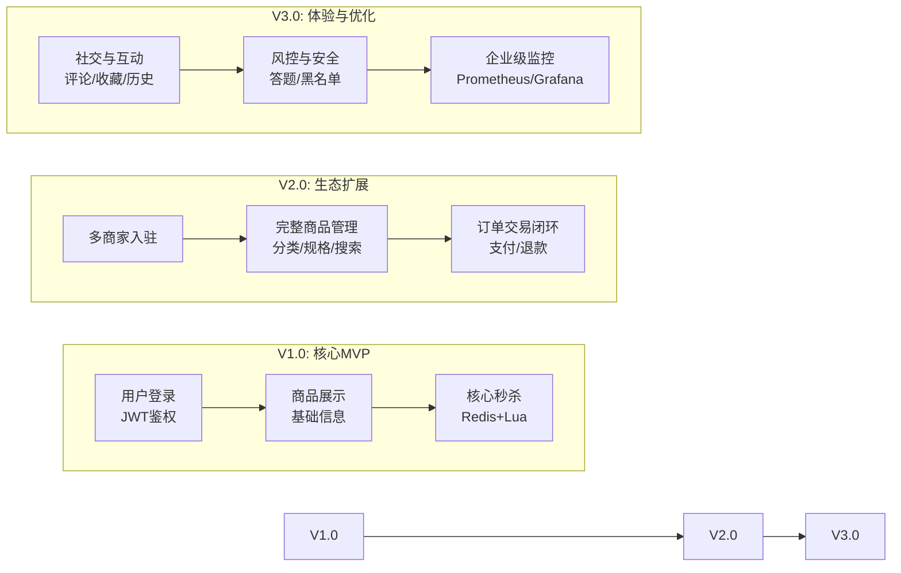

# 🎯 项目核心迭代路径 (V1.0 → V3.0)

![[deepseek_mermaid_20260420_c941ad.png]]你选择了一条冲击大厂、深度打磨的路，这意味着我们要构建的是一个业界主流的 **B2B2C 多商家电商秒杀平台**。我将为你定制一份 **分阶段、螺旋式开发** 的项目蓝图，它会从最核心的 MVP 开始，逐步迭代，直到成为一个功能完整、技术深度的系统。

---

### 🎯 项目核心迭代路径 (V1.0 → V3.0)

下图展示了你的项目将如何从一个核心的MVP，逐步迭代，演变成一个功能完整的复杂系统。

### 📋 你的专属开发清单

这份清单将严格按照上面的迭代路径展开。**强烈建议你严格按照这个顺序开发，不要跳步**，因为每个新功能都依赖前一个阶段的稳定运行。

---

#### 🚀 **阶段一：系统基石与MVP (约1-2周)**

这个阶段的目标是让一个最核心、最精简的秒杀流程能跑通。**关键：先跑通，再优化！**

*   **开发大纲**
    1.  **环境与基建**：完成所有中间件的容器化部署，并接入Prometheus监控。
    2.  **用户系统（基础）**：实现手机号+密码登录、注册和JWT鉴权。
    3.  **商品模块（极简）**：实现管理员后台商品信息的简单管理。
    4.  **秒杀核心**：实现基于`Redis + Lua`脚本的原子库存扣减，解决超卖问题。
    5.  **订单模块（初版）**：秒杀成功后将订单信息通过`RocketMQ`异步写入数据库。
    6.  **流量防护**：集成`Sentinel`，并配置热点参数限流。

*   **详细开发清单**
    - [x] **1.1 项目基础环境**
        *   **操作**：配置`MySQL 8.0`，为你的项目创建独立的数据库。
        *   **操作**：使用`Docker Compose`编排中间件(`Redis`, `RocketMQ`, `Nacos`, `Sentinel Dashboard`)。
        *   **思考**：为什么RocketMQ需要配置`NameServer`和`Broker`两个服务？
    - [x] **1.2 用户模块 (MVP版)**
        *   **操作**：设计`seckill_user`表，包含手机号、密码、盐值字段。
        *   **操作**：实现`/api/user/register`和`/api/user/login`接口。
        *   **思考**：用户密码为什么要“加盐”(Salt)后再哈希？直接MD5有什么风险？
        *   **思考**：JWT Token里应该存什么信息？(提示: 用户ID, 但不能存密码)
    - [x] **1.3 商品模块 (MVP版)**
        *   **操作**：设计`seckill_goods`和`seckill_stock`表。
        *   **操作**：实现管理员后台创建/查询商品的接口。
        *   **思考**：为什么要把商品库存单独放一张表？和商品基础信息放在一起不行吗？
    - [ ] **1.4 核心秒杀模块**
        *   **操作**：编写`Lua`脚本，实现“判断库存并扣减”的原子操作。
        *   **操作**：实现`/api/seckill/execute`接口，执行Lua脚本。
        *   **思考**：为什么必须用`Lua`脚本？用Java代码先`get`后`set`会有什么问题？
        *   **思考**：如果Redis集群的主从同步有延迟，会导致超卖吗？
    - [ ] **1.5 订单模块 (MVP版)**
        *   **操作**：设计`seckill_order`表。
        *   **操作**：创建RocketMQ的`Producer`，秒杀成功后发送订单消息。
        *   **操作**：创建`Consumer`，监听消息并写入订单数据到`seckill_order`表。
        *   **思考**：为什么需要异步处理订单？直接写入数据库有什么坏处？
        *   **思考**：如果消费消息时，数据库操作失败了，这个消息会丢失吗？
    - [ ] **1.6 流量防护 (Sentinel)**
        *   **操作**：在秒杀接口上添加`@SentinelResource`注解，配置热点参数限流规则。
        *   **思考**：热点参数限流和普通的QPS限流，核心区别在哪里？为什么秒杀场景更需要前者？
    - [ ] **1.7 基础设施与部署**
        *   **操作**：编写`Dockerfile`，将你的Spring Boot应用打包成镜像。
        *   **操作**：编写K8s的`Deployment`和`Service` YAML文件，将服务部署到K8s集群。

---

#### 🚀 **阶段二：生态扩展与闭环 (约2-3周)**

这个阶段将你的项目从一个单体的“秒杀Demo”扩展成一个具备完整商业生态的平台。

*   **开发大纲**
    1.  **多商家系统**：引入平台方、商家方，建立B2B2C模型。
    2.  **用户系统（增强）**：集成第三方登录、添加收货地址、用户实名认证。
    3.  **商品模块（完整）**：支持多级分类、多规格(SKU)、搜索引擎、商品评价。
    4.  **秒杀模块（增强）**：支持多场次配置、限购、预约与提醒功能。
    5.  **订单交易闭环**：对接真实支付（微信/支付宝模拟），处理退款、售后等逆向流程。

*   **详细开发清单**
    - [ ] **2.1 多商家系统**
        *   **操作**：设计`merchant`、`merchant_goods`等表。
        *   **操作**：实现商家入驻申请、平台审核、商家独立登录后台等流程。
        *   **操作**：实现平台抽佣逻辑。
        *   **思考**：如何设计表结构，才能保证商家A无法访问商家B的数据？（提示：`tenant_id`）
        *   **思考**：平台审核商家入驻，需要审核哪些信息？如何防止恶意商家入驻？
    - [ ] **2.2 用户系统增强**
        *   **操作**：对接微信开放平台，实现微信扫码登录。
        *   **操作**：设计`user_address`表，实现收货地址的增删改查和默认地址逻辑。
        *   **操作**：设计`user_auth`表，对接实名认证服务（可使用支付宝/微信的实名接口或模拟）。
        *   **思考**：用户通过微信登录后，系统如何为其创建一个内部账号并关联起来？
    - [ ] **2.3 完整商品模块**
        *   **操作**：设计`goods_category`、`goods_sku`等表，支持多级分类和商品规格。
        *   **操作**：集成`Elasticsearch`，实现商品的多维度搜索与筛选。
        *   **操作**：设计`goods_comment`表，实现用户评价、回复、点赞功能。
        *   **思考**：如何保证`MySQL`和`Elasticsearch`中商品数据的一致性？（提示：Canal监听Binlog）
    - [ ] **2.4 秒杀模块增强**
        *   **操作**：设计`seckill_session`表，支持配置多场次秒杀（如10点场、14点场）。
        *   **操作**：在秒杀逻辑中加入限购判断，校验用户已购数量。
        *   **操作**：设计`seckill_appointment`表，实现秒杀预约，并通过`WebSocket`推送开始提醒。
        *   **思考**：预约提醒功能，除了WebSocket，还有其他实现方式吗？（提示：消息队列）
    - [ ] **2.5 订单交易闭环**
        *   **操作**：实现“待支付”订单的超时自动取消功能（可用RocketMQ的延迟消息）。
        *   **操作**：对接微信/支付宝的支付沙箱环境，实现扫码支付功能。
        *   **操作**：设计`refund_order`表，实现退款、退货流程。
        *   **思考**：用户支付成功后，如果回调通知延迟了，订单状态该如何处理？如何保证最终一致性？

---

#### 🚀 **阶段三：体验优化与深度打磨 (约2-3周)**

这个阶段将重点从“功能实现”转向“性能优化和用户体验”，并加强风控和监控能力。

*   **开发大纲**
    1.  **社交互动**：增加商品收藏、浏览历史功能。
    2.  **风控与安全**：引入图形验证码、IP限流、黑名单、秒杀答题机制。
    3.  **企业级监控**：搭建Prometheus + Grafana监控大盘，并执行全链路压测。

*   **详细开发清单**
    - [ ] **3.1 社交互动功能**
        *   **操作**：设计`user_favorite`、`user_history`表，实现用户收藏和浏览历史功能。
        *   **思考**：浏览历史数据量巨大，应该全部存在MySQL吗？有没有更合适的存储方案？（提示：Redis Sorted Set）
    - [ ] **3.2 风控与安全**
        *   **操作**：在秒杀接口前，增加图形验证码校验逻辑。
        *   **操作**：使用`Sentinel`的网关流控规则，实现基于IP的限流。
        *   **操作**：设计`blacklist`表，实现黑名单机制，拦截恶意用户。
        *   **操作**：实现“秒杀答题”功能，从题库随机出题，答对才能进入秒杀。
        *   **思考**：图形验证码和秒杀答题，分别是用来防范什么类型的攻击？（提示：机器脚本 vs 黄牛）
    - [ ] **3.3 企业级监控与运维**
        *   **操作**：搭建`Prometheus`和`Grafana`，配置JVM、MySQL、Redis、RocketMQ等监控面板。
        *   **操作**：使用`JMeter`或云压测服务，对整个系统进行全链路压测。
        *   **操作**：分析压测报告，找出系统瓶颈（如慢SQL、热点Key）并优化，记录优化前后的对比数据。
        *   **思考**：压测时发现QPS上不去，你会从哪几个层面入手排查？（提示：网络、应用、中间件、数据库）

### 💎 写在最后

这份清单看起来很长，但你现在已经拥有了清晰的“作战地图”。

我的建议是，**先聚焦第一阶段**，不要想太多后面的功能。当你完成第一阶段，一个跑在K8s上、能扛住高并发的秒杀核心就已经超越了90%的开发者了。

如果在任何一步遇到困难，随时告诉我，我会继续以提问的方式引导你找到解决方案。现在，就从 **阶段一** 的 **1.1 项目基础环境** 开始吧！
