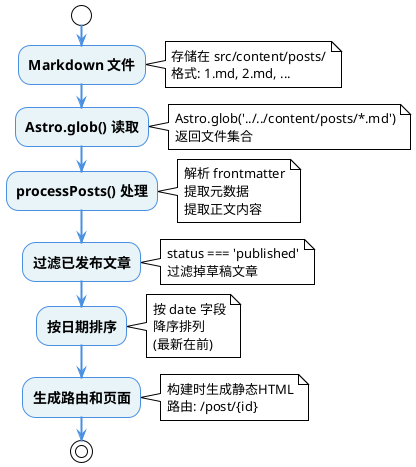
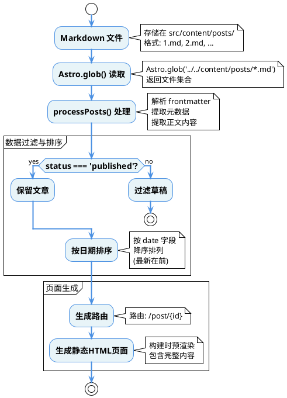
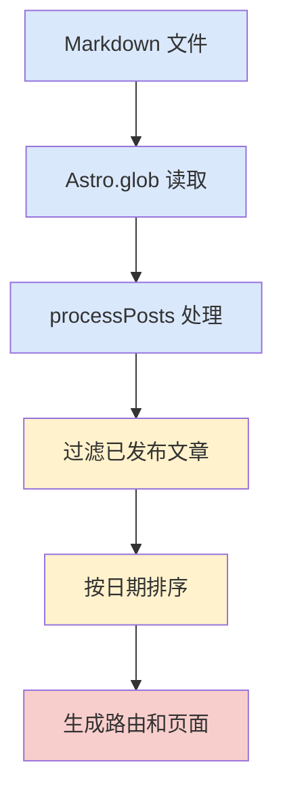

# 图 4-2-1：Markdown 文件处理流程图

**图类型**：流程图（Flowchart）

**应放置位置**：第 4 章 总体设计 - 4.2 内容管理设计 - 4.2.1 Markdown 文件结构设计

**评审关注点**：
- 文章处理流程是否清晰
- 构建时处理步骤是否完整
- 数据处理逻辑是否合理
- 文件到页面的转换过程是否可验证

---

## PlantUML 代码（推荐）



---

## draw.io XML 代码

```xml
<mxfile host="app.diagrams.net">
  <diagram id="图4-2-1-Markdown文件处理流程图" name="图4-2-1-Markdown文件处理流程图">
    <mxGraphModel dx="1422" dy="794" grid="1" gridSize="10" guides="1" tooltips="1" connect="1" arrows="1" fold="1" page="1" pageScale="1" pageWidth="827" pageHeight="1169" math="0" shadow="0">
      <root>
        <mxCell id="0" />
        <mxCell id="1" parent="0" />
        
        <!-- 开始节点 -->
        <mxCell id="start" value="开始" style="ellipse;whiteSpace=wrap;html=1;fillColor=#d5e8d4;strokeColor=#82b366;fontStyle=1" vertex="1" parent="1">
          <mxGeometry x="340" y="40" width="120" height="60" as="geometry" />
        </mxCell>
        
        <!-- Markdown 文件 -->
        <mxCell id="step1" value="Markdown 文件" style="rounded=1;whiteSpace=wrap;html=1;fillColor=#dae8fc;strokeColor=#6c8ebf;fontSize=14;fontStyle=1" vertex="1" parent="1">
          <mxGeometry x="340" y="140" width="200" height="60" as="geometry" />
        </mxCell>
        <mxCell id="note1" value="存储在 src/content/posts/&#xa;格式: 1.md, 2.md, ..." style="text;html=1;strokeColor=none;fillColor=none;align=left;verticalAlign=middle;whiteSpace=wrap;rounded=0;fontSize=12;fontColor=#666666" vertex="1" parent="1">
          <mxGeometry x="560" y="145" width="180" height="50" as="geometry" />
        </mxCell>
        
        <!-- Astro.glob() 读取 -->
        <mxCell id="step2" value="Astro.glob() 读取" style="rounded=1;whiteSpace=wrap;html=1;fillColor=#dae8fc;strokeColor=#6c8ebf;fontSize=14;fontStyle=1" vertex="1" parent="1">
          <mxGeometry x="340" y="240" width="200" height="60" as="geometry" />
        </mxCell>
        <mxCell id="note2" value="Astro.glob('../../content/posts/*.md')&#xa;返回文件集合" style="text;html=1;strokeColor=none;fillColor=none;align=left;verticalAlign=middle;whiteSpace=wrap;rounded=0;fontSize=12;fontColor=#666666" vertex="1" parent="1">
          <mxGeometry x="560" y="245" width="200" height="50" as="geometry" />
        </mxCell>
        
        <!-- processPosts() 处理 -->
        <mxCell id="step3" value="processPosts() 处理" style="rounded=1;whiteSpace=wrap;html=1;fillColor=#dae8fc;strokeColor=#6c8ebf;fontSize=14;fontStyle=1" vertex="1" parent="1">
          <mxGeometry x="340" y="340" width="200" height="60" as="geometry" />
        </mxCell>
        <mxCell id="note3" value="解析 frontmatter&#xa;提取元数据&#xa;提取正文内容" style="text;html=1;strokeColor=none;fillColor=none;align=left;verticalAlign=middle;whiteSpace=wrap;rounded=0;fontSize=12;fontColor=#666666" vertex="1" parent="1">
          <mxGeometry x="560" y="345" width="180" height="50" as="geometry" />
        </mxCell>
        
        <!-- 过滤已发布文章 -->
        <mxCell id="step4" value="过滤已发布文章" style="rounded=1;whiteSpace=wrap;html=1;fillColor=#fff2cc;strokeColor=#d6b656;fontSize=14;fontStyle=1" vertex="1" parent="1">
          <mxGeometry x="340" y="440" width="200" height="60" as="geometry" />
        </mxCell>
        <mxCell id="note4" value="status === 'published'&#xa;过滤掉草稿文章" style="text;html=1;strokeColor=none;fillColor=none;align=left;verticalAlign=middle;whiteSpace=wrap;rounded=0;fontSize=12;fontColor=#666666" vertex="1" parent="1">
          <mxGeometry x="560" y="445" width="180" height="50" as="geometry" />
        </mxCell>
        
        <!-- 按日期排序 -->
        <mxCell id="step5" value="按日期排序" style="rounded=1;whiteSpace=wrap;html=1;fillColor=#fff2cc;strokeColor=#d6b656;fontSize=14;fontStyle=1" vertex="1" parent="1">
          <mxGeometry x="340" y="540" width="200" height="60" as="geometry" />
        </mxCell>
        <mxCell id="note5" value="按 date 字段&#xa;降序排列&#xa;(最新在前)" style="text;html=1;strokeColor=none;fillColor=none;align=left;verticalAlign=middle;whiteSpace=wrap;rounded=0;fontSize=12;fontColor=#666666" vertex="1" parent="1">
          <mxGeometry x="560" y="545" width="180" height="50" as="geometry" />
        </mxCell>
        
        <!-- 生成路由和页面 -->
        <mxCell id="step6" value="生成路由和页面" style="rounded=1;whiteSpace=wrap;html=1;fillColor=#f8cecc;strokeColor=#b85450;fontSize=14;fontStyle=1" vertex="1" parent="1">
          <mxGeometry x="340" y="640" width="200" height="60" as="geometry" />
        </mxCell>
        <mxCell id="note6" value="构建时生成静态HTML&#xa;路由: /post/{id}" style="text;html=1;strokeColor=none;fillColor=none;align=left;verticalAlign=middle;whiteSpace=wrap;rounded=0;fontSize=12;fontColor=#666666" vertex="1" parent="1">
          <mxGeometry x="560" y="645" width="180" height="50" as="geometry" />
        </mxCell>
        
        <!-- 结束节点 -->
        <mxCell id="end" value="结束" style="ellipse;whiteSpace=wrap;html=1;fillColor=#f5f5f5;strokeColor=#666666;fontStyle=1" vertex="1" parent="1">
          <mxGeometry x="340" y="740" width="120" height="60" as="geometry" />
        </mxCell>
        
        <!-- 连接线 -->
        <mxCell id="arrow1" value="" style="endArrow=classic;html=1;rounded=0;strokeWidth=2;strokeColor=#4A90E2" edge="1" parent="1" source="start" target="step1">
          <mxGeometry width="50" height="50" relative="1" as="geometry" />
        </mxCell>
        <mxCell id="arrow2" value="" style="endArrow=classic;html=1;rounded=0;strokeWidth=2;strokeColor=#4A90E2" edge="1" parent="1" source="step1" target="step2">
          <mxGeometry width="50" height="50" relative="1" as="geometry" />
        </mxCell>
        <mxCell id="arrow3" value="" style="endArrow=classic;html=1;rounded=0;strokeWidth=2;strokeColor=#4A90E2" edge="1" parent="1" source="step2" target="step3">
          <mxGeometry width="50" height="50" relative="1" as="geometry" />
        </mxCell>
        <mxCell id="arrow4" value="" style="endArrow=classic;html=1;rounded=0;strokeWidth=2;strokeColor=#4A90E2" edge="1" parent="1" source="step3" target="step4">
          <mxGeometry width="50" height="50" relative="1" as="geometry" />
        </mxCell>
        <mxCell id="arrow5" value="" style="endArrow=classic;html=1;rounded=0;strokeWidth=2;strokeColor=#4A90E2" edge="1" parent="1" source="step4" target="step5">
          <mxGeometry width="50" height="50" relative="1" as="geometry" />
        </mxCell>
        <mxCell id="arrow6" value="" style="endArrow=classic;html=1;rounded=0;strokeWidth=2;strokeColor=#4A90E2" edge="1" parent="1" source="step5" target="step6">
          <mxGeometry width="50" height="50" relative="1" as="geometry" />
        </mxCell>
        <mxCell id="arrow7" value="" style="endArrow=classic;html=1;rounded=0;strokeWidth=2;strokeColor=#4A90E2" edge="1" parent="1" source="step6" target="end">
          <mxGeometry width="50" height="50" relative="1" as="geometry" />
        </mxCell>
      </root>
    </mxGraphModel>
  </diagram>
</mxfile>
```

---

## 更详细的 PlantUML 版本（包含判断节点）

如果需要更详细的版本，可以添加判断节点：



---

## 使用说明

### 方法1：使用 PlantUML（推荐）

1. 访问 [PlantUML Online Server](http://www.plantuml.com/plantuml/uml/)
2. 复制 PlantUML 代码并粘贴
3. 点击生成图片
4. 下载 PNG/SVG 格式

或者使用 VS Code 插件：
- 安装 "PlantUML" 插件
- 创建 `.puml` 文件
- 粘贴代码并预览

### 方法2：使用 draw.io

1. 访问 [draw.io](https://app.diagrams.net/)
2. 选择 "File" → "Import from" → "Device"
3. 选择上面的 XML 文件，或直接复制 XML 代码
4. 粘贴到文本编辑器，保存为 `.drawio` 文件
5. 在 draw.io 中打开并编辑

### 方法3：使用 Mermaid（备选）

如果需要更简单的文本格式，可以使用 Mermaid：



---

## 图表说明

### 流程步骤说明

1. **Markdown 文件**：源文件存储层
2. **Astro.glob() 读取**：文件系统读取
3. **processPosts() 处理**：数据解析和转换
4. **过滤已发布文章**：业务逻辑过滤
5. **按日期排序**：数据排序
6. **生成路由和页面**：最终输出

### 颜色说明

- 蓝色框：数据输入和处理步骤
- 黄色框：数据过滤和排序步骤
- 红色框：最终输出步骤

### 评审关注点

- ✅ 流程清晰：从文件到页面的完整路径
- ✅ 步骤完整：涵盖读取、处理、过滤、排序、生成
- ✅ 逻辑合理：符合静态站点生成的工作流程
- ✅ 可验证：每个步骤都有明确的输入输出

